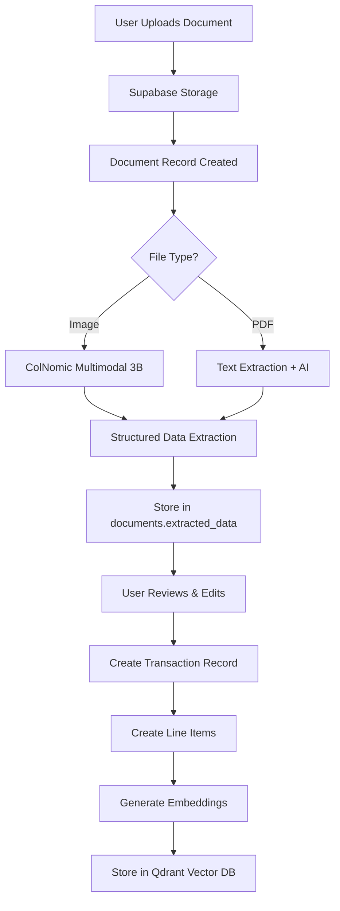

# FinanSEAL Architecture Documentation

## System Overview

FinanSEAL is a multimodal financial co-pilot web application designed for Southeast Asian SMEs, featuring state-of-the-art Agentic RAG (Retrieval Augmented Generation) capabilities powered by LangGraph for intelligent document processing and conversational financial guidance.

## Core Architecture

### Technology Stack
- **Frontend**: Next.js 14 with App Router, TypeScript, Tailwind CSS
- **Backend**: Next.js API routes with serverless functions
- **Database**: Supabase PostgreSQL with Row Level Security (RLS)
- **Authentication**: Clerk for user management
- **Vector Database**: Qdrant Cloud for embedding storage and similarity search
- **AI Models**: 
  - SEA-LION (Southeast Asian Large Language Model) via Hugging Face Inference API
  - ColNomic Embed Multimodal 3B for document processing
- **Agent Framework**: LangGraph for state-driven conversational AI
- **Deployment**: Vercel (frontend) + serverless architecture

## Database Schema & Relationships

### Core Tables

#### 1. Users & Business Context
```sql
-- User profiles with localization preferences
users (
  id UUID PRIMARY KEY,
  clerk_user_id VARCHAR UNIQUE,
  email VARCHAR,
  full_name VARCHAR,
  home_currency VARCHAR DEFAULT 'SGD',
  language_preference VARCHAR DEFAULT 'en',
  timezone VARCHAR DEFAULT 'Asia/Singapore',
  business_id UUID REFERENCES businesses(id)
)

-- Multi-tenant business structure
businesses (
  id UUID PRIMARY KEY,
  name TEXT,
  slug TEXT UNIQUE,
  country_code TEXT DEFAULT 'SG',
  home_currency TEXT DEFAULT 'SGD'
)
```

#### 2. Document Processing Pipeline
```sql
-- Document upload and processing tracking
documents (
  id UUID PRIMARY KEY,
  user_id TEXT,
  file_name VARCHAR,
  file_type VARCHAR,
  storage_path VARCHAR,
  processing_status VARCHAR DEFAULT 'pending', -- pending, processing, completed, failed
  processing_method VARCHAR, -- multimodal, text_extraction, manual
  confidence_score NUMERIC,
  extracted_data JSONB, -- Raw AI extraction results
  business_id UUID REFERENCES businesses(id)
)
```

#### 3. Financial Transaction System
```sql
-- Finalized financial transactions
transactions (
  id UUID PRIMARY KEY,
  user_id TEXT,
  document_id UUID REFERENCES documents(id),
  transaction_type VARCHAR, -- expense, income, transfer
  description TEXT,
  original_amount NUMERIC,
  original_currency VARCHAR,
  home_currency_amount NUMERIC, -- Converted amount
  exchange_rate NUMERIC,
  transaction_date DATE,
  vendor_name VARCHAR,
  vendor_details JSONB,
  created_by_method VARCHAR DEFAULT 'manual', -- manual, ai_extracted, api_import
  processing_metadata JSONB,
  business_id UUID REFERENCES businesses(id)
)

-- Itemized transaction details
line_items (
  id UUID PRIMARY KEY,
  transaction_id UUID REFERENCES transactions(id),
  item_description TEXT,
  quantity NUMERIC DEFAULT 1,
  unit_price NUMERIC,
  total_amount NUMERIC,
  currency VARCHAR,
  category VARCHAR,
  tax_amount NUMERIC,
  tax_rate NUMERIC,
  line_order INTEGER DEFAULT 1
)
```

#### 4. Conversational AI System
```sql
-- Chat conversation containers
conversations (
  id UUID PRIMARY KEY,
  user_id TEXT,
  title TEXT, -- Auto-generated or user-provided
  language VARCHAR DEFAULT 'en', -- en, th, id
  context_summary TEXT, -- AI-generated conversation summary
  is_active BOOLEAN DEFAULT true,
  business_id UUID REFERENCES businesses(id)
)

-- Individual chat messages
messages (
  id UUID PRIMARY KEY,
  conversation_id UUID REFERENCES conversations(id),
  user_id TEXT,
  role VARCHAR CHECK (role IN ('user', 'assistant')),
  content TEXT, -- Message content
  metadata JSONB, -- Tool calls, reasoning traces, etc.
  token_count INTEGER
)
```

## Data Flow Architecture

### 1. Document Processing Pipeline



**Key Points**:
- **Raw AI Results**: Stored in `documents.extracted_data` (JSONB)
- **Finalized Data**: User-reviewed data becomes `transactions` + `line_items`
- **Search Index**: Document chunks embedded and stored in Qdrant for RAG

### 2. LangGraph Agent Architecture

#### Agent State Management
```typescript
interface AgentState {
  messages: BaseMessage[];          // Chat history in LangChain format
  language?: string;               // User's preferred language (en/th/id)
  userId?: string;                 // Current user context
  conversationId?: string;         // Active conversation
  [key: string]: any;             // LangGraph compatibility
}
```

#### Node Implementation
```typescript
// State-driven agent workflow
const workflow = new StateGraph<AgentState>({
  channels: {
    messages: { reducer: messagesReducer },
    language: { default: () => 'en' },
    userId: { default: () => undefined },
    conversationId: { default: () => undefined }
  }
})

// Core processing nodes
workflow.addNode('callModel', callModel)      // SEA-LION inference
workflow.addNode('executeTool', executeTool)  // Tool orchestration
```

#### Conditional Routing Logic
```typescript
function shouldContinue(state: AgentState): 'executeTool' | '__end__' {
  const lastMessage = state.messages[state.messages.length - 1]
  
  if (lastMessage._getType() === 'ai' && lastMessage.tool_calls?.length) {
    return 'executeTool'  // Agent wants to use tools
  }
  return '__end__'        // Final response ready
}
```

### 3. Tool Integration System

#### Available Tools
1. **search_documents**: RAG-powered document search using Qdrant
2. **lookup_transactions**: Financial transaction queries with filters
3. **get_exchange_rates**: Real-time currency conversion (planned)
4. **calculate_totals**: Financial calculations (planned)

#### Tool Implementation Pattern
```typescript
// Prompt-guided tool calling for SEA-LION (no native function calling)
const TOOL_SYSTEM_PROMPT = `
Available tools:
- search_documents(query: string): Search financial documents
- lookup_transactions(filters: object): Find transaction records

When you need to use a tool, respond with JSON:
{"tool": "tool_name", "parameters": {...}}
`

// Tool execution in executeTool node
async function executeTool(state: AgentState): Promise<Partial<AgentState>> {
  const toolCall = parseToolCall(lastMessage.content)
  
  switch (toolCall.tool) {
    case 'search_documents':
      return await searchDocuments(toolCall.parameters.query)
    case 'lookup_transactions':  
      return await lookupTransactions(toolCall.parameters.filters)
  }
}
```

### 4. Multi-Language Support

#### Translation System
```typescript
// Centralized translation management
export const translations: Record<SupportedLanguage, TranslationKeys> = {
  en: { send: 'Send', thinking: 'Thinking...', welcome: 'Welcome to FinanSEAL AI' },
  th: { send: 'ส่ง', thinking: 'กำลังคิด...', welcome: 'ยินดีต้อนรับสู่ FinanSEAL AI' },
  id: { send: 'Kirim', thinking: 'Berpikir...', welcome: 'Selamat datang di FinanSEAL AI' }
}

// React Context for language state
const LanguageContext = createContext<{
  language: SupportedLanguage
  setLanguage: (lang: SupportedLanguage) => void
  t: (key: keyof TranslationKeys) => string
}>()
```

#### Language-Aware Agent Responses
- User language preference stored in `conversations.language`
- SEA-LION model receives language context in system prompts
- Agent responses adapt to user's preferred language

## AI Services Integration

### 1. Vector Storage Service (Qdrant)
```typescript
class VectorStorageService {
  async storeEmbedding(documentId: string, text: string, embedding: number[], metadata: Record<string, unknown>)
  async searchSimilar(embedding: number[], limit: number = 10): Promise<SearchResult[]>
  async similaritySearch(embedding: number[], limit: number = 10, scoreThreshold: number = 0.3)
}
```

### 2. SEA-LION Integration
- **Model**: Specialized for Southeast Asian languages and context
- **Endpoint**: Hugging Face Inference API
- **Usage**: Conversational AI, financial guidance, multi-language support

### 3. ColNomic Embed Multimodal 3B
- **Purpose**: Document processing (invoices, receipts)
- **Capabilities**: Image + text understanding, structured data extraction
- **Output**: JSON structured financial data

## Security Architecture

### Row Level Security (RLS)
```sql
-- Users can only access their own data
CREATE POLICY "Users can access own conversations" ON conversations
  FOR ALL USING (user_id = auth.uid()::text);

CREATE POLICY "Users can access own messages" ON messages  
  FOR ALL USING (user_id = auth.uid()::text);

-- Cross-table security: messages must belong to user's conversations
CREATE POLICY "Messages belong to user's conversations" ON messages
  FOR ALL USING (
    EXISTS (
      SELECT 1 FROM conversations 
      WHERE conversations.id = messages.conversation_id 
      AND conversations.user_id = auth.uid()::text
    )
  );
```

### Authentication Flow
1. **Clerk Integration**: Handles user authentication and session management
2. **Supabase RLS**: Database-level access control using `auth.uid()`
3. **API Protection**: Next.js middleware validates Clerk sessions

## State Management Patterns

### LangGraph vs Supabase Storage

| Aspect | LangGraph State | Supabase Storage |
|--------|----------------|------------------|
| **Scope** | Single request/conversation turn | Persistent across sessions |
| **Duration** | Temporary (request lifecycle) | Permanent |
| **Purpose** | Workflow coordination & reasoning | User experience & data integrity |
| **Data** | In-memory agent state, tool results | Chat history, user preferences, financial records |
| **Access** | Agent nodes only | UI components, API routes, reports |

### Data Persistence Strategy
1. **LangGraph manages**: Current reasoning process, tool orchestration, temporary state
2. **Supabase stores**: Conversation history, user data, financial transactions
3. **Qdrant indexes**: Document embeddings for similarity search

## API Architecture

### Chat Endpoint (`/api/chat/route.ts`)
```typescript
// LangGraph-powered conversational AI
export async function POST(request: Request) {
  // 1. Load conversation history from Supabase
  const messages = await loadConversationHistory(conversationId)
  
  // 2. Convert to LangChain format
  const langchainMessages = convertToLangChainMessages(messages)
  
  // 3. Initialize agent state
  const initialState: AgentState = {
    messages: [...langchainMessages, new HumanMessage(userMessage)],
    language,
    userId, 
    conversationId
  }
  
  // 4. Execute LangGraph workflow
  const agent = createFinancialAgent()
  const result = await agent.invoke(initialState)
  
  // 5. Save results to Supabase
  await saveMessagesToDatabase(result.messages, conversationId)
  
  return Response.json({ message: result.messages[result.messages.length - 1].content })
}
```

## Performance Considerations

### Caching Strategy
- **Exchange Rates**: Redis cache with TTL
- **AI Model Responses**: Response caching for common queries
- **Vector Embeddings**: Qdrant native caching and indexing

### Optimization Patterns
- **Code Splitting**: Feature-based loading with Next.js dynamic imports
- **Database Indexing**: Optimized for user queries and conversation lookup
- **Batch Processing**: Multiple document processing in parallel
- **Connection Pooling**: Supabase connection optimization

## Deployment Architecture

### Serverless Pattern
- **Frontend**: Vercel Edge Functions
- **API Routes**: Vercel serverless functions with cold start optimization
- **Database**: Supabase managed PostgreSQL with global distribution
- **Vector DB**: Qdrant Cloud with regional deployment
- **File Storage**: Supabase Storage with CDN

### Environment Configuration
```typescript
// AI service configuration with validation
export const aiConfig: AIConfig = {
  ocr: { endpointUrl: process.env.OCR_ENDPOINT_URL!, modelName: process.env.OCR_MODEL_NAME! },
  embedding: { endpointUrl: process.env.EMBEDDING_ENDPOINT_URL!, modelId: process.env.EMBEDDING_MODEL_ID! },
  seaLion: { endpointUrl: process.env.SEALION_ENDPOINT_URL!, modelId: process.env.SEALION_MODEL_ID! },
  qdrant: { url: process.env.QDRANT_URL!, apiKey: process.env.QDRANT_API_KEY! }
}
```

## Development Workflow

### Core Principles
1. **Prefer Modification Over Creation**: Update existing files before creating new ones
2. **Build-Fix Loop**: Always run `npm run build` and fix errors before completion
3. **Parallel Execution**: Run independent tasks concurrently for speed

### Testing Strategy
- **Unit Tests**: Component and API route testing with Jest/React Testing Library
- **Integration Tests**: Authentication flows and database operations
- **E2E Tests**: Full user workflows with Playwright
- **AI Model Tests**: Mock responses for consistent testing

## Future Enhancements

### Planned Features
1. **Real-time Exchange Rates**: Live currency conversion with caching
2. **Advanced Analytics**: Financial reporting and trend analysis
3. **Multi-business Support**: Enhanced tenant isolation
4. **Mobile App**: React Native implementation
5. **Webhook Integration**: External system synchronization
6. **Advanced RLS**: Fine-grained permission system

### Scalability Roadmap
- **Microservices**: Break out AI processing into dedicated services  
- **Event Streaming**: Kafka/Redis for real-time updates
- **Horizontal Scaling**: Multi-region deployment
- **AI Model Optimization**: Custom model fine-tuning for financial domain