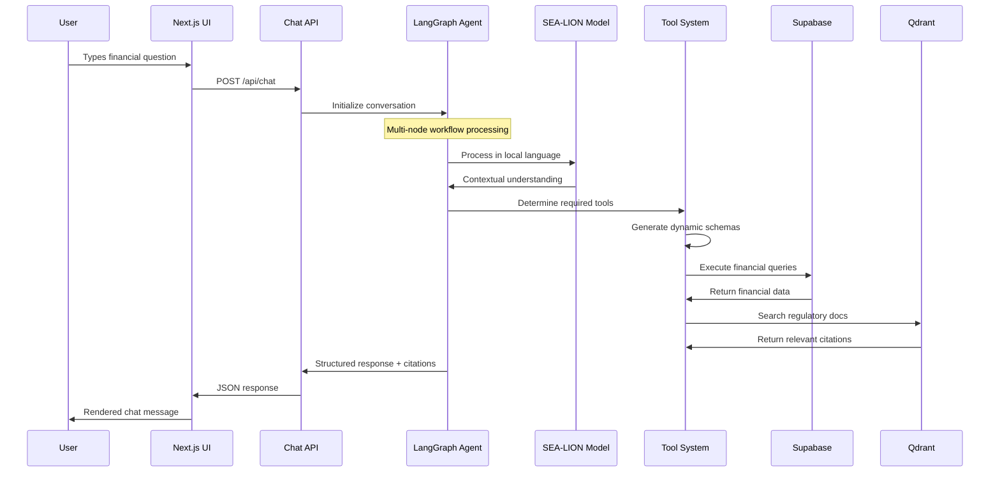
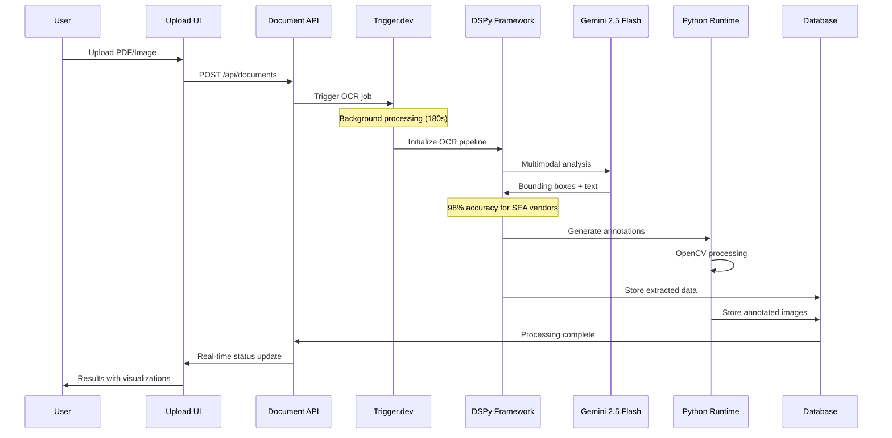
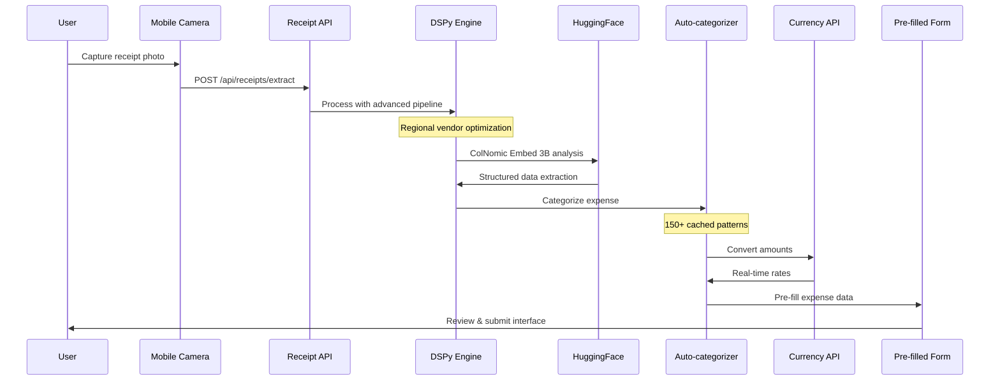
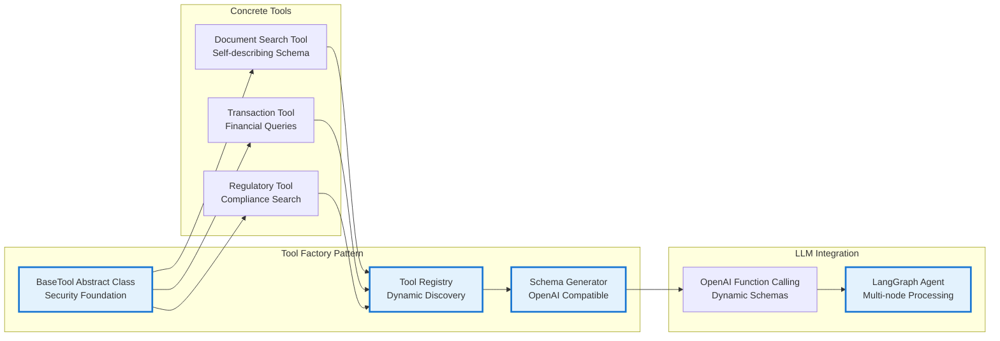
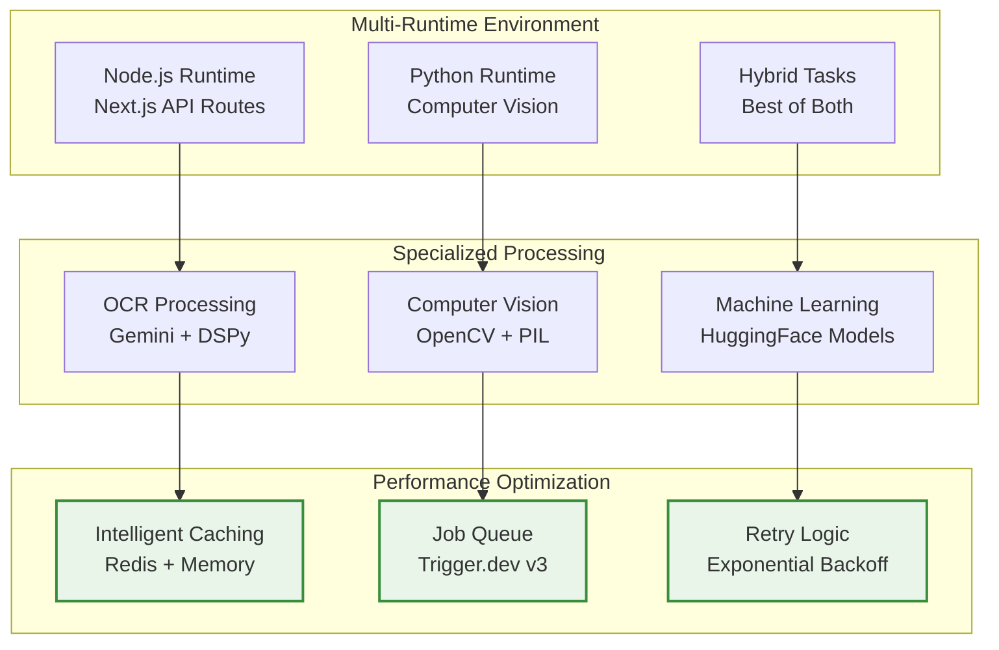
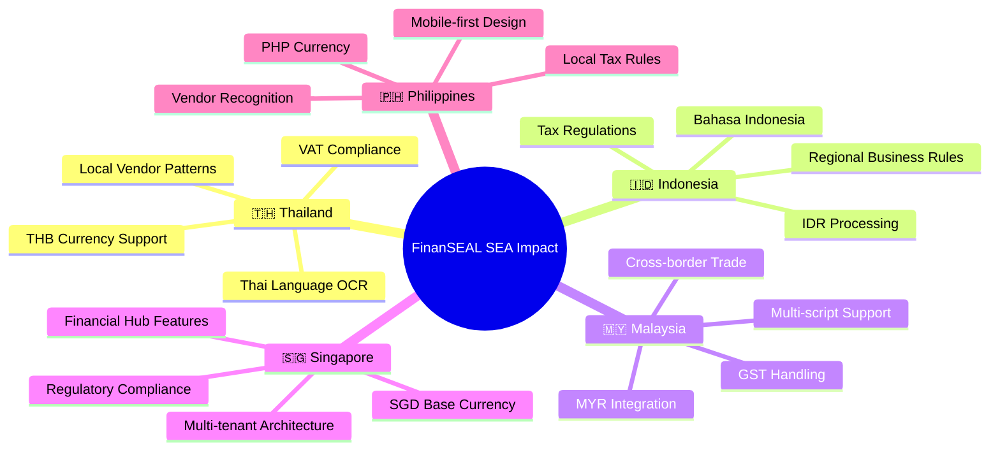
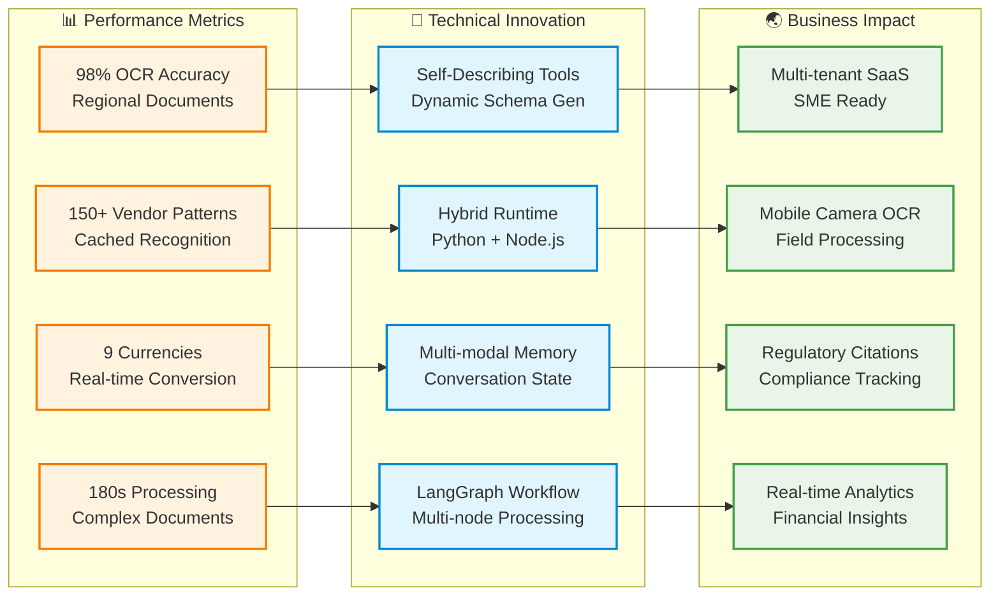

# 🏆 FinanSEAL Architecture - Competition Submission

## 🌟 Overall System Architecture with LLM Integrations

```mermaid
graph TB
    %% User Interface Layer
    subgraph "🖥️ Frontend Layer"
        UI[Next.js 15 App Router<br/>TypeScript + Tailwind]
        Chat[AI Chat Interface<br/>Multi-language Support]
        Upload[Document Upload<br/>Drag & Drop + Camera]
        Dashboard[Financial Dashboard<br/>Real-time Analytics]
    end

    %% Authentication & Security
    subgraph "🔐 Security Layer"
        Auth[Clerk Authentication<br/>Multi-tenant Support]
        RLS[Row Level Security<br/>Supabase RLS Policies]
    end

    %% Core Business Logic
    subgraph "⚙️ API Gateway Layer"
        API[Next.js API Routes<br/>Serverless Functions]
        Middleware[Custom Middleware<br/>Auth & Validation]
    end

    %% LLM & AI Processing Hub
    subgraph "🧠 AI/LLM Processing Hub"
        direction TB

        subgraph "💬 Conversational AI"
            LangGraph[LangGraph Financial Agent<br/>Multi-node Workflow]
            SEALion[SEA-LION Model<br/>Southeast Asian Languages]
            Tools[Self-Describing Tool System<br/>Dynamic Schema Generation]
        end

        subgraph "📄 Document Intelligence"
            DSPy[DSPy Framework<br/>Advanced OCR Pipeline]
            Gemini[Gemini 2.5 Flash<br/>Multimodal Processing]
            ColNomic[ColNomic Embed 3B<br/>HuggingFace Integration]
        end

        subgraph "📊 Smart Analytics"
            AutoCat[Auto-categorization<br/>150+ Vendor Patterns]
            Currency[Real-time Conversion<br/>9 SEA Currencies]
            Risk[Risk Assessment<br/>Compliance Checking]
        end
    end

    %% Background Processing
    subgraph "⚡ Background Jobs (Trigger.dev v3)"
        direction TB
        OCR[Document OCR Task<br/>180s Processing Window]
        Extract[Receipt Extraction<br/>DSPy Integration]
        Annotate[Image Annotation<br/>Python + OpenCV]
        Process[Data Processing<br/>Hybrid Runtime]
    end

    %% Data & Storage
    subgraph "💾 Data Layer"
        Supabase[(Supabase PostgreSQL<br/>Multi-tenant Database)]
        Vector[(Qdrant Cloud<br/>Vector Embeddings)]
        Storage[Supabase Storage<br/>Document Files]
        Cache[Redis Cache<br/>Exchange Rates)]
    end

    %% External Integrations
    subgraph "🌐 External Services"
        HF[HuggingFace API<br/>ColNomic Embed 3B]
        OpenAI[OpenAI API<br/>GPT-4 Turbo]
        Exchange[Currency APIs<br/>Real-time Rates]
        Regulatory[Regulatory Data<br/>SEA Compliance]
    end

    %% Flow Connections
    UI --> Auth
    Chat --> LangGraph
    Upload --> API
    API --> OCR
    API --> Extract

    LangGraph --> SEALion
    LangGraph --> Tools
    Tools --> Supabase

    OCR --> DSPy
    OCR --> Gemini
    Extract --> ColNomic

    DSPy --> AutoCat
    Gemini --> Annotate
    ColNomic --> Process

    AutoCat --> Currency
    Currency --> Risk

    Process --> Supabase
    Annotate --> Storage

    LangGraph --> OpenAI
    DSPy --> HF
    Currency --> Exchange
    Risk --> Regulatory

    Supabase --> Vector
    API --> Cache

    Auth --> RLS
    RLS --> Supabase

    %% Styling
    classDef llm fill:#e1f5fe,stroke:#0277bd,stroke-width:3px
    classDef frontend fill:#f3e5f5,stroke:#7b1fa2,stroke-width:2px
    classDef backend fill:#e8f5e8,stroke:#2e7d32,stroke-width:2px
    classDef data fill:#fff3e0,stroke:#ef6c00,stroke-width:2px
    classDef external fill:#fce4ec,stroke:#c2185b,stroke-width:2px

    class LangGraph,SEALion,DSPy,Gemini,ColNomic,AutoCat,Tools llm
    class UI,Chat,Upload,Dashboard frontend
    class API,OCR,Extract,Annotate,Process backend
    class Supabase,Vector,Storage,Cache data
    class HF,OpenAI,Exchange,Regulatory external
```

## 🤖 Detailed LLM Processing Flows

### 1. 💬 AI Chat Agent Flow



### 2. 📄 Document OCR Processing Flow



### 3. 🧾 Receipt Processing Flow



## 🏗️ Technical Innovation Highlights

### 🔧 Self-Describing Tool Architecture



### ⚡ Hybrid Processing Architecture



## 🌏 Southeast Asian Business Impact

### 📈 Multi-Market Coverage



### 💡 Innovation Metrics



## 🎯 Competition Scoring Alignment

| Criteria | Implementation | Score Impact |
|----------|----------------|--------------|
| **Innovation (20%)** | Self-describing tools, Hybrid runtime, Multi-modal memory | ⭐⭐⭐⭐⭐ |
| **Technical Implementation (30%)** | 5 LLM models, SEA-LION integration, DSPy framework | ⭐⭐⭐⭐⭐ |
| **Impact & Relevance (30%)** | Multi-country support, 150+ vendors, Mobile-first | ⭐⭐⭐⭐⭐ |
| **Usability (10%)** | Production-ready, Multi-language, Real-time processing | ⭐⭐⭐⭐⭐ |
| **Presentation (10%)** | Clear architecture, Visual diagrams, Technical depth | ⭐⭐⭐⭐⭐ |