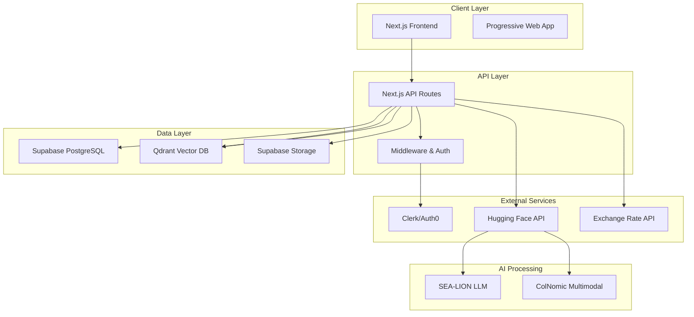

# Design Document

## Overview

FinanSEAL MVP is a multi-modal financial co-pilot web application built with a modern serverless architecture. The system leverages Next.js for the frontend, Supabase for backend services and database, and integrates multiple AI models for intelligent document processing and conversational guidance. The architecture is designed to be scalable, secure, and optimized for Southeast Asian SME users with varying digital literacy levels.

The application follows a component-based architecture with clear separation of concerns, enabling efficient development and maintenance while providing a seamless user experience across desktop and mobile devices.

## Architecture

### High-Level Architecture



### Technology Stack Integration

- **Frontend**: Next.js 14 with App Router, TypeScript, Tailwind CSS
- **Backend**: Next.js API routes with serverless functions
- **Database**: Supabase PostgreSQL with Row Level Security (RLS)
- **Authentication**: Clerk for user management and session handling
- **File Storage**: Supabase Storage for document uploads
- **Vector Database**: Qdrant Cloud for embedding storage and similarity search
- **AI Models**: Hugging Face Inference API for SEA-LION and ColNomic models
- **Deployment**: Vercel (preferred) or AWS/GCP serverless setup

## Components and Interfaces

### Frontend Components

#### Core Layout Components
- **DashboardLayout**: Main application shell with navigation and user context
- **AuthGuard**: Route protection wrapper ensuring authenticated access
- **LoadingSpinner**: Consistent loading states across the application
- **ErrorBoundary**: Global error handling and user-friendly error displays

#### Feature-Specific Components
- **FileUploadZone**: Web drag-and-drop interface supporting images and PDFs (both mandatory for MVP)
- **TransactionForm**: Editable form for confirming extracted transaction data
- **TransactionList**: Dashboard view displaying all user transactions
- **CurrencyConverter**: Real-time currency conversion display component
- **ChatInterface**: Text-based conversational UI for financial guidance (English, Thai, Indonesian)
- **LanguageSelector**: Simple dropdown for switching between supported languages

#### Utility Components
- **CurrencySelector**: Dropdown for selecting home currency
- **FilePreview**: Preview component for uploaded documents
- **ConfirmationModal**: Reusable modal for user confirmations
- **Toast**: Non-intrusive notifications for user feedback

### API Interfaces

#### Document Processing API
```typescript
// POST /api/documents/process
interface ProcessDocumentRequest {
  fileId: string;
  fileType: 'image' | 'pdf';
  userId: string;
}

interface ProcessDocumentResponse {
  success: boolean;
  extractedData: {
    vendor: string;
    amount: number;
    currency: string;
    date: string;
    lineItems?: Array<{
      description: string;
      amount: number;
    }>;
  };
  confidence: number;
  processingMethod: 'multimodal' | 'text-extraction' | 'pdf-extraction';
}
```

#### Chat API
```typescript
// POST /api/chat
interface ChatRequest {
  message: string;
  conversationId?: string;
  userId: string;
  context?: 'regulatory' | 'educational' | 'general';
}

interface ChatResponse {
  response: string;
  conversationId: string;
  confidence: number;
  sources?: string[];
}
```

#### Transaction API
```typescript
// GET /api/transactions
interface TransactionListResponse {
  transactions: Array<Transaction & {
    homeCurrencyAmount: number; // Calculated dynamically based on user's current home currency
  }>;
  totalCount: number;
  cashFlow: {
    totalIncome: number; // In user's current home currency
    totalExpenses: number; // In user's current home currency
    netFlow: number; // In user's current home currency
    homeCurrency: string;
  };
}

// POST /api/transactions
interface CreateTransactionRequest {
  vendor: string;
  amount: number;
  originalCurrency: string;
  date: string;
  category: string;
  lineItems?: LineItem[];
  documentId?: string;
}
```

## Data Models

### Database Schema (Supabase PostgreSQL)

#### Users Table
```sql
CREATE TABLE users (
  id UUID PRIMARY KEY DEFAULT gen_random_uuid(),
  clerk_user_id VARCHAR UNIQUE NOT NULL,
  email VARCHAR NOT NULL,
  home_currency VARCHAR(3) DEFAULT 'USD',
  onboarding_completed BOOLEAN DEFAULT FALSE,
  created_at TIMESTAMP WITH TIME ZONE DEFAULT NOW(),
  updated_at TIMESTAMP WITH TIME ZONE DEFAULT NOW()
);
```

#### Transactions Table
```sql
CREATE TABLE transactions (
  id UUID PRIMARY KEY DEFAULT gen_random_uuid(),
  user_id UUID REFERENCES users(id) ON DELETE CASCADE,
  vendor VARCHAR NOT NULL,
  amount DECIMAL(12,2) NOT NULL,
  original_currency VARCHAR(3) NOT NULL,
  exchange_rate DECIMAL(10,6), -- Rate at time of transaction for historical accuracy
  transaction_date DATE NOT NULL,
  category VARCHAR,
  type VARCHAR CHECK (type IN ('income', 'expense')) DEFAULT 'expense',
  document_id UUID,
  created_at TIMESTAMP WITH TIME ZONE DEFAULT NOW(),
  updated_at TIMESTAMP WITH TIME ZONE DEFAULT NOW()
);
```

#### Line Items Table
```sql
CREATE TABLE line_items (
  id UUID PRIMARY KEY DEFAULT gen_random_uuid(),
  transaction_id UUID REFERENCES transactions(id) ON DELETE CASCADE,
  description VARCHAR NOT NULL,
  amount DECIMAL(10,2) NOT NULL,
  quantity INTEGER DEFAULT 1,
  created_at TIMESTAMP WITH TIME ZONE DEFAULT NOW()
);
```

#### Documents Table
```sql
CREATE TABLE documents (
  id UUID PRIMARY KEY DEFAULT gen_random_uuid(),
  user_id UUID REFERENCES users(id) ON DELETE CASCADE,
  file_name VARCHAR NOT NULL,
  file_type VARCHAR NOT NULL,
  file_size INTEGER,
  storage_path VARCHAR NOT NULL,
  processing_status VARCHAR CHECK (processing_status IN ('pending', 'processing', 'completed', 'failed')) DEFAULT 'pending',
  extracted_data JSONB,
  created_at TIMESTAMP WITH TIME ZONE DEFAULT NOW()
);
```

#### Conversations Table
```sql
CREATE TABLE conversations (
  id UUID PRIMARY KEY DEFAULT gen_random_uuid(),
  user_id UUID REFERENCES users(id) ON DELETE CASCADE,
  title VARCHAR,
  context_type VARCHAR,
  created_at TIMESTAMP WITH TIME ZONE DEFAULT NOW(),
  updated_at TIMESTAMP WITH TIME ZONE DEFAULT NOW()
);

CREATE TABLE messages (
  id UUID PRIMARY KEY DEFAULT gen_random_uuid(),
  conversation_id UUID REFERENCES conversations(id) ON DELETE CASCADE,
  role VARCHAR CHECK (role IN ('user', 'assistant')) NOT NULL,
  content TEXT NOT NULL,
  created_at TIMESTAMP WITH TIME ZONE DEFAULT NOW()
);
```

### Vector Database Schema (Qdrant)

#### Document Embeddings Collection
```typescript
interface DocumentEmbedding {
  id: string;
  vector: number[]; // 1024-dimensional embedding from ColNomic
  payload: {
    userId: string;
    documentId: string;
    documentType: 'receipt' | 'invoice' | 'statement';
    extractedText: string;
    vendor: string;
    amount: number;
    currency: string;
    date: string;
    createdAt: string;
  };
}
```

## UI Design Approach

### Design System
The MVP uses a single, standardized dark theme optimized for professional financial applications:

```css
/* MVP Color Palette */
:root {
  --primary-color: #0066CC;        /* Trust blue */
  --primary-dark: #004499;         /* Darker blue for hover states */
  --secondary-color: #6C757D;      /* Neutral gray */
  --success-color: #28A745;        /* Success green */
  --warning-color: #FFC107;        /* Warning amber */
  --error-color: #DC3545;          /* Error red */
  
  /* Dark theme base */
  --bg-primary: #1A1A1A;           /* Main background */
  --bg-secondary: #2D2D2D;         /* Card/component background */
  --text-primary: #FFFFFF;         /* Primary text */
  --text-secondary: #B0B0B0;       /* Secondary text */
  --border-color: #404040;         /* Borders and dividers */
}
```

### Language Support
The MVP supports three languages:
- **English**: Primary interface language
- **Thai**: For Thai market users
- **Indonesian**: For Indonesian market users

Language switching implemented via simple dropdown selector. All AI interactions support these three languages through SEA-LION model.

## Error Handling

### Client-Side Error Handling
- **Network Errors**: Retry logic with exponential backoff for API calls
- **File Upload Errors**: Clear error messages with suggested file formats and size limits
- **Authentication Errors**: Automatic redirect to login with session restoration
- **Validation Errors**: Real-time form validation with inline error messages
- **Cultural Error Messaging**: Localized error messages with appropriate tone and context

### Server-Side Error Handling
- **AI Model Failures**: Graceful degradation with fallback processing methods
- **Database Errors**: Transaction rollback and consistent error logging
- **External API Failures**: Circuit breaker pattern with cached fallbacks
- **File Processing Errors**: Detailed error classification for user guidance
- **Cultural Context Preservation**: Error messages maintain cultural appropriateness

### Error Response Format
```typescript
interface ErrorResponse {
  success: false;
  error: {
    code: string;
    message: string;
    localizedMessage?: string; // Cultural adaptation
    details?: any;
    retryable: boolean;
    culturalContext?: string;
  };
  requestId: string;
}
```

## Testing Strategy

### Unit Testing
- **Component Testing**: React Testing Library for UI component behavior
- **API Testing**: Jest for API route logic and data transformations
- **Utility Testing**: Pure function testing for currency conversion and data validation
- **Database Testing**: Supabase local development with test data fixtures

### Integration Testing
- **Authentication Flow**: End-to-end user registration and login testing
- **Document Processing**: Mock AI model responses for consistent testing
- **Database Operations**: Transaction integrity and RLS policy testing
- **External API Integration**: Mock external services with realistic responses

### End-to-End Testing
- **User Workflows**: Playwright for complete user journey testing
- **Cross-Browser Testing**: Chrome, Firefox, Safari compatibility
- **Mobile Responsiveness**: Touch interaction and responsive design testing
- **Performance Testing**: Core Web Vitals and loading time optimization

### AI Model Testing
- **Model Response Validation**: Schema validation for AI model outputs
- **Confidence Threshold Testing**: Ensuring appropriate confidence levels
- **Fallback Mechanism Testing**: Behavior when AI models are unavailable
- **Multi-language Testing**: SEA-LION responses in various Southeast Asian contexts

## Security Considerations

### Authentication & Authorization
- **JWT Token Management**: Secure token storage and automatic refresh
- **Row Level Security**: Supabase RLS policies for data isolation
- **API Rate Limiting**: Prevent abuse of AI model endpoints
- **Session Management**: Secure session handling with proper expiration

### Data Protection
- **Encryption**: All sensitive data encrypted at rest and in transit
- **PII Handling**: Minimal collection and secure storage of personal information
- **File Upload Security**: Virus scanning and file type validation
- **Database Security**: Parameterized queries and input sanitization

### API Security
- **CORS Configuration**: Proper cross-origin resource sharing setup
- **Input Validation**: Comprehensive validation of all user inputs
- **Prompt Injection Prevention**: Input sanitization and validation for LLM queries to prevent malicious prompt manipulation
- **Error Information**: Sanitized error messages to prevent information leakage
- **Audit Logging**: Comprehensive logging for security monitoring

## Performance Optimization

### Frontend Performance
- **Code Splitting**: Dynamic imports for feature-based code splitting
- **Image Optimization**: Next.js Image component with automatic optimization
- **Caching Strategy**: Aggressive caching of static assets and API responses
- **Bundle Analysis**: Regular bundle size monitoring and optimization

### Backend Performance
- **Database Indexing**: Optimized indexes for common query patterns
- **Connection Pooling**: Efficient database connection management
- **Currency Conversion Caching**: Cache exchange rates with appropriate TTL to reduce API calls
- **Dynamic Currency Calculation**: Real-time conversion based on stored exchange rates and current user preferences
- **API Response Optimization**: Minimal payload sizes and efficient serialization

### AI Model Performance
- **Request Batching**: Batch processing for multiple document uploads
- **Model Caching**: Cache frequently requested model responses
- **Async Processing**: Background processing for time-intensive operations
- **Load Balancing**: Distribute AI model requests across multiple endpoints

V. Post-MVP Architecture: The Agentic Core
This section details the architectural upgrade required to transform FinanSEAL into an agentic system. This moves beyond a simple RAG pipeline to a multi-step, tool-based reasoning framework.

A. High-Level Agentic Architecture
The core of this new architecture is an Orchestrator that manages a suite of specialized "tools" to fulfill a user's request.
graph TD
    subgraph "User Interaction Layer"
        UserQuery["User Asks Complex Question"]
    end
    
    subgraph "Agentic Core (Backend API)"
        Orchestrator["Brain: The Orchestrator (Plans & Dispatches)"]
        Synthesizer["Synthesizer (SEA-LION LLM)"]
        Toolbox["Toolbox (Abstraction Layer)"]
    end

    subgraph "Specialist Tools (Internal Agents)"
        T1["Tool: RegulatoryResearcher"]
        T2["Tool: TaxAnalyst"]
        T3["Tool: BankingAdvisor"]
        T4["Tool: UserDataRetriever"]
    end

    subgraph "Knowledge & Data Sources"
        QDRANT["Qdrant Vector DB (Regulations, etc.)"]
        SUPABASE["Supabase PostgreSQL (User Data, Transactions)"]
        API["External APIs (e.g., Real-time Tax Info)"]
    end

    UserQuery --> Orchestrator
    Orchestrator --> Toolbox
    Toolbox --> T1 & T2 & T3 & T4
    T1 --> QDRANT
    T2 --> QDRANT
    T3 --> QDRANT
    T4 --> SUPABASE
    T1 & T2 & T3 & T4 --> Orchestrator
    Orchestrator --> Synthesizer
    Synthesizer --> FinalResponse["Final, Structured Response"]
    FinalResponse --> UserQuery

B. Component Breakdown
1. The Orchestrator (The "Brain"):
- Description: This is the central component, acting as the application's "MCP." It receives the user's query, uses an LLM to create a multi-step execution plan, and then calls the necessary tools in the correct sequence. It gathers the results and passes them to the Synthesizer.
- Technology: This can be implemented using a framework like LangChain Agents or LlamaIndex, or a custom-built state machine within our Next.js backend.
2. The Toolbox (Abstraction Layer):
- Description: This is not a specific service but a design pattern. We will define a generic Tool interface (e.g., interface Tool { name: string; description: string; execute(input: any): Promise<any>; }). This allows us to easily create and register new tools without changing the Orchestrator's core logic.
3. The Specialist "Tools" (Internal Agents):
- RegulatoryResearcher: Queries the Qdrant vector database for information on business laws, licenses, and registration requirements.
- TaxAnalyst: Queries a dedicated vector collection in Qdrant or a structured table in Supabase for tax rates, filing deadlines, and VAT information.
- BankingAdvisor: Queries the knowledge base for information on opening business bank accounts, required documentation, and major financial institutions.
- UserDataRetriever: A secure, internal tool that makes a read-only call to our Supabase database to fetch the logged-in user's profile information to personalize the query. This tool will never write data.
4. The Synthesizer (Final LLM Call):
- Description: This is the final, crucial step. The Orchestrator provides the SEA-LION LLM with the user's original question and all the evidence gathered by the tools. The prompt explicitly instructs the LLM to use only the provided evidence to construct a final, comprehensive answer, which drastically reduces hallucinations and improves accuracy.

C. Data Model Considerations
To support this new agentic functionality, we will need to add a new table for logging and auditing these complex interactions.

agentic_tasks Table
CREATE TABLE agentic_tasks (
  id UUID PRIMARY KEY DEFAULT gen_random_uuid(),
  user_id UUID REFERENCES users(id) ON DELETE CASCADE,
  conversation_id UUID REFERENCES conversations(id),
  initial_query TEXT NOT NULL,
  execution_plan JSONB, -- The plan generated by the orchestrator
  tools_used TEXT[],     -- An array of tool names that were called
  final_response TEXT,
  status VARCHAR CHECK (status IN ('processing', 'completed', 'failed')) DEFAULT 'processing',
  created_at TIMESTAMP WITH TIME ZONE DEFAULT NOW(),
  completed_at TIMESTAMP WITH TIME ZONE
);