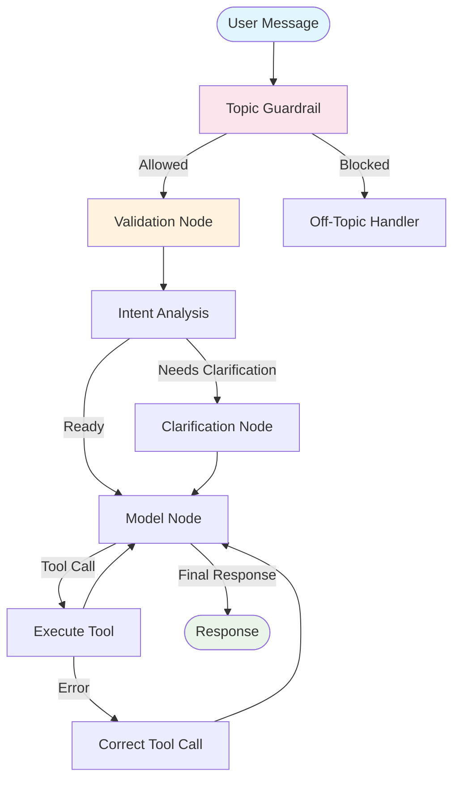

# Architecture Overview

## System Design Philosophy

The FinanSEAL AI Chat Agent follows a **security-first, phase-driven architecture** built on LangGraph's state management capabilities. Every component prioritizes user authentication, data privacy, and system reliability.

## Core Components

### 1. **Agent State Management** (`src/lib/agent/types.ts`)

The `AgentState` serves as the central nervous system, tracking:

```typescript
interface AgentState {
  messages: BaseMessage[]           // Conversation history (max 50 messages)
  language: string                  // User language preference
  userContext: UserContext          // MANDATORY authenticated user data
  securityValidated: boolean        // Security checkpoint status
  failureCount: number              // Circuit breaker failure tracking
  currentIntent: UserIntent | null  // LLM-analyzed user intent
  needsClarification: boolean       // Clarification requirement flag
  clarificationQuestions: string[]  // Generated clarification prompts
  currentPhase: ProcessingPhase     // Workflow phase tracking
  citations: CitationData[]         // Accumulated regulatory citations
  isTopicAllowed: boolean          // Topic guardrail validation
  isClarificationResponse: boolean  // Response type detection
}
```

### 2. **LangGraph Workflow** (`src/lib/langgraph-agent.ts`)



### 3. **Processing Phases**

The agent operates through distinct phases to ensure proper validation and processing:

1. **`validation`** - User authentication and security checks
2. **`intent_analysis`** - LLM-powered query understanding
3. **`clarification`** - Missing context collection
4. **`execution`** - Tool execution and response generation
5. **`completed`** - Final response delivery

### 4. **Security Layers**

#### Layer 1: Topic Guardrails (`guardrail-nodes.ts`)
- LLM-powered topic classification
- Blocks non-financial/business queries
- Multi-language rejection messages

#### Layer 2: User Validation (`validation-node.ts`)
- Mandatory user context verification
- Clerk authentication integration
- Database user existence validation

#### Layer 3: Tool Security (`base-tool.ts`)
- RLS-enforced database queries
- Authenticated Supabase client creation
- Parameter validation and sanitization

### 5. **Tool System Architecture**

#### Self-Describing Tools Pattern

```typescript
abstract class BaseTool {
  // Security-first execution wrapper
  async execute(parameters: ToolParameters, userContext: UserContext): Promise<ToolResult>

  // Self-describing schema generation
  abstract getToolSchema(modelType?: ModelType): OpenAIToolSchema

  // Mandatory security implementations
  protected abstract validateParameters(parameters: ToolParameters): Promise<{valid: boolean; error?: string}>
  protected abstract executeInternal(parameters: ToolParameters, userContext: UserContext): Promise<ToolResult>
}
```

#### Tool Factory Registry (`tool-factory.ts`)

```typescript
export class ToolFactory {
  private static tools: Map<string, BaseTool> = new Map([
    ['transaction-lookup', new TransactionLookupTool()],
    ['document-search', new DocumentSearchTool()],
    ['get-vendors', new GetVendorsTool()],
    ['regulatory-knowledge', new RegulatoryKnowledgeTool()]
  ]);

  // Dynamic schema generation for LLM function calling
  static getToolSchemas(modelType: ModelType = 'openai'): OpenAIToolSchema[]
}
```

## Key Architectural Patterns

### 1. **Immutable State Updates**
- LangGraph annotations ensure thread-safe state transitions
- Functional reducers prevent state corruption
- Automatic conversation trimming (50 message limit)

### 2. **Circuit Breaker Pattern** (`router.ts`)
```typescript
function checkCircuitBreaker(state: AgentState): {shouldBreak: boolean; reason?: string} {
  // 4 unified protection mechanisms:
  // 1. Turn length protection (max 8 messages per turn)
  // 2. State-based failure tracking (max 3 consecutive failures)
  // 3. Repeated "no results" detection (max 2 in turn)
  // 4. Tool failure cascade protection (max 3 failures in turn)
}
```

### 3. **Phase-Based Routing**
- Deterministic workflow progression
- Intelligent backtracking on errors
- Clarification loop management

### 4. **Memory Management**
- Citation deduplication by ID
- Conversation context trimming
- Strategic citation reset on new turns

## Database Integration

### Row Level Security (RLS)
All database operations enforce user-based access control:

```sql
-- Example RLS policy
CREATE POLICY "Users can only access their own transactions" ON transactions
    FOR ALL USING (user_id = auth.uid());
```

### Authenticated Client Pattern
```typescript
// Each tool receives an authenticated Supabase client
this.authenticatedSupabase = await createAuthenticatedSupabaseClient(userContext.userId)

// All queries automatically enforce RLS
const { data } = await this.authenticatedSupabase
  .from('transactions')
  .select('*')  // RLS automatically filters by user
```

### Performance Optimization

#### Database Indexes
Critical composite indexes for performance:
```sql
-- Transaction lookup optimization
CREATE INDEX idx_transactions_user_date ON transactions(user_id, transaction_date DESC);
CREATE INDEX idx_transactions_user_doctype_date ON transactions(user_id, document_type, transaction_date DESC);
```

#### Query Structure
- Filter by user_id first (leverages RLS + indexes)
- Apply high-confidence filters before complex logic
- Use ordering after filters for index efficiency

## Scalability Considerations

### Horizontal Scaling
- Stateless node processing (all state in AgentState)
- Database connection pooling via Supabase
- Independent tool execution (no shared state)

### Performance Monitoring
- Execution time tracking in ToolResult
- Circuit breaker metrics logging
- Database query performance monitoring

### Memory Optimization
- Conversation history limits (50 messages)
- Citation cleanup strategies
- Efficient state serialization

## Security Best Practices Implemented

1. **Authentication**: Multi-layer user validation
2. **Authorization**: RLS enforcement at database level
3. **Input Validation**: Parameter sanitization and validation
4. **PII Protection**: Secure logging practices (no sensitive data)
5. **Rate Limiting**: Circuit breaker patterns prevent abuse
6. **Audit Trails**: Comprehensive logging for security events

## Integration Points

### Frontend Integration
- Chat API endpoint: `/api/chat` (Next.js route)
- Conversation management with Supabase storage
- Real-time citation delivery and display

### External Services
- **LLM APIs**: OpenAI-compatible endpoints via `ai-config.ts`
- **Vector Search**: Qdrant integration for regulatory knowledge
- **Document Processing**: Trigger.dev background jobs
- **Authentication**: Clerk user management integration

---

*This architecture ensures secure, scalable, and maintainable conversational AI for Southeast Asian SME financial guidance.*