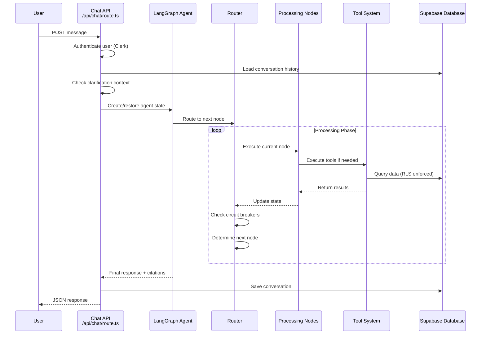

# Agent Flow

## Complete Conversation Processing Flow

This document describes the complete flow of how a user message is processed through the FinanSEAL AI Chat Agent system.

## High-Level Flow Diagram



## Phase-by-Phase Processing

### Phase 1: Topic Guardrail (`topicGuardrail` → `handleOffTopic`)

**Purpose**: Ensure queries are relevant to financial/business topics

```typescript
// Input: Raw user message
// Node: guardrail-nodes.ts → topicGuardrail()

Classification Rules:
✅ ALLOWED: Tax, GST, business setup, transactions, compliance
❌ BLOCKED: Entertainment, geography, personal chat, technical support
🔄 CLARIFICATION: Short answers to business questions

// LLM Classification Prompt
const result = await llm.classify(userQuery)
// → "ALLOWED" | "BLOCKED" | "CLARIFICATION"

// Routing Decision
if (result === "BLOCKED") → handleOffTopic
if (result === "ALLOWED") → validate
```

**Output**: `isTopicAllowed: boolean`, `isClarificationResponse: boolean`

### Phase 2: Security Validation (`validate`)

**Purpose**: Mandatory authentication and security verification

```typescript
// Node: validation-node.ts → validate()

Security Checks:
1. ✓ UserContext exists and valid
2. ✓ UserId format validation
3. ✓ Database user existence verification
4. ✓ Conversation ownership validation

// Critical Security Pattern
if (!state.userContext?.userId) {
  return {
    currentPhase: 'completed',  // End conversation immediately
    securityValidated: false
  }
}
```

**Output**: `securityValidated: boolean`, `currentPhase: 'intent_analysis'`

### Phase 3: Intent Analysis (`analyzeIntent`)

**Purpose**: LLM-powered understanding of user intent and context needs

```typescript
// Node: intent-node.ts → analyzeIntent()

Intent Categories:
- regulatory_knowledge (GST, tax regulations)
- business_setup (incorporation, compliance)
- transaction_analysis (spending patterns, history)
- document_search (invoice processing, receipts)
- compliance_check (regulatory requirements)
- general_inquiry (broad financial questions)

Context Analysis:
- Country detection (Singapore, Malaysia, Thailand, Indonesia)
- Business type (SME, individual, corporate, startup)
- Missing information identification
- Clarification requirement assessment
```

**LLM Processing**:
```typescript
const intentPrompt = `Analyze this financial query and determine:
1. Primary intent category
2. Required context (country, business type, etc.)
3. Missing information that needs clarification
4. Confidence level (0-1)

Query: "${userMessage}"
Response format: JSON only`

const result = await llm.analyze(intentPrompt)
// → UserIntent object with confidence and context needs
```

**Output**: `currentIntent: UserIntent`, routing to clarification or execution

### Phase 4: Clarification Handling (`handleClarification`)

**Purpose**: Collect missing context through targeted questions

```typescript
// Node: clarification-node.ts → handleClarification()

Clarification Triggers:
- Low intent confidence (<0.7)
- Missing required context (country, business type)
- Ambiguous query requirements
- Insufficient information for tool execution

Question Generation:
const questions = [
  "Which country are you planning to set up your business in?",
  "What type of business structure are you considering?",
  "What industry will your business operate in?",
  "When are you planning to start operations?"
]

Metadata Preservation:
{
  clarification_pending: true,
  agent_state: completeAgentState,  // For restoration
  original_query: userMessage
}
```

**Output**: Clarification questions + preserved state for continuation

### Phase 5: Model Interaction (`callModel`)

**Purpose**: LLM tool calling and response generation

```typescript
// Node: model-node.ts → callModel()

Tool Schema Generation:
const tools = ToolFactory.getToolSchemas('openai')
// → Dynamic OpenAI function schemas from self-describing tools

LLM System Prompt:
- Role: Southeast Asian SME financial co-pilot
- Capabilities: Transaction analysis, regulatory guidance, document processing
- Language: User's preferred language (en/th/id)
- Context: User's established facts and conversation history

Tool Call Decision:
if (needsData) → Generate tool_calls
if (hasInformation) → Generate final response
```

**Output**: Tool calls for execution OR final AI response

### Phase 6: Tool Execution (`executeTool`)

**Purpose**: Execute tools with security validation and error handling

```typescript
// Node: tool-nodes.ts → executeTool()

Security Pattern:
1. Tool factory lookup and validation
2. Parameter security validation
3. User context authentication
4. RLS-enforced database execution
5. Result sanitization and formatting

Error Handling:
try {
  const result = await tool.execute(parameters, userContext)
  // Update failure count on errors
  // Circuit breaker evaluation
} catch (error) {
  state.failureCount += 1
  // Attempt tool call correction
}
```

**Available Tools**:
- `get_transactions`: Financial transaction queries with advanced filtering
- `search_documents`: Document and regulatory knowledge search
- `get_vendors`: Vendor and supplier information
- `regulatory_knowledge`: Tax and compliance guidance

**Output**: Tool results → back to `callModel` for response generation

## Router Logic and Circuit Breakers

### Intelligent Routing (`router.ts`)

```typescript
export function router(state: AgentState): string {
  // 1. Circuit breaker evaluation (prevents infinite loops)
  const breakerResult = checkCircuitBreaker(state)
  if (breakerResult.shouldBreak) return END

  // 2. Phase-based routing
  switch (state.currentPhase) {
    case 'validation': return 'validate'
    case 'intent_analysis': return 'analyzeIntent'
    case 'clarification': return 'handleClarification'
    case 'execution': return 'callModel'
    case 'completed': return END
  }

  // 3. Message type routing
  const messageType = lastMessage._getType()
  if (messageType === 'ai' && hasToolCalls) return 'executeTool'
  if (messageType === 'tool') return 'callModel'

  return 'callModel'  // Default: generate response
}
```

### Circuit Breaker Protection

```typescript
function checkCircuitBreaker(state: AgentState): {shouldBreak: boolean; reason?: string} {
  const currentTurn = getCurrentTurnMessages(state)

  // Protection 1: Turn length (max 8 messages per turn)
  if (currentTurn.length > 8) {
    return {shouldBreak: true, reason: "Turn too long"}
  }

  // Protection 2: State failure count (max 3 consecutive failures)
  if (state.failureCount >= 3) {
    return {shouldBreak: true, reason: "Too many consecutive failures"}
  }

  // Protection 3: Repeated "no results" (max 2 per turn)
  const noResultsCount = countNoResultsMessages(currentTurn)
  if (noResultsCount >= 2) {
    return {shouldBreak: true, reason: "Repeated no results"}
  }

  // Protection 4: Tool failure cascade (max 3 tool failures per turn)
  const toolFailures = countToolFailures(currentTurn)
  if (toolFailures >= 3) {
    return {shouldBreak: true, reason: "Tool failure cascade"}
  }

  return {shouldBreak: false}
}
```

## Conversation Context Management

### State Restoration for Clarifications

```typescript
// When user provides clarification response:
if (isClarificationResponse.isResponse) {
  // Restore complete agent state from database metadata
  agentState = isClarificationResponse.originalState

  // Critical fixes:
  agentState.userContext = currentUserContext  // Prevent validation loop
  agentState.currentPhase = 'execution'        // Reset from 'completed'
  agentState.needsClarification = false        // Clear clarification flags
  agentState.isClarificationResponse = true    // Mark as clarification
}
```

### Memory Management

```typescript
// Conversation history limits (prevent context overflow)
const conversationHistory = messages.slice(-50)  // Last 50 messages

// Citation management (prevent memory bloat)
if (isNewTurn && !isClarificationResponse) {
  state.citations = []  // Reset citations for new conversations
}

// Message deduplication and trimming
const trimmedMessages = AgentStateAnnotation.messages.reducer(existing, new)
```

## Error Handling and Recovery

### Tool Call Correction (`correctToolCall`)

```typescript
// When LLM generates malformed tool calls
if (message.finish_reason === 'tool_calls' && !message.tool_calls?.length) {
  // Route to correction node
  return 'correctToolCall'
}

// Correction strategies:
1. Parameter validation and fixing
2. Tool name normalization
3. Schema compliance enforcement
4. Fallback to simpler queries
```

### Failure Recovery Patterns

```typescript
// Graceful degradation on tool failures
if (toolExecutionFailed && attempts < 3) {
  state.failureCount += 1
  // Attempt simpler query or provide general guidance
}

// User-friendly error messages
if (circuitBreakerTriggered) {
  return "I apologize, but I'm having trouble processing your request. Let me try a different approach."
}
```

## Performance Considerations

### Database Query Optimization

```typescript
// Transaction lookup performance pattern
1. Apply user_id filter first (RLS + index)
2. Add high-confidence filters (dates, document_type)
3. Apply ordering after filters (index efficiency)
4. Use appropriate fetch limits (analysis vs regular queries)

// Example optimized query structure:
let query = supabase
  .from('transactions')
  .eq('user_id', userId)           // RLS + index
  .gte('transaction_date', start)  // Date range filter
  .eq('document_type', type)       // Type filter
  .order('transaction_date', {ascending: false})  // After filters
  .limit(analysisQuery ? 50 : 10)  // Appropriate limits
```

### Conversation Efficiency

```typescript
// Minimize conversation rounds
- Smart intent analysis reduces clarification needs
- Batch multiple questions in single clarification
- Efficient tool parameter extraction
- Context preservation across turns
```

---

*This flow ensures secure, efficient, and user-friendly conversational AI processing for Southeast Asian SME financial guidance.*