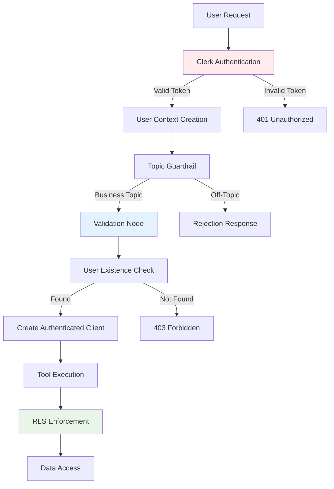

# Security Model

## Security-First Architecture

The FinanSEAL AI Chat Agent implements a multi-layered security model designed to protect sensitive financial data and ensure proper access control for Southeast Asian SME users.

## Authentication & Authorization Flow



## Layer 1: API Authentication

### Clerk Integration (`/api/chat/route.ts`)

```typescript
export async function POST(request: NextRequest) {
  // CRITICAL: Clerk authentication check
  const { userId } = await auth()

  if (!userId) {
    return NextResponse.json(
      { error: 'Unauthorized' },
      { status: 401 }
    )
  }

  // Create secure user context
  const userContext: UserContext = {
    userId: userId,              // Clerk user ID
    conversationId: conversationId
  }
}
```

**Security Features**:
- Server-side token validation
- Automatic session management
- Secure cookie handling
- Request rate limiting (via Clerk)

## Layer 2: Topic Validation

### LLM-Powered Content Filtering (`guardrail-nodes.ts`)

```typescript
export async function topicGuardrail(state: AgentState): Promise<Partial<AgentState>> {
  const topicClassificationPrompt = `
    CLASSIFICATION RULES:
    1. ALLOWED: Tax, GST, business setup, financial analysis, compliance
    2. BLOCKED: Personal chat, entertainment, geography, technical support
    3. CLARIFICATION: Short answers to business questions

    User Query: "${userQuery}"
    Respond: ALLOWED, BLOCKED, or CLARIFICATION
  `

  const classification = await llm.classify(prompt)

  if (classification === 'BLOCKED') {
    return { isTopicAllowed: false }  // → Rejection response
  }
}
```

**Protection Against**:
- Social engineering attempts
- Off-topic query abuse
- System manipulation attempts
- Data mining attacks

## Layer 3: User Context Validation

### Mandatory Security Validation (`validation-node.ts`)

```typescript
export async function validate(state: AgentState): Promise<Partial<AgentState>> {
  // CRITICAL: Validate user context exists
  if (!state.userContext?.userId) {
    return {
      securityValidated: false,
      currentPhase: 'completed',  // End conversation immediately
      messages: [...state.messages, new AIMessage(
        'Authentication error. Please refresh and try again.'
      )]
    }
  }

  // CRITICAL: Validate user context format
  if (typeof state.userContext.userId !== 'string' ||
      state.userContext.userId.length === 0) {
    return {
      securityValidated: false,
      currentPhase: 'completed'
    }
  }

  // Verify user exists in database
  const { data: user } = await supabase
    .from('users')
    .select('id, clerk_user_id')
    .eq('clerk_user_id', state.userContext.userId)
    .single()

  if (!user) {
    console.warn(`User not found: ${state.userContext.userId}`)
    return { securityValidated: false }
  }

  return { securityValidated: true }
}
```

**Validation Checks**:
1. ✅ User context presence
2. ✅ User ID format validation
3. ✅ Database user existence
4. ✅ Active user status
5. ✅ Conversation ownership

## Layer 4: Row Level Security (RLS)

### Database-Level Access Control

```sql
-- Users table RLS policy
CREATE POLICY "Users can only access their own data"
ON users FOR ALL
USING (clerk_user_id = auth.uid());

-- Transactions table RLS policy
CREATE POLICY "Users can only access their own transactions"
ON transactions FOR ALL
USING (user_id = auth.uid());

-- Documents table RLS policy
CREATE POLICY "Users can only access their own documents"
ON documents FOR ALL
USING (user_id = auth.uid());

-- Conversations table RLS policy
CREATE POLICY "Users can only access their own conversations"
ON conversations FOR ALL
USING (user_id = auth.uid());
```

### Authenticated Client Creation

```typescript
// base-tool.ts - Security pattern for all tools
export abstract class BaseTool {
  async execute(parameters: ToolParameters, userContext: UserContext): Promise<ToolResult> {
    // CRITICAL: Create authenticated client for this specific user
    this.authenticatedSupabase = await createAuthenticatedSupabaseClient(userContext.userId)

    if (!this.authenticatedSupabase) {
      return {
        success: false,
        error: 'Authentication failed: Unable to create authenticated database connection'
      }
    }

    // All subsequent queries automatically enforce RLS
    return await this.executeInternal(parameters, userContext)
  }
}
```

## Layer 5: Tool-Level Security

### Parameter Validation and Sanitization

```typescript
// transaction-lookup-tool.ts - Example security implementation
protected async validateParameters(parameters: ToolParameters): Promise<{valid: boolean; error?: string}> {
  // CRITICAL: Strip unsupported parameters
  const supportedParams = ['query', 'limit', 'startDate', 'endDate', 'dateRange', 'category', 'minAmount', 'maxAmount', 'document_type']
  const cleanedParameters: any = {}

  for (const [key, value] of Object.entries(parameters)) {
    if (supportedParams.includes(key)) {
      cleanedParameters[key] = value
    } else {
      console.warn(`Stripping unsupported parameter: ${key}`)
    }
  }

  // Input validation
  if (params.query && params.query.length > 300) {
    return { valid: false, error: 'Query too long (max 300 characters)' }
  }

  // SQL injection prevention through parameterized queries
  if (params.limit && (!Number.isInteger(Number(params.limit)) || Number(params.limit) < 1 || Number(params.limit) > 100)) {
    return { valid: false, error: 'Invalid limit parameter' }
  }

  return { valid: true }
}
```

### Query Sanitization

```typescript
// Temporal contamination prevention
private _sanitize_query(query: string): string {
  const TEMPORAL_PATTERNS = [
    /\b(past|last|previous|recent)\b/gi,
    /\b(january|february|march|april|may|june|july|august|september|october|november|december)\b/gi,
    /\b(today|yesterday|tomorrow)\b/gi,
    /\d{1,4}[-/]\d{1,2}[-/]\d{1,4}/gi  // Date patterns
  ]

  let sanitized = query.toLowerCase().trim()

  // Remove temporal contamination
  for (const pattern of TEMPORAL_PATTERNS) {
    sanitized = sanitized.replace(pattern, '')
  }

  return sanitized
}
```

## Layer 6: Data Protection

### PII and Sensitive Data Protection

```typescript
// BEFORE (Security Issue - FIXED):
console.log(`Transaction: ${t.description} - ${t.original_amount} ${t.original_currency}`)

// AFTER (Secure Logging):
console.log(`Transaction ID: ${t.id} - Date: ${t.transaction_date}`)
```

**PII Protection Rules**:
- ❌ Never log transaction descriptions
- ❌ Never log vendor names
- ❌ Never log amounts or currencies
- ❌ Never log user personal information
- ✅ Log transaction IDs and dates only
- ✅ Log system status and performance metrics
- ✅ Log security events (without PII)

### API Key Security

```typescript
// guardrail-nodes.ts - Enhanced API key validation
const headers: Record<string, string> = {
  'Content-Type': 'application/json'
}

// CRITICAL: Validate API key before use
if (typeof aiConfig.chat.apiKey === 'string' &&
    aiConfig.chat.apiKey.length > 0) {
  headers['Authorization'] = `Bearer ${aiConfig.chat.apiKey}`
} else {
  // Fail gracefully without exposing undefined/null values
  console.error('Invalid API key configuration')
  return { isTopicAllowed: true }  // Fail open for availability
}
```

## Layer 7: Circuit Breaker Security

### Abuse Prevention

```typescript
function checkCircuitBreaker(state: AgentState): {shouldBreak: boolean; reason?: string} {
  // Protection against conversation abuse
  if (currentTurnLength > 8) {
    return { shouldBreak: true, reason: "Turn length exceeded" }
  }

  // Protection against repeated failures (potential attack)
  if (state.failureCount >= 3) {
    return { shouldBreak: true, reason: "Failure threshold exceeded" }
  }

  // Protection against resource exhaustion
  if (noResultsCount >= 2) {
    return { shouldBreak: true, reason: "Repeated no results pattern" }
  }

  return { shouldBreak: false }
}
```

**Prevents**:
- Resource exhaustion attacks
- Infinite loop exploitation
- System overload attempts
- Data mining through repeated queries

## Security Monitoring and Logging

### Audit Trail Implementation

```typescript
// Security event logging
console.log(`[Security] User validation passed: ${userContext.userId}`)
console.log(`[Security] Tool execution authorized: ${toolName}`)
console.log(`[Security] Circuit breaker triggered: ${reason}`)
console.log(`[Security] Topic blocked: ${query.substring(0, 50)}`)

// Performance monitoring
console.log(`[Performance] Query execution time: ${executionTime}ms`)
console.log(`[Performance] Results returned: ${resultCount}`)
```

### Error Handling Security

```typescript
// Never expose internal errors to users
catch (error) {
  console.error(`[Internal] Database error:`, error)  // Log internally

  return {
    success: false,
    error: 'Service temporarily unavailable'  // Generic user message
  }
}
```

## Security Best Practices Enforced

### 1. **Authentication**
- ✅ Multi-layer user validation (Clerk + Database)
- ✅ Server-side token verification
- ✅ Automatic session management

### 2. **Authorization**
- ✅ Row Level Security (RLS) enforcement
- ✅ User-scoped database queries
- ✅ Conversation ownership validation

### 3. **Input Validation**
- ✅ Parameter type checking and sanitization
- ✅ Query length limits and content filtering
- ✅ SQL injection prevention via parameterized queries

### 4. **Data Protection**
- ✅ PII logging prevention
- ✅ Secure error message handling
- ✅ API key validation and protection

### 5. **Rate Limiting & Abuse Prevention**
- ✅ Circuit breaker patterns
- ✅ Conversation turn limits
- ✅ Tool failure cascade protection

### 6. **Audit & Monitoring**
- ✅ Security event logging
- ✅ Performance monitoring
- ✅ Failure pattern detection

## Compliance Considerations

### Data Privacy (GDPR/PDPA)
- User data is processed only for legitimate business purposes
- Data access is restricted to the authenticated user
- Conversation history can be deleted upon request
- PII is never logged or exposed in system outputs

### Financial Data Security
- Transaction data protected by RLS
- No financial information in system logs
- Secure conversation storage with encryption
- User-controlled data access and retention

### Southeast Asian Regulatory Compliance
- Designed for Singapore, Malaysia, Thailand, Indonesia requirements
- Supports local business structure and tax regulations
- Compliance-aware regulatory knowledge base
- Multi-language privacy notices and error messages

---

*This security model ensures enterprise-grade protection for sensitive SME financial data while maintaining usability and performance.*