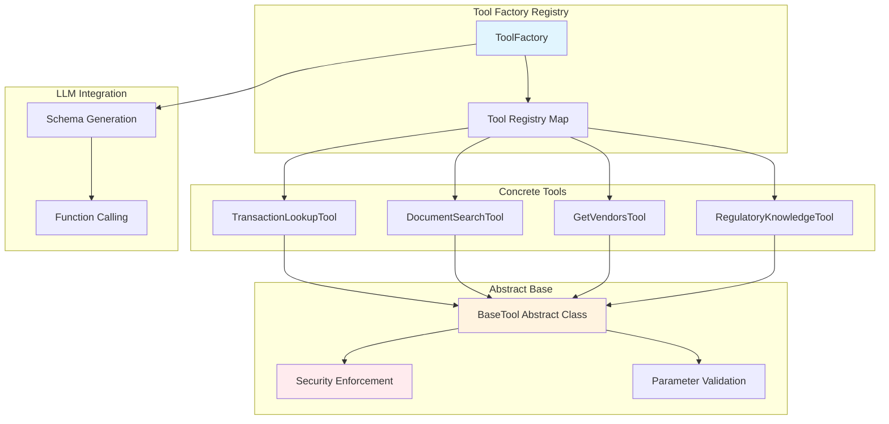

# Tool System

## Self-Describing Tool Architecture

The FinanSEAL AI Chat Agent uses a sophisticated self-describing tool system that automatically generates OpenAI function schemas and enforces security patterns across all tool implementations.

## Architecture Overview



## Base Tool Security Framework

### Abstract Base Class (`base-tool.ts`)

```typescript
export abstract class BaseTool {
  protected supabase: SupabaseClient
  protected authenticatedSupabase: SupabaseClient | null = null

  /**
   * Security-enforced execution wrapper
   */
  async execute(parameters: ToolParameters, userContext: UserContext): Promise<ToolResult> {
    // Layer 1: User context validation
    if (!userContext?.userId) {
      return { success: false, error: 'Unauthorized: User context required' }
    }

    // Layer 2: Create authenticated client with RLS
    this.authenticatedSupabase = await createAuthenticatedSupabaseClient(userContext.userId)
    if (!this.authenticatedSupabase) {
      return { success: false, error: 'Authentication failed' }
    }

    // Layer 3: Parameter validation
    const validation = await this.validateParameters(parameters)
    if (!validation.valid) {
      return { success: false, error: `Invalid parameters: ${validation.error}` }
    }

    // Layer 4: Permission check
    const hasPermission = await this.checkUserPermissions(userContext)
    if (!hasPermission) {
      return { success: false, error: 'Insufficient permissions' }
    }

    // Layer 5: Execute with error handling
    try {
      return await this.executeInternal(parameters, userContext)
    } catch (error) {
      return { success: false, error: `Execution failed: ${error.message}` }
    }
  }

  /**
   * Abstract methods - must be implemented by concrete tools
   */
  abstract getToolName(modelType?: ModelType): string
  abstract getDescription(modelType?: ModelType): string
  abstract getToolSchema(modelType?: ModelType): OpenAIToolSchema
  protected abstract validateParameters(parameters: ToolParameters): Promise<{valid: boolean; error?: string}>
  protected abstract executeInternal(parameters: ToolParameters, userContext: UserContext): Promise<ToolResult>
}
```

## Tool Factory Registry System

### Dynamic Schema Generation (`tool-factory.ts`)

```typescript
export class ToolFactory {
  private static tools: Map<string, BaseTool> = new Map([
    ['transaction-lookup', new TransactionLookupTool()],
    ['document-search', new DocumentSearchTool()],
    ['get-vendors', new GetVendorsTool()],
    ['regulatory-knowledge', new RegulatoryKnowledgeTool()]
  ])

  /**
   * Get all tool schemas for LLM function calling
   * Single source of truth for tool definitions
   */
  static getToolSchemas(modelType: ModelType = 'openai'): OpenAIToolSchema[] {
    return Array.from(this.tools.values()).map(tool =>
      tool.getToolSchema(modelType)
    )
  }

  /**
   * Execute tool by name with security enforcement
   */
  static async executeTool(
    toolName: string,
    parameters: ToolParameters,
    userContext: UserContext
  ): Promise<ToolResult> {
    const tool = this.tools.get(toolName)
    if (!tool) {
      return { success: false, error: `Unknown tool: ${toolName}` }
    }

    return await tool.execute(parameters, userContext)
  }

  /**
   * Validation for development and debugging
   */
  static async validateTools(): Promise<{valid: boolean; errors: string[]}> {
    const errors: string[] = []

    for (const [name, tool] of this.tools) {
      try {
        const schema = tool.getToolSchema()
        if (!schema.function?.name || !schema.function?.description) {
          errors.push(`${name}: Invalid schema structure`)
        }
      } catch (error) {
        errors.push(`${name}: Schema generation failed - ${error.message}`)
      }
    }

    return { valid: errors.length === 0, errors }
  }
}
```

## Concrete Tool Implementations

### 1. Transaction Lookup Tool

**Purpose**: Secure financial transaction queries with advanced filtering

```typescript
export class TransactionLookupTool extends BaseTool {
  getToolName(modelType: ModelType = 'openai'): string {
    return modelType === 'gemini' ? 'get_data_records' : 'get_transactions'
  }

  getToolSchema(modelType: ModelType = 'openai'): OpenAIToolSchema {
    return {
      type: "function",
      function: {
        name: this.getToolName(modelType),
        description: "CRITICAL: Use this function to retrieve user financial transactions...",
        parameters: {
          type: "object",
          properties: {
            query: {
              type: "string",
              description: "CONTENT SEARCH ONLY: Vendor names, descriptions. NEVER dates or analytical terms.",
              examples: ["", "McDonald's", "Grab", "office supplies"]
            },
            dateRange: {
              type: "string",
              description: "TIME CONSTRAINT ONLY: Handles all temporal filtering.",
              enum: ["past_7_days", "past_30_days", "past_60_days", "past_90_days", "this_month", "last_month", "this_year"]
            },
            document_type: {
              type: "string",
              description: "Filter by document type for precise database filtering.",
              enum: ["invoice", "receipt", "bill", "statement", "contract", "other"]
            },
            minAmount: { type: "number", description: "Minimum transaction amount" },
            maxAmount: { type: "number", description: "Maximum transaction amount" },
            limit: { type: "integer", minimum: 1, maximum: 100, description: "Max results (default: 10)" }
          },
          required: []
        }
      }
    }
  }
}
```

**Security Features**:
- Query sanitization against temporal contamination
- Parameter validation and type checking
- RLS-enforced database queries
- PII-safe logging practices
- Circuit breaker integration

**Performance Optimizations**:
- Composite database indexes: `(user_id, transaction_date)`, `(user_id, document_type, transaction_date)`
- Optimized query structure: user filter → dates → document type → ordering
- Analysis query detection for appropriate limits
- Memory-efficient result processing

### 2. Document Search Tool

**Purpose**: Regulatory knowledge and document search with vector similarity

```typescript
export class DocumentSearchTool extends BaseTool {
  getToolSchema(): OpenAIToolSchema {
    return {
      type: "function",
      function: {
        name: "search_documents",
        description: "Search regulatory documents, tax guides, and compliance information for Southeast Asian countries",
        parameters: {
          type: "object",
          properties: {
            query: {
              type: "string",
              description: "Search query for regulatory or compliance information",
              examples: ["GST registration Singapore", "Tax obligations Malaysia SME"]
            },
            country: {
              type: "string",
              enum: ["singapore", "malaysia", "thailand", "indonesia"],
              description: "Target country for regulatory information"
            },
            limit: {
              type: "integer",
              minimum: 1,
              maximum: 20,
              description: "Maximum number of results (default: 5)"
            }
          },
          required: ["query"]
        }
      }
    }
  }

  protected async executeInternal(parameters: ToolParameters, userContext: UserContext): Promise<ToolResult> {
    // Vector embedding generation
    const embedding = await this.generateEmbedding(parameters.query)

    // Qdrant vector search with similarity threshold
    const searchResults = await this.vectorSearch(embedding, {
      country: parameters.country,
      limit: parameters.limit || 5,
      threshold: 0.7
    })

    // Citation formatting with source attribution
    const citations = searchResults.map((result, index) => ({
      id: `doc_${index + 1}`,
      source_name: result.metadata.source_name,
      country: result.metadata.country,
      content_snippet: result.content,
      confidence_score: result.score,
      official_url: result.metadata.url
    }))

    return {
      success: true,
      data: this.formatSearchResults(searchResults),
      citations,
      metadata: { query: parameters.query, resultsCount: searchResults.length }
    }
  }
}
```

### 3. Regulatory Knowledge Tool

**Purpose**: Southeast Asian tax and compliance guidance with citation support

```typescript
export class RegulatoryKnowledgeTool extends BaseTool {
  getToolSchema(): OpenAIToolSchema {
    return {
      type: "function",
      function: {
        name: "get_regulatory_knowledge",
        description: "Get specific tax, GST, and regulatory information for Southeast Asian countries with official citations",
        parameters: {
          type: "object",
          properties: {
            topic: {
              type: "string",
              description: "Specific regulatory topic or question",
              examples: ["GST registration threshold", "Corporate tax rates", "Business license requirements"]
            },
            country: {
              type: "string",
              enum: ["singapore", "malaysia", "thailand", "indonesia"],
              description: "Country for regulatory information"
            },
            businessType: {
              type: "string",
              enum: ["sme", "individual", "corporate", "startup"],
              description: "Type of business entity"
            }
          },
          required: ["topic", "country"]
        }
      }
    }
  }
}
```

### 4. Vendor Management Tool

**Purpose**: Supplier and vendor information retrieval

```typescript
export class GetVendorsTool extends BaseTool {
  getToolSchema(): OpenAIToolSchema {
    return {
      type: "function",
      function: {
        name: "get_vendors",
        description: "Retrieve vendor and supplier information from user's transaction history",
        parameters: {
          type: "object",
          properties: {
            // Minimal parameters - uses transaction history for vendor discovery
          },
          required: []
        }
      }
    }
  }
}
```

## Advanced Tool Features

### Multi-Model Support

Tools support different LLM providers with tailored schemas:

```typescript
getDescription(modelType: ModelType = 'openai'): string {
  if (modelType === 'gemini') {
    // Detailed instructions for Gemini with explicit database mentions
    return 'CRITICAL: Use this function to retrieve user financial transaction records. This is the ONLY way to access transaction data from the Supabase database...'
  } else {
    // Rich description for OpenAI-compatible models
    return 'CRITICAL: Use this function to retrieve a user\'s financial transactions...'
  }
}
```

### Parameter Validation Patterns

```typescript
protected async validateParameters(parameters: ToolParameters): Promise<{valid: boolean; error?: string}> {
  // 1. Parameter stripping (security)
  const supportedParams = ['query', 'limit', 'dateRange', 'country']
  const cleaned = this.stripUnsupportedParameters(parameters, supportedParams)

  // 2. Type validation
  if (cleaned.limit && (!Number.isInteger(Number(cleaned.limit)) || Number(cleaned.limit) < 1)) {
    return { valid: false, error: 'Invalid limit parameter' }
  }

  // 3. Enum validation
  if (cleaned.country && !['singapore', 'malaysia', 'thailand', 'indonesia'].includes(cleaned.country)) {
    return { valid: false, error: 'Unsupported country' }
  }

  // 4. Content validation
  if (cleaned.query && cleaned.query.length > 500) {
    return { valid: false, error: 'Query too long' }
  }

  return { valid: true }
}
```

### Error Handling and Recovery

```typescript
protected async executeInternal(parameters: ToolParameters, userContext: UserContext): Promise<ToolResult> {
  try {
    // Primary execution path
    const result = await this.performToolOperation(parameters, userContext)
    return { success: true, data: result }

  } catch (error) {
    // Structured error handling
    if (error.code === 'PGRST116') {
      // Database connection error
      return { success: false, error: 'Database temporarily unavailable' }
    }

    if (error.message.includes('timeout')) {
      // Timeout error
      return { success: false, error: 'Request timeout - please try again' }
    }

    // Generic error (never expose internal details)
    console.error(`[${this.getToolName()}] Internal error:`, error)
    return { success: false, error: 'Service temporarily unavailable' }
  }
}
```

## Performance Optimization Strategies

### Database Query Optimization

```typescript
// Optimized query structure for transaction lookup
private buildOptimizedQuery(params: TransactionLookupParameters, userContext: UserContext) {
  let query = this.authenticatedSupabase
    .from('transactions')
    .select(`
      id, description, original_amount, original_currency,
      home_currency_amount, transaction_date, category,
      vendor_name, transaction_type, document_type, created_at
    `)
    .eq('user_id', userContext.userId)  // RLS + index optimization

  // Apply high-confidence filters first
  if (params.startDate) query = query.gte('transaction_date', params.startDate)
  if (params.endDate) query = query.lte('transaction_date', params.endDate)
  if (params.document_type) query = query.eq('document_type', params.document_type)

  // Apply ordering after filters for index efficiency
  query = query.order('transaction_date', { ascending: false })

  // Dynamic limits based on query type
  const limit = this.isAnalysisQuery(params) ? Math.max(50, params.limit * 3) : params.limit
  return query.limit(limit)
}
```

### Memory Management

```typescript
// Result processing with memory efficiency
private formatResults(transactions: any[]): string {
  // Limit processing to reasonable sizes
  const maxResults = 50
  const processedData = transactions.slice(0, maxResults)

  // Stream processing for large datasets
  return processedData
    .map((transaction, index) => this.formatTransaction(transaction, index))
    .join('\n\n')
}
```

### Caching Strategies

```typescript
// Vector search result caching (future enhancement)
private async getCachedOrSearch(query: string, options: SearchOptions): Promise<SearchResult[]> {
  const cacheKey = `search_${hash(query + JSON.stringify(options))}`

  // Check cache first
  const cached = await this.getFromCache(cacheKey)
  if (cached && !this.isCacheExpired(cached)) {
    return cached.results
  }

  // Perform search and cache
  const results = await this.performVectorSearch(query, options)
  await this.setCache(cacheKey, { results, timestamp: Date.now() }, 300) // 5min TTL

  return results
}
```

## Tool Integration Patterns

### LangGraph Agent Integration

```typescript
// model-node.ts - Tool schema integration
export async function callModel(state: AgentState): Promise<Partial<AgentState>> {
  // Get dynamic tool schemas from factory
  const tools = ToolFactory.getToolSchemas(modelType)

  const systemPrompt = `You are a financial co-pilot for Southeast Asian SMEs.
Available tools: ${tools.map(t => t.function.name).join(', ')}`

  const response = await llm.chat({
    messages: state.messages,
    tools: tools,  // Automatically generated schemas
    systemPrompt
  })

  return { messages: [...state.messages, response] }
}
```

### Tool Execution Flow

```typescript
// tool-nodes.ts - Secure tool execution
export async function executeTool(state: AgentState): Promise<Partial<AgentState>> {
  const lastMessage = state.messages[state.messages.length - 1] as AIMessage

  for (const toolCall of lastMessage.tool_calls) {
    try {
      // Factory-based tool execution with security
      const result = await ToolFactory.executeTool(
        toolCall.name,
        toolCall.args,
        state.userContext
      )

      // Handle results and update state
      const toolMessage = new ToolMessage({
        content: JSON.stringify(result),
        tool_call_id: toolCall.id
      })

      return {
        messages: [...state.messages, toolMessage],
        citations: result.citations ? [...state.citations, ...result.citations] : state.citations,
        failureCount: result.success ? 0 : state.failureCount + 1
      }

    } catch (error) {
      // Circuit breaker integration
      return {
        messages: [...state.messages, new ToolMessage({
          content: JSON.stringify({ success: false, error: 'Tool execution failed' }),
          tool_call_id: toolCall.id
        })],
        failureCount: state.failureCount + 1
      }
    }
  }
}
```

## Extension and Maintenance

### Adding New Tools

1. **Create Tool Class**:
   ```typescript
   export class NewTool extends BaseTool {
     getToolName() { return 'new_tool' }
     getDescription() { return 'Tool description' }
     getToolSchema() { return { /* OpenAI schema */ } }
     protected async validateParameters() { /* validation */ }
     protected async executeInternal() { /* implementation */ }
   }
   ```

2. **Register in Factory**:
   ```typescript
   private static tools: Map<string, BaseTool> = new Map([
     // ... existing tools
     ['new-tool', new NewTool()]
   ])
   ```

3. **Automatic Integration**: Tool is immediately available to LLM via schema generation

### Best Practices for Tool Development

1. **Security First**: Always inherit from BaseTool for security enforcement
2. **Self-Describing**: Implement comprehensive getToolSchema() with examples
3. **Parameter Validation**: Strict validation with helpful error messages
4. **Error Handling**: Graceful degradation with user-friendly messages
5. **Performance**: Consider database indexing and query optimization
6. **Testing**: Unit tests for validation, security, and functionality

---

*This tool system provides a secure, maintainable, and extensible foundation for AI-powered financial assistance.*