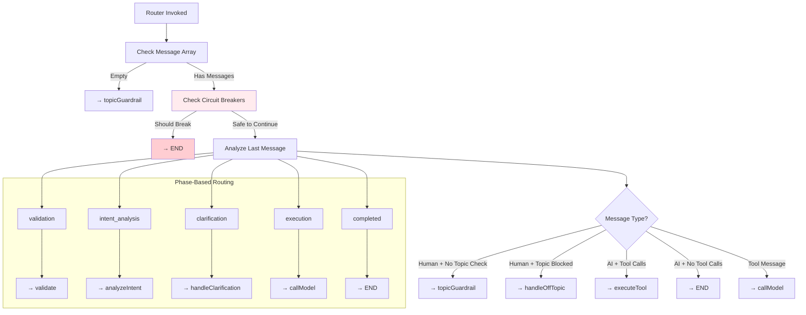

# Router Logic and Circuit Breakers

## Intelligent Routing System

The router (`src/lib/agent/router.ts`) serves as the traffic controller for the LangGraph agent, making intelligent decisions about the next processing step while preventing infinite loops and system abuse.

## Router Decision Flow



## Circuit Breaker Architecture

### Unified Protection Function

The circuit breaker system was refactored (January 2025) from 5 separate mechanisms into a single, maintainable function:

```typescript
/**
 * Simplified circuit breaker function to prevent infinite loops
 * Consolidates all loop detection logic into a single, maintainable function
 */
function checkCircuitBreaker(state: AgentState): { shouldBreak: boolean; reason?: string } {
  if (!state.messages || state.messages.length === 0) {
    return { shouldBreak: false };
  }

  // Find current conversation turn boundaries
  let currentTurnStart = state.messages.length - 1;
  for (let i = state.messages.length - 1; i >= 0; i--) {
    const msg = state.messages[i];
    const msgType = msg._getType ? msg._getType() : (msg as any).type;
    if (msgType === 'human') {
      currentTurnStart = i;
      break;
    }
  }

  const currentTurnMessages = state.messages.slice(currentTurnStart);
  const currentTurnLength = currentTurnMessages.length;

  // Protection Mechanism 1: Turn Length Limit
  if (currentTurnLength > 8) {
    return { shouldBreak: true, reason: `Turn too long (${currentTurnLength} messages)` };
  }

  // Protection Mechanism 2: State-Based Failure Count
  if (state.failureCount && state.failureCount >= 3) {
    return { shouldBreak: true, reason: `${state.failureCount} consecutive failures` };
  }

  // Protection Mechanism 3: Repeated "No Results" Pattern
  const noResultsCount = currentTurnMessages.filter(msg => {
    if (msg._getType && msg._getType() === 'tool') {
      const content = typeof msg.content === 'string' ? msg.content : '';
      return content.includes('No transactions found') ||
             content.includes('No results found') ||
             content.includes('No documents found');
    }
    return false;
  }).length;

  if (noResultsCount >= 2) {
    return { shouldBreak: true, reason: `${noResultsCount} repeated "no results" responses` };
  }

  // Protection Mechanism 4: Tool Failure Cascade
  const toolFailuresCount = currentTurnMessages.filter(msg => {
    if (msg._getType && msg._getType() === 'tool') {
      const content = typeof msg.content === 'string' ? msg.content : '';
      return content.includes('error') || content.includes('failed') || content.includes('timeout');
    }
    return false;
  }).length;

  if (toolFailuresCount >= 3) {
    return { shouldBreak: true, reason: `${toolFailuresCount} tool failures in current turn` };
  }

  return { shouldBreak: false };
}
```

## Router Implementation

### Main Router Function

```typescript
export function router(state: AgentState): string {
  console.log(`[Router] Current phase: ${state.currentPhase}, Messages: ${state.messages?.length || 0}, Topic allowed: ${state.isTopicAllowed}, Is clarification: ${state.isClarificationResponse}`);

  // CRITICAL: Check for empty messages array
  if (!state.messages || state.messages.length === 0) {
    return 'topicGuardrail';
  }

  // Get last message for analysis
  const lastMessage = state.messages[state.messages.length - 1];
  const isHumanMessage = lastMessage && lastMessage._getType() === 'human';

  // Topic Guardrail Logic - First priority for new human messages
  if (isHumanMessage) {
    // Check if topic classification is needed
    if (state.isTopicAllowed === undefined) {
      console.log('[Router] New human message requires topic classification');
      return 'topicGuardrail';
    }

    // Handle off-topic queries
    if (state.isTopicAllowed === false) {
      console.log('[Router] Topic not allowed, routing to handleOffTopic');
      return 'handleOffTopic';
    }
  }

  // Phase-based routing for intelligent workflow
  if (state.currentPhase === 'validation') return 'validate';
  if (state.currentPhase === 'intent_analysis') return 'analyzeIntent';
  if (state.currentPhase === 'clarification') return 'handleClarification';
  if (state.currentPhase === 'completed') return END;

  // SIMPLIFIED CIRCUIT BREAKER: Single unified check
  const circuitBreakerResult = checkCircuitBreaker(state);
  if (circuitBreakerResult.shouldBreak) {
    console.log(`[Router] CIRCUIT BREAKER: ${circuitBreakerResult.reason}`);
    return END;
  }

  // Message type routing
  const currentMessage = state.messages[state.messages.length - 1] as any;
  const messageType = currentMessage._getType ? currentMessage._getType() : currentMessage.type;

  // Handle incomplete tool calls
  if (currentMessage.finish_reason === 'tool_calls' &&
      (!currentMessage.tool_calls || currentMessage.tool_calls.length === 0)) {
    console.log('[Router] Incomplete tool call detected. Routing for correction.');
    return 'correctToolCall';
  }

  if (messageType === 'ai') {
    if (currentMessage.tool_calls && currentMessage.tool_calls.length > 0) {
      console.log('[Router] Valid tool call detected. Routing to execute tool.');
      return 'executeTool';
    }
    console.log('[Router] Final AI response. Ending turn.');
    return END;
  }

  if (messageType === 'tool') {
    console.log('[Router] Tool result received. Routing to call model for final answer.');
    return 'callModel';
  }

  // Default: Human message needs response
  console.log('[Router] Human message received. Routing to call model.');
  return 'callModel';
}
```

## Circuit Breaker Protection Mechanisms

### 1. Turn Length Protection

**Purpose**: Prevent excessively long conversation turns that could indicate loops

```typescript
// Protection: Maximum 8 messages per turn
// Turn = Human message → AI response → Tool calls → Tool results → Final response
if (currentTurnLength > 8) {
  return { shouldBreak: true, reason: `Turn too long (${currentTurnLength} messages)` };
}
```

**Rationale**: Normal conversation turns follow predictable patterns:
- Human → AI (2 messages)
- Human → AI → Tool → AI (4 messages)
- Human → AI → Tool → Tool → AI (5 messages)
- Complex queries with multiple tools (up to 8 messages)

### 2. State-Based Failure Tracking

**Purpose**: Track persistent failures across conversation turns using AgentState

```typescript
// Protection: Maximum 3 consecutive failures
if (state.failureCount && state.failureCount >= 3) {
  return { shouldBreak: true, reason: `${state.failureCount} consecutive failures` };
}
```

**Integration with Tool Execution**:
```typescript
// In tool-nodes.ts
const result = await tool.execute(parameters, userContext)

return {
  messages: [...state.messages, toolMessage],
  failureCount: result.success ? 0 : state.failureCount + 1  // Reset on success, increment on failure
}
```

### 3. Repeated "No Results" Detection

**Purpose**: Prevent user frustration loops when queries consistently return no data

```typescript
// Protection: Maximum 2 "no results" responses per turn
const noResultsPatterns = [
  'No transactions found',
  'No results found',
  'No documents found'
];

const noResultsCount = currentTurnMessages.filter(msg => {
  const content = typeof msg.content === 'string' ? msg.content : '';
  return noResultsPatterns.some(pattern => content.includes(pattern));
}).length;

if (noResultsCount >= 2) {
  return { shouldBreak: true, reason: `${noResultsCount} repeated "no results" responses` };
}
```

**User Experience**: Prevents scenarios where users repeatedly refine queries that will never return results due to data availability or permission issues.

### 4. Tool Failure Cascade Protection

**Purpose**: Prevent system overload from cascading tool failures

```typescript
// Protection: Maximum 3 tool failures per turn
const failurePatterns = ['error', 'failed', 'timeout'];

const toolFailuresCount = currentTurnMessages.filter(msg => {
  if (msg._getType() === 'tool') {
    const content = typeof msg.content === 'string' ? msg.content : '';
    return failurePatterns.some(pattern => content.includes(pattern));
  }
  return false;
}).length;

if (toolFailuresCount >= 3) {
  return { shouldBreak: true, reason: `${toolFailuresCount} tool failures in current turn` };
}
```

## Routing Strategies

### Phase-Based Routing

The agent operates through distinct phases to ensure proper validation and processing:

```typescript
// Deterministic phase progression
const phaseRouting = {
  'validation': 'validate',           // → Security validation
  'intent_analysis': 'analyzeIntent', // → LLM intent analysis
  'clarification': 'handleClarification', // → User clarification
  'execution': 'callModel',          // → Tool execution/response
  'completed': END                   // → End conversation
};

if (state.currentPhase in phaseRouting) {
  return phaseRouting[state.currentPhase];
}
```

### Message Type Routing

```typescript
const messageTypeRouting = {
  // AI message with tool calls → Execute tools
  'ai + tool_calls': 'executeTool',

  // AI message without tools → End conversation
  'ai + no_tools': END,

  // Tool message → Process results with LLM
  'tool': 'callModel',

  // Human message → Generate response
  'human': 'callModel'
};
```

### Topic Guardrail Routing

```typescript
// LLM-powered topic classification routing
const topicRouting = {
  'ALLOWED': 'validate',        // → Continue normal flow
  'BLOCKED': 'handleOffTopic',  // → Rejection response
  'CLARIFICATION': 'validate'   // → Continue (clarification responses)
};
```

## Error Recovery Patterns

### Tool Call Correction

```typescript
// Handle malformed tool calls from LLM
if (message.finish_reason === 'tool_calls' &&
    (!message.tool_calls || message.tool_calls.length === 0)) {
  return 'correctToolCall';  // → Attempt correction
}
```

**Correction Strategies**:
1. Parameter validation and fixing
2. Tool name normalization
3. Schema compliance enforcement
4. Fallback to simpler queries

### Graceful Degradation

```typescript
// When circuit breaker activates
if (circuitBreakerTriggered) {
  // End conversation with helpful message
  return {
    messages: [...state.messages, new AIMessage(
      "I'm having trouble processing your request. Let me try a different approach or please rephrase your question."
    )],
    currentPhase: 'completed'
  };
}
```

## Performance Optimizations

### Efficient Message Analysis

```typescript
// Optimized message type detection
const messageType = message._getType ? message._getType() : (message as any).type;

// Cached turn boundary calculation
let currentTurnStart = findLastHumanMessageIndex(state.messages);
const currentTurnMessages = state.messages.slice(currentTurnStart);
```

### Minimal State Updates

```typescript
// Only return necessary state changes
return {
  currentPhase: 'execution',  // Required phase transition
  // Don't update unnecessary fields
};
```

### Strategic Logging

```typescript
// Structured logging for debugging and monitoring
console.log(`[Router] Phase: ${state.currentPhase} → ${nextNode}`);
console.log(`[Router] Circuit breaker: ${breaker.reason || 'inactive'}`);
console.log(`[Router] Message flow: ${messageType} → ${nextNode}`);
```

## Configuration and Tuning

### Circuit Breaker Thresholds

Current thresholds (optimized for production use):

```typescript
const CIRCUIT_BREAKER_CONFIG = {
  MAX_TURN_LENGTH: 8,           // Reasonable conversation turn limit
  MAX_STATE_FAILURES: 3,       // Persistent failure tolerance
  MAX_NO_RESULTS_IN_TURN: 2,   // User experience threshold
  MAX_TOOL_FAILURES_IN_TURN: 3 // System reliability threshold
};
```

**Tuning Considerations**:
- **Turn Length**: Balance between complex queries and loop prevention
- **Failure Tolerance**: Balance between retry attempts and system protection
- **User Experience**: Prevent frustration while allowing legitimate retries
- **System Protection**: Ensure service availability under load

### Monitoring and Metrics

```typescript
// Production monitoring points
- Circuit breaker activation rates by type
- Average turn length and complexity
- Tool failure patterns and recovery rates
- User experience metrics (successful completions)
- System performance under various loads
```

## Testing and Validation

### Unit Tests for Circuit Breaker

```typescript
describe('Circuit Breaker', () => {
  it('should break on excessive turn length', () => {
    const state = createStateWithMessages(10);  // > 8 messages
    const result = checkCircuitBreaker(state);
    expect(result.shouldBreak).toBe(true);
  });

  it('should break on repeated failures', () => {
    const state = { failureCount: 3 };
    const result = checkCircuitBreaker(state);
    expect(result.shouldBreak).toBe(true);
  });
});
```

### Integration Tests for Router

```typescript
describe('Router Integration', () => {
  it('should handle complete conversation flow', async () => {
    const agent = createFinancialAgent();
    const state = createAgentState(userContext, "Show my transactions");

    const result = await agent.invoke(state);

    expect(result.currentPhase).toBe('completed');
    expect(result.messages).toContainMessageType('ai');
  });
});
```

## Troubleshooting Guide

### Common Issues

1. **Infinite Loops**: Check circuit breaker logs for activation patterns
2. **Premature Termination**: Review thresholds for current usage patterns
3. **Phase Confusion**: Verify state transitions and phase logic
4. **Tool Call Issues**: Monitor tool call correction patterns

### Debugging Commands

```typescript
// Enable detailed router logging
console.log('[Router DEBUG] State:', JSON.stringify({
  phase: state.currentPhase,
  messageCount: state.messages?.length,
  lastMessageType: state.messages?.[state.messages.length - 1]?._getType(),
  failureCount: state.failureCount
}, null, 2));
```

---

*This routing system ensures reliable, secure, and efficient conversation flow while preventing system abuse and infinite loops.*