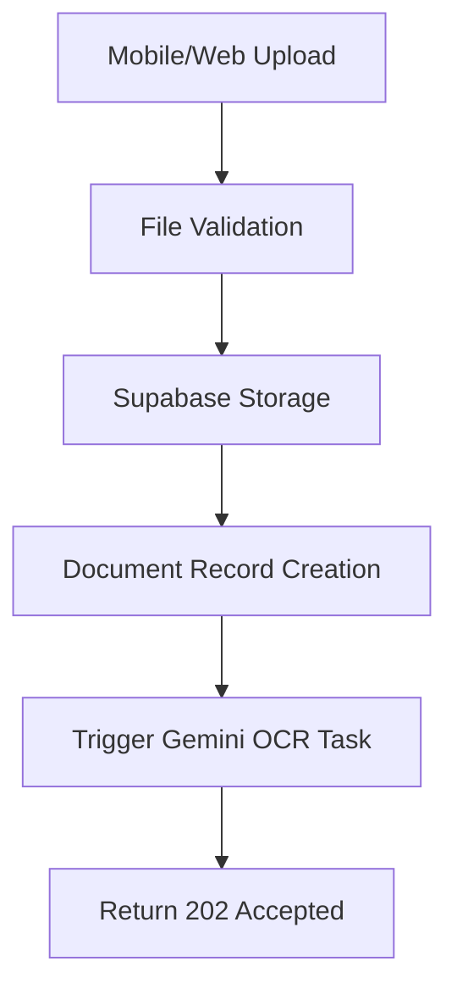
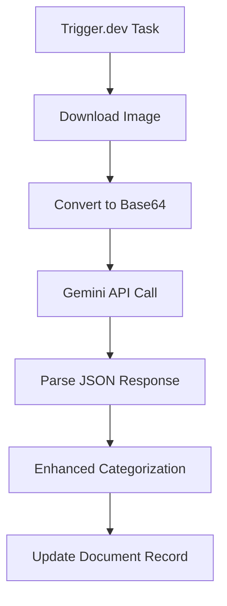
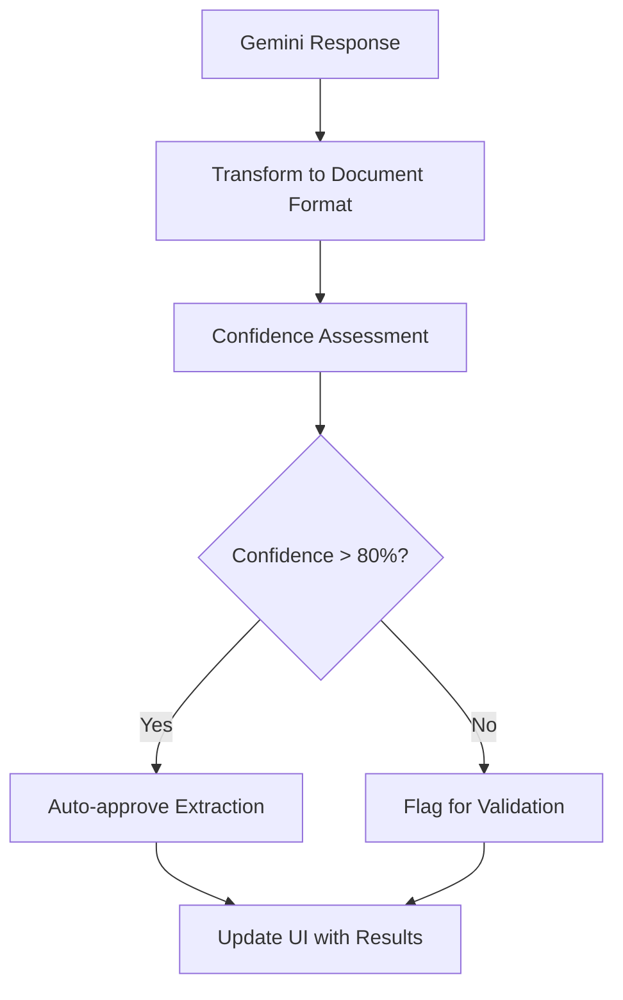
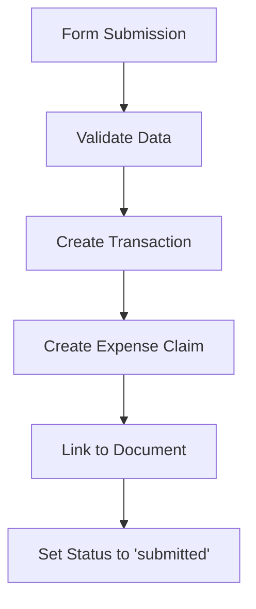
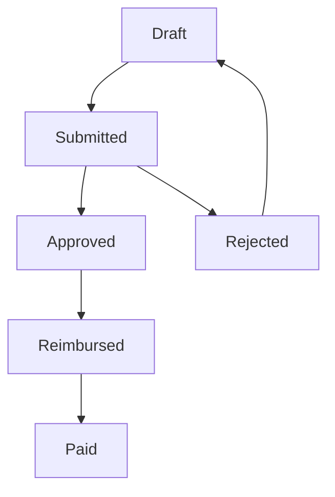

# Expense Claims Processing Module

## Overview

The Expense Claims Processing Module is a comprehensive system for managing employee expense claims with intelligent receipt processing using Google's Gemini AI. It implements a complete workflow from receipt capture to reimbursement processing, designed specifically for Southeast Asian SMEs.

## Architecture

### Core Components
- **Frontend**: React components with mobile-first design
- **Backend**: Next.js API routes with serverless functions
- **AI Processing**: Google Gemini 2.5-flash for OCR and categorization
- **Background Jobs**: Trigger.dev v3 with Node.js runtime
- **Database**: Supabase PostgreSQL with Row Level Security

### Key Features
- Multimodal receipt processing with Gemini AI
- Intelligent expense categorization
- Unified direct approval workflow
- Real-time confidence indicators
- Southeast Asian vendor pattern recognition
- Multi-currency support

## Accounting Flow (IFRS/GAAP Compliant)

### Principle: Only Approved Expenses Hit the General Ledger

The system follows proper accounting principles where expenses are recognized when approved (accrual basis), not when receipts are uploaded.

### Complete Flow:

  ┌─────────────────────────────────────────────────────────────┐
  │ 1. DSPy Extraction (Trigger.dev background job)            │
  │    Location: src/trigger/dspy-receipt-extraction.ts        │
  │                                                             │
  │    ├─→ Stores extracted data in:                           │
  │    │   expense_claims.processing_metadata (JSONB)          │
  │    │   {                                                    │
  │    │     extraction_method: 'dspy',                        │
  │    │     financial_data: { vendor, amount, currency... },  │
  │    │     line_items: [...],                                │
  │    │     raw_extraction: {...}                             │
  │    │   }                                                    │
  │    │                                                        │
  │    ├─→ Updates convenient fields for UI:                   │
  │    │   vendor_name, total_amount, currency, etc.           │
  │    │                                                        │
  │    ├─→ Sets expense_claims.status = 'draft'                │
  │    │                                                        │
  │    └─→ NO accounting_entries created ✅                    │
  │        expense_claims.accounting_entry_id = NULL           │
  └─────────────────────────────────────────────────────────────┘
                              ↓
  ┌─────────────────────────────────────────────────────────────┐
  │ 2. User edits pre-filled form                               │
  │    Location: src/components/expense-claims/                 │
  │              expense-submission-form.tsx                    │
  │                                                             │
  │    └─→ expense_claims.status remains 'draft'               │
  │        User can modify AI-extracted data                    │
  └─────────────────────────────────────────────────────────────┘
                              ↓
  ┌─────────────────────────────────────────────────────────────┐
  │ 3. User submits for approval                                │
  │                                                             │
  │    └─→ expense_claims.status = 'submitted'                 │
  │        submission_date = NOW()                              │
  │        Still NO accounting_entries                          │
  └─────────────────────────────────────────────────────────────┘
                              ↓
  ┌─────────────────────────────────────────────────────────────┐
  │ 4. Manager APPROVES ← ✅ RPC RUNS HERE                     │
  │    Location: src/app/api/expense-claims/[id]/status/       │
  │              route.ts (lines 170-194)                       │
  │                                                             │
  │    ├─→ expense_claims.status = 'approved'                  │
  │    │   approval_date = NOW()                                │
  │    │                                                        │
  │    └─→ RPC Function Executes:                              │
  │        const { data: transactionId, error } = await        │
  │          supabase.rpc(                                      │
  │            'create_accounting_entry_from_approved_claim', { │
  │              p_claim_id: claimId,                           │
  │              p_approver_id: userProfile.user_id            │
  │            }                                                │
  │          )                                                  │
  │                                                             │
  │        RPC Function Steps:                                  │
  │        ├─→ Reads processing_metadata from expense_claims   │
  │        ├─→ Creates accounting_entries record               │
  │        │   with status = 'awaiting_payment'                │
  │        ├─→ Creates line_items if present in metadata       │
  │        └─→ Updates expense_claims.accounting_entry_id      │
  │                                                             │
  │        Migration: supabase/migrations/                      │
  │        20250106100000_create_accounting_entry_on_approval   │
  └─────────────────────────────────────────────────────────────┘
                              ↓
  ┌─────────────────────────────────────────────────────────────┐
  │ 5. Finance reimburses                                        │
  │    Location: src/app/api/expense-claims/[id]/status/       │
  │              route.ts (lines 280-286)                       │
  │                                                             │
  │    ├─→ expense_claims.status = 'reimbursed'                │
  │    │   reimbursement_date = NOW()                           │
  │    │                                                        │
  │    └─→ Updates accounting_entries:                         │
  │        status = 'paid'                                      │
  │        payment_date = NOW()                                 │
  └─────────────────────────────────────────────────────────────┘

### Key Point:
**RPC runs at APPROVAL time, NOT after DSPy extraction!**

This ensures:
- ✅ Only approved expenses appear in general ledger (accounting_entries)
- ✅ IFRS/GAAP compliance (accrual basis accounting)
- ✅ Clean separation: expense_claims (requests) vs accounting_entries (posted transactions)
- ✅ User can edit draft before submission
  
## Database Schema

### Core Tables

#### `employee_profiles`
```sql
CREATE TABLE employee_profiles (
  id UUID PRIMARY KEY DEFAULT gen_random_uuid(),
  user_id TEXT NOT NULL REFERENCES auth.users(id),
  clerk_id TEXT UNIQUE,
  employee_number TEXT,
  full_name TEXT NOT NULL,
  email TEXT NOT NULL,
  department TEXT,
  job_title TEXT,
  manager_id UUID REFERENCES employee_profiles(id),
  home_currency TEXT DEFAULT 'SGD',
  expense_limit DECIMAL(10,2) DEFAULT 1000.00,
  role_permissions JSONB DEFAULT '{"employee": true, "manager": false, "finance": false}',
  is_active BOOLEAN DEFAULT true,
  created_at TIMESTAMPTZ DEFAULT NOW(),
  updated_at TIMESTAMPTZ DEFAULT NOW()
);
```

#### `expense_claims`
```sql
CREATE TABLE expense_claims (
  id UUID PRIMARY KEY DEFAULT gen_random_uuid(),
  transaction_id UUID REFERENCES transactions(id),
  employee_id UUID REFERENCES employee_profiles(id) NOT NULL,
  
  -- Unified workflow (direct: submitted → approved)
  status TEXT CHECK (status IN ('draft', 'submitted', 'approved', 'rejected', 'reimbursed', 'paid')) DEFAULT 'draft',
  submission_date TIMESTAMPTZ,
  approval_date TIMESTAMPTZ,
  reimbursement_date TIMESTAMPTZ,
  payment_date TIMESTAMPTZ,
  
  -- Approver tracking
  current_approver_id UUID REFERENCES employee_profiles(id),
  approved_by_ids UUID[] DEFAULT '{}',
  rejected_by_id UUID REFERENCES employee_profiles(id),
  rejection_reason TEXT,
  
  -- Policy and compliance
  policy_violations JSONB DEFAULT '[]',
  compliance_flags JSONB DEFAULT '[]',
  business_purpose TEXT NOT NULL,
  
  -- Expense-specific fields
  expense_category TEXT CHECK (expense_category IN ('travel_accommodation', 'petrol', 'toll', 'entertainment', 'other')) NOT NULL,
  claim_month TEXT NOT NULL, -- YYYY-MM format
  
  created_at TIMESTAMPTZ DEFAULT NOW(),
  updated_at TIMESTAMPTZ DEFAULT NOW()
);
```

#### `documents` (Extended for Gemini OCR)
```sql
CREATE TABLE documents (
  id UUID PRIMARY KEY DEFAULT gen_random_uuid(),
  user_id TEXT NOT NULL,
  file_name TEXT NOT NULL,
  file_size BIGINT NOT NULL,
  file_type TEXT NOT NULL,
  storage_path TEXT NOT NULL,
  document_type TEXT DEFAULT 'receipt',
  
  -- Processing status
  processing_status TEXT CHECK (processing_status IN ('pending', 'processing', 'completed', 'failed', 'requires_validation')) DEFAULT 'pending',
  confidence_score DECIMAL(5,4), -- 0.0000 to 1.0000
  processed_at TIMESTAMPTZ,
  error_message TEXT,
  
  -- Gemini OCR extracted data
  extracted_data JSONB,
  
  -- Processing metadata
  processing_metadata JSONB DEFAULT '{}',
  
  created_at TIMESTAMPTZ DEFAULT NOW(),
  updated_at TIMESTAMPTZ DEFAULT NOW()
);
```

#### `expense_approvals` (Audit Trail)
```sql
CREATE TABLE expense_approvals (
  id UUID PRIMARY KEY DEFAULT gen_random_uuid(),
  expense_claim_id UUID REFERENCES expense_claims(id) NOT NULL,
  approver_id UUID REFERENCES employee_profiles(id) NOT NULL,
  action TEXT CHECK (action IN ('approved', 'rejected', 'requested_changes')) NOT NULL,
  comment TEXT,
  timestamp TIMESTAMPTZ DEFAULT NOW()
);
```

### Relationships
- `expense_claims` → `transactions` (1:1 via `transaction_id`)
- `expense_claims` → `employee_profiles` (many:1 via `employee_id`)
- `transactions` → `documents` (1:1 via `document_id`)
- `expense_claims` → `expense_approvals` (1:many for audit trail)

## Processing Flow

### 1. Receipt Capture & Upload


**Components:**
- `ExpenseSubmissionForm` (Frontend)
- `/api/expense-claims/upload-receipt` (API Route)

### 2. Gemini OCR Processing


**Components:**
- `processDocumentOCR` (Trigger.dev Task)
- `GeminiOCRService` (AI Service)
- `ExpenseCategorizer` (Pattern Matching)

### 3. Data Extraction & Validation


### 4. Expense Claim Creation


### 5. Approval Workflow (Unified Direct Approval)


## Component Architecture

### Frontend Components

#### `ExpenseSubmissionForm`
**Location:** `src/components/expense-claims/expense-submission-form.tsx`

**Features:**
- Mobile-first receipt capture
- Real-time OCR processing feedback
- Confidence indicators for extracted fields
- Auto-categorization with AI suggestions
- Progressive form validation

**Key States:**
```typescript
interface ExpenseFormData {
  description: string
  business_purpose: string
  expense_category: string
  original_amount: number
  original_currency: string
  transaction_date: string
  vendor_name: string
  reference_number?: string
  notes?: string
  document_id?: string
}

interface OCRResult {
  vendor_name?: string
  total_amount?: number
  currency?: string
  transaction_date?: string
  description?: string
  confidence_score?: number
  processing_status?: string
  requires_validation?: boolean
  expense_category?: string
  category_confidence?: number
  category_reasoning?: string
  processing_method?: string
  gemini_model?: string
  line_items?: Array<{
    description: string
    amount: number
    quantity?: number
  }>
}
```

#### `ExpenseClaimsListView`
**Location:** `src/components/expense-claims/`

**Features:**
- Filterable expense claims list
- Status-based sorting
- Bulk approval actions
- Export functionality

### Backend Services

#### `GeminiOCRService`
**Location:** `src/lib/services/gemini-ocr-service.ts`

**Features:**
- Google Gemini 2.5-flash integration
- Structured prompt engineering
- Retry logic with exponential backoff
- JSON response validation
- Error recovery and timeout handling

**Key Methods:**
```typescript
class GeminiOCRService {
  async processReceipt(request: GeminiOCRRequest): Promise<GeminiProcessingResult>
  private buildExpenseExtractionPrompt(): string
  private parseGeminiResponse(responseText: string): GeminiOCRResponse | null
  private validateGeminiResponse(data: any): { isValid: boolean; errors: string[] }
}
```

#### `ExpenseCategorizer`
**Location:** `src/lib/services/expense-categorizer.ts`

**Features:**
- Pattern matching for Southeast Asian vendors
- Confidence boosting when AI and patterns agree
- Fallback categorization
- Business rule validation

**Vendor Patterns:**
- **Travel & Accommodation**: Agoda, Booking.com, Singapore Airlines, hotels
- **Petrol**: Shell, Petron, Esso, Caltex, Mobil, BP
- **Toll**: ERP, Touch n Go, parking fees
- **Entertainment**: Restaurants, client meals, team building
- **Other**: Office supplies, software licenses, telecommunications

### API Routes

#### `/api/expense-claims/upload-receipt`
**Methods:** POST, GET

**POST - Upload & Trigger OCR:**
```typescript
// Request
FormData {
  receipt: File
  expense_category: string
}

// Response (202 Accepted)
{
  success: true,
  data: {
    document: {
      id: string
      file_name: string
      processing_status: string
      public_url: string
    }
  },
  message: "Receipt uploaded successfully. OCR processing started."
}
```

**GET - Retrieve OCR Results:**
```typescript
// Request
?document_id=uuid

// Response
{
  success: true,
  data: {
    document_id: string
    processing_complete: boolean
    extraction_quality: 'high' | 'medium' | 'low'
    expense_data: {
      vendor_name: string
      total_amount: number
      currency: string
      transaction_date: string
      expense_category: string
      category_confidence: number
      requires_validation: boolean
    },
    gemini_metadata: {
      processing_time_ms: number
      model_used: string
      requires_validation: boolean
    }
  }
}
```

#### `/api/expense-claims`
**Methods:** POST, GET

**Features:**
- Create new expense claims
- List and filter existing claims
- Pagination and sorting
- Role-based access control

### Background Jobs

#### `processDocumentOCR`
**Location:** `src/trigger/process-document-ocr.ts`

**Workflow:**
1. Fetch document record from Supabase
2. Create signed URL for image access
3. Download and convert image to base64
4. Initialize Gemini OCR service
5. Process receipt with AI
6. Enhance categorization with patterns
7. Transform response to document format
8. Update database with results

**Configuration:**
```typescript
{
  model: 'gemini-2.5-flash',
  confidenceThreshold: 0.7,
  timeoutMs: 45000,
  retryAttempts: 2
}
```

## AI Processing Details

### Gemini Prompt Engineering

**Structured Extraction Prompt:**
```
You are an expert financial analyst specializing in expense receipt processing for Southeast Asian businesses.

TASK: Extract structured data from this receipt/invoice image for expense claim processing.

REQUIRED OUTPUT: Return ONLY a valid JSON object with this exact structure:
{
  "vendor_name": "Business name from receipt",
  "total_amount": 123.45,
  "currency": "SGD|USD|EUR|MYR|THB|IDR|CNY|VND|PHP",
  "transaction_date": "YYYY-MM-DD",
  "description": "Brief expense description based on items/services",
  "line_items": [...],
  "suggested_category": "travel_accommodation|petrol|toll|entertainment|other",
  "category_confidence": 0.85,
  "confidence_score": 0.90,
  "requires_validation": false,
  "reasoning": "Brief explanation of extraction and categorization decisions"
}
```

### Categorization Logic

**Enhanced Categorization Flow:**
1. **Gemini AI Suggestion**: Primary categorization with confidence score
2. **Pattern Matching**: Southeast Asian vendor pattern verification
3. **Confidence Boosting**: If AI and patterns agree, increase confidence
4. **Fallback Logic**: Use pattern matching if AI confidence is low
5. **Business Rule Validation**: Check against policy limits and requirements

### Confidence Scoring

**Confidence Levels:**
- **High (80-100%)**: Auto-approved extraction, minimal validation needed
- **Medium (60-79%)**: Requires user review, show warnings
- **Low (<60%)**: Flag for manual entry, highlight potential issues

## Security & Compliance

### Row Level Security (RLS)
```sql
-- Employee can only see their own claims
CREATE POLICY employee_own_claims ON expense_claims 
FOR ALL USING (employee_id IN (
  SELECT id FROM employee_profiles WHERE user_id = auth.uid()
));

-- Managers can see their team's claims
CREATE POLICY manager_team_claims ON expense_claims 
FOR SELECT USING (employee_id IN (
  SELECT id FROM employee_profiles WHERE manager_id IN (
    SELECT id FROM employee_profiles WHERE user_id = auth.uid()
  )
));
```

### Policy Validation Rules
```typescript
const EXPENSE_VALIDATION_RULES = [
  {
    id: 'amount_limit_check',
    validator: (claim) => {
      if (claim.transaction.original_amount > claim.employee.expense_limit) {
        return [{
          type: 'amount_limit_exceeded',
          severity: 'high',
          message: `Amount exceeds employee limit`,
          auto_resolvable: false
        }]
      }
    }
  },
  {
    id: 'receipt_requirement_check',
    validator: (claim) => {
      const requiresReceipt = claim.transaction.original_amount > 25
      if (requiresReceipt && !claim.transaction.document_id) {
        return [{
          type: 'missing_receipt',
          severity: 'medium',
          message: 'Receipt required for expenses over $25',
          auto_resolvable: false
        }]
      }
    }
  }
]
```

## Performance Optimization

### Caching Strategy
- **Exchange Rates**: Redis cache with 1-hour TTL
- **Gemini Responses**: Optional caching for duplicate receipts
- **Category Patterns**: In-memory caching for frequently used patterns

### Background Processing
- **Non-blocking Uploads**: Immediate 202 response with background OCR
- **Polling Strategy**: Client polls every 1 second for up to 30 seconds
- **Retry Logic**: Exponential backoff for failed OCR attempts

### Database Optimization
- **Indexes**: Composite indexes on `(user_id, status)`, `(employee_id, claim_month)`
- **Partitioning**: Monthly partitioning for large claim volumes
- **Archiving**: Automated archival of claims older than 7 years

## Error Handling

### OCR Processing Errors
```typescript
interface GeminiOCRError {
  error: string
  error_type: 'api_error' | 'parsing_error' | 'validation_error' | 'rate_limit_error'
  retry_after?: number
  raw_response?: string
}
```

### Fallback Strategies
1. **OCR Failure**: Graceful fallback to manual entry
2. **Categorization Failure**: Default to 'other' category with low confidence
3. **API Timeout**: Retry with exponential backoff up to 3 attempts
4. **Invalid Data**: Show specific validation errors to user

## Integration Points

### External Services
- **Google Gemini API**: Primary OCR and AI processing
- **Clerk**: Authentication and user management
- **Supabase**: Database, storage, and real-time subscriptions
- **Trigger.dev**: Background job orchestration

### Webhooks & Events
- **Document Processing Complete**: Trigger UI refresh
- **Expense Claim Status Change**: Send notifications
- **Approval Required**: Notify managers via email
- **Policy Violations**: Alert compliance team

## Testing Strategy

### Unit Tests
- Service layer validation (GeminiOCRService, ExpenseCategorizer)
- Business logic validation (policy rules, workflow transitions)
- Utility functions (currency conversion, date handling)

### Integration Tests
- API route functionality
- Database constraints and RLS policies
- Trigger.dev task execution

### E2E Tests
- Complete expense submission workflow
- OCR processing with sample receipts
- Approval workflow simulation
- Error scenario handling

## Monitoring & Analytics

### Key Metrics
- **OCR Accuracy**: Confidence scores and validation rates
- **Processing Time**: Average OCR completion time
- **User Adoption**: Receipt upload vs manual entry rates
- **Error Rates**: Failed OCR attempts and error types

### Logging
- **Structured Logging**: JSON format with correlation IDs
- **Performance Tracking**: Processing time for each stage
- **Error Tracking**: Detailed error context and stack traces
- **Audit Trail**: All expense claim state changes

## Future Enhancements

### Planned Features
1. **Multi-language Support**: Thai, Indonesian receipt processing
2. **Advanced Analytics**: Spending pattern analysis and insights
3. **Mobile App**: Native iOS/Android app with camera integration
4. **Automated Reimbursement**: Direct bank transfer integration
5. **AI Fraud Detection**: Duplicate receipt and anomaly detection

### Scalability Considerations
1. **Microservices**: Split OCR processing into dedicated service
2. **Event Sourcing**: Implement event-driven architecture
3. **Multi-region**: Deploy OCR processing closer to users
4. **Batch Processing**: Bulk receipt processing capabilities

---

*This documentation covers the complete expense claims processing module implementation with Gemini AI integration, designed for Southeast Asian SMEs with emphasis on accuracy, compliance, and user experience.*