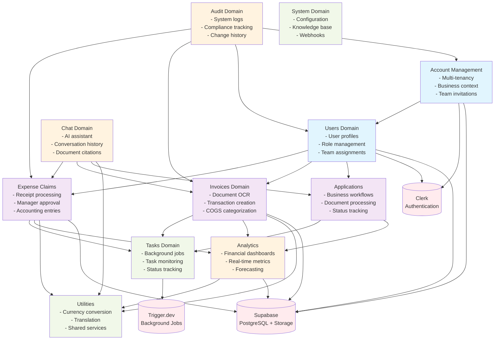

# Domain Architecture Guide

## Overview

FinanSEAL follows a domain-driven design (DDD) architecture where each business domain is self-contained with clear boundaries and interfaces.

## Domain Structure

```
src/domains/
├── account-management/     # Multi-tenancy, business management, team invitations
├── analytics/              # Financial dashboards, real-time metrics, forecasting
├── applications/           # Business application workflows, document processing
├── audit/                  # System audit logs, compliance tracking
├── chat/                   # AI assistant, conversation management, citations
├── expense-claims/         # Employee expense submission, manager approval workflows
├── invoices/              # Document processing, OCR extraction, transaction creation
├── system/                # System configuration, knowledge base, webhooks
├── tasks/                 # Background job monitoring, task status tracking
├── users/                 # User profiles, team management, role assignment
└── utilities/             # Shared utilities, currency conversion, translation
```

## Domain Interaction Diagram



## API Route Structure

Each domain maintains its own API routes under the v1 namespace:

```
/api/v1/
├── account-management/
├── analytics/
├── applications/
├── chat/
├── expense-claims/
├── invoices/
├── system/
├── tasks/
├── users/
└── utils/
```

## Data Flow Patterns

### Document Processing Flow
```
1. User uploads document → Applications/Invoices/ExpenseClaims domain
2. Domain triggers background job → Tasks domain → Trigger.dev
3. OCR processing completes → Updates domain entities
4. Analytics domain aggregates financial data
5. Audit domain logs all changes
```

### Approval Workflows
```
1. User creates expense claim → ExpenseClaims domain
2. Manager notification → Users domain (role-based routing)
3. Approval action → Creates accounting entry
4. Analytics updates → Real-time dashboard refresh
5. Audit trail → Compliance tracking
```

### Multi-tenant Context
```
1. User authentication → Clerk → AccountMgmt domain
2. Business context resolution → AccountMgmt sets RLS context
3. All domains enforce RLS → Data isolation by business
4. Cross-domain queries respect tenant boundaries
```

## Domain Principles

### Self-Containment
- Each domain manages its own components, hooks, and services
- No direct imports between domain internals
- Shared logic extracted to utilities domain

### API Isolation
- Domain-specific routes under `/api/v1/{domain}/`
- Clear request/response contracts
- Proper error handling and validation

### Type Safety
- Domain-specific types and interfaces
- Shared types in `/src/types/` for cross-domain contracts
- Strict TypeScript configuration

### Component Reuse
- Components can be shared via well-defined interfaces
- UI primitives in `/src/components/ui/`
- Domain components remain within domain boundaries

## Migration Notes

### From Component-Based to Domain-Based
The migration involved moving components from `/src/components/` to appropriate domains while maintaining functionality:

- Manager components → `expense-claims` domain
- Dashboard components → `analytics` domain
- Settings components → `account-management` domain
- Chat components → `chat` domain

### API Endpoint Migration
Legacy endpoints were updated to v1 structure:
- `/api/expense-claims/*` → `/api/v1/expense-claims/*`
- `/api/applications/*` → `/api/v1/applications/*`
- `/api/invoices/*` → `/api/v1/invoices/*`

### Build and Runtime Considerations
- All domains compile independently
- Circular dependency detection
- Tree-shaking optimization by domain
- Hot reload works per domain