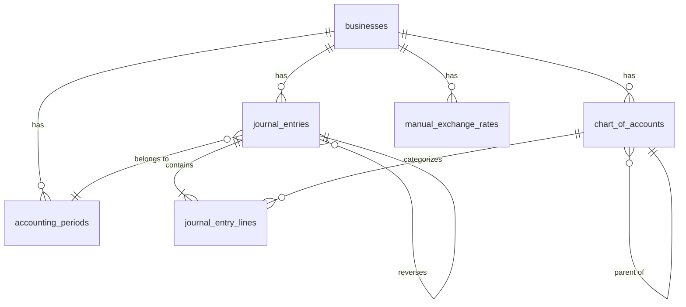

# Data Model: Double-Entry Accounting System

**Branch**: `001-accounting-double-entry` | **Date**: 2026-03-12
**Source**: [research.md](./research.md) - Schema design section 1

## Overview

This document defines the Convex database schema for implementing GAAP/IFRS/MAS-8 compliant double-entry bookkeeping. The design follows industry-standard patterns (QuickBooks, Xero, ERPNext) adapted for Convex's document database constraints.

**Core Principle**: Every financial transaction creates balanced journal entries where `SUM(debits) = SUM(credits)`.

---

## Table Schemas

### 1. `chart_of_accounts` - Account Master Data

Organizational structure categorizing all business accounts. Each account represents a classification of assets, liabilities, equity, revenue, or expenses.

**Fields**:
```typescript
{
  _id: Id<"chart_of_accounts">;
  _creationTime: number;

  // Identity
  businessId: Id<"businesses">;
  accountCode: string;          // e.g., "1000", "4100", "5200"
  accountName: string;           // e.g., "Cash", "Sales Revenue", "Travel Expense"

  // Classification
  accountType: "Asset" | "Liability" | "Equity" | "Revenue" | "Expense";
  accountSubtype?: string;       // e.g., "Current Asset", "Fixed Asset"
  normalBalance: "debit" | "credit";  // Account's natural balance side

  // Hierarchy
  parentAccountId?: Id<"chart_of_accounts">;  // For sub-accounts
  level: number;                 // 0 = top-level, 1 = sub-account, etc.

  // Status
  isActive: boolean;
  isSystemAccount: boolean;      // Cannot be deleted (Cash, AR, AP, etc.)

  // Metadata
  description?: string;
  tags?: string[];               // For custom categorization

  // Audit
  createdBy: string;             // Clerk userId
  createdAt: number;
  updatedBy?: string;
  updatedAt?: number;
}
```

**Indexes**:
```typescript
// Primary lookup by business
by_businessId: ["businessId"]

// Unique constraint enforcement
by_business_code: ["businessId", "accountCode"]

// Active accounts for dropdowns
by_business_active: ["businessId", "isActive"]

// Account type filtering
by_business_type: ["businessId", "accountType", "isActive"]
```

**Validation Rules**:
1. `accountCode` must be unique per `businessId`
2. `accountCode` format: 4-digit number string (e.g., "1000", "4520")
3. Account code ranges by type:
   - Assets: 1000-1999
   - Liabilities: 2000-2999
   - Equity: 3000-3999
   - Revenue: 4000-4999
   - Expenses: 5000-5999
4. `normalBalance` must match account type:
   - Asset/Expense accounts: `normalBalance = "debit"`
   - Liability/Equity/Revenue accounts: `normalBalance = "credit"`
5. `parentAccountId` must reference an account of the same `accountType`
6. System accounts (`isSystemAccount = true`) cannot have `isActive = false`

**Default Accounts** (created on business setup):
```
1000 - Cash
1200 - Accounts Receivable
1500 - Inventory
2100 - Accounts Payable
2200 - Sales Tax Payable
3000 - Owner's Equity
3100 - Retained Earnings
4100 - Sales Revenue
4900 - Other Income
5100 - Cost of Goods Sold
5200 - Operating Expenses
5900 - Other Expenses
```

---

### 2. `journal_entries` - Transaction Header

Represents a complete accounting transaction. Each entry contains multiple balanced lines (debits/credits).

**Fields**:
```typescript
{
  _id: Id<"journal_entries">;
  _creationTime: number;

  // Identity
  businessId: Id<"businesses">;
  entryNumber: string;           // Sequential: "JE-2026-00001"

  // Dates
  transactionDate: string;       // YYYY-MM-DD (business date, no timezone conversion)
  postingDate: string;           // YYYY-MM-DD (when posted to ledger)

  // Description
  description: string;
  memo?: string;                 // Additional notes

  // Status
  status: "draft" | "posted" | "reversed" | "voided";

  // Source tracking
  sourceType: "manual" | "sales_invoice" | "expense_claim" | "ar_reconciliation" | "migrated";
  sourceId?: string;             // Reference to source document (invoice ID, claim ID, etc.)

  // Fiscal period
  fiscalYear: number;            // e.g., 2026
  fiscalPeriod: string;          // e.g., "2026-01" (YYYY-MM)

  // Currency
  homeCurrency: string;          // Business's home currency (e.g., "MYR")

  // Balancing validation (denormalized for performance)
  totalDebit: number;            // SUM(lines.debitAmount)
  totalCredit: number;           // SUM(lines.creditAmount)
  lineCount: number;             // COUNT(journal_entry_lines)

  // Reversal tracking
  reversedBy?: Id<"journal_entries">;  // Points to reversing entry
  reversalOf?: Id<"journal_entries">;  // Points to original entry

  // Audit trail
  createdBy: string;             // Clerk userId
  createdAt: number;
  postedBy?: string;             // Who posted the entry
  postedAt?: number;             // When it was posted

  // Locking
  accountingPeriodId?: Id<"accounting_periods">;
  isPeriodLocked: boolean;       // Prevents modification if period closed
}
```

**Indexes**:
```typescript
// Primary date range queries (most common)
by_business_date_status: ["businessId", "transactionDate", "status"]

// Fiscal period reporting
by_business_period: ["businessId", "fiscalPeriod", "status"]

// Source document traceability
by_source: ["sourceType", "sourceId"]

// Posting date (for audit/compliance)
by_posted_date: ["businessId", "postingDate"]

// Entry number lookup
by_business_entry_number: ["businessId", "entryNumber"]
```

**Validation Rules**:
1. `totalDebit` must equal `totalCredit` (± 0.01 rounding tolerance)
2. `lineCount` must be >= 2 (minimum: 1 debit + 1 credit)
3. `status` transitions:
   - `draft → posted` (when balanced and validated)
   - `posted → reversed` (creates new reversing entry)
   - Cannot modify `posted` or `reversed` entries directly
4. `entryNumber` must be unique per `businessId`
5. `transactionDate` and `postingDate` cannot be in future
6. If `isPeriodLocked = true`, entry is immutable
7. `reversedBy` and `reversalOf` must form valid reversal pair

---

### 3. `journal_entry_lines` - Transaction Details

Individual debit or credit within a journal entry. Multiple lines create a balanced transaction.

**Fields**:
```typescript
{
  _id: Id<"journal_entry_lines">;
  _creationTime: number;

  // Parent reference
  journalEntryId: Id<"journal_entries">;
  businessId: Id<"businesses">;  // Denormalized for query performance

  // Line ordering
  lineOrder: number;             // Sequential within entry: 1, 2, 3...

  // Account reference
  accountId: Id<"chart_of_accounts">;
  accountCode: string;           // Denormalized from COA
  accountName: string;           // Denormalized from COA
  accountType: string;           // Denormalized from COA

  // Amounts
  debitAmount: number;           // Must be 0 if creditAmount > 0
  creditAmount: number;          // Must be 0 if debitAmount > 0
  homeCurrencyAmount: number;    // Converted to business home currency

  // Foreign currency support
  foreignCurrency?: string;      // e.g., "USD" if different from home
  foreignAmount?: number;        // Original amount in foreign currency
  exchangeRate?: number;         // Conversion rate used
  rateSource?: "api" | "manual" | "fallback";  // Exchange rate source

  // Line description
  lineDescription?: string;      // Specific to this line

  // Entity tracking (optional)
  entityType?: "customer" | "vendor" | "employee";
  entityId?: string;             // customer_id, vendor_id, employee_id
  entityName?: string;           // Denormalized for display

  // "Against Account" (ERPNext pattern for traceability)
  againstAccountCode?: string;   // The offsetting account code
  againstAccountName?: string;   // e.g., "Dr. Cash" line shows "Against: AR"

  // Tax tracking
  taxCode?: string;              // SST/GST code
  taxRate?: number;              // e.g., 0.06 for 6%
  taxAmount?: number;            // Tax portion of amount

  // Bank reconciliation
  bankReconciled: boolean;       // For bank statement matching
  bankReconciledDate?: string;   // YYYY-MM-DD

  // Audit
  createdAt: number;
}
```

**Indexes**:
```typescript
// Fetch all lines for an entry
by_journal_entry: ["journalEntryId", "lineOrder"]

// Account balance calculations
by_account_date: ["accountId", "businessId", "journalEntryId"]

// Business-wide account queries
by_business_account: ["businessId", "accountId"]

// Entity tracking (e.g., all transactions for a customer)
by_entity: ["entityType", "entityId", "businessId"]

// Bank reconciliation
by_bank_reconciled: ["businessId", "bankReconciled"]
```

**Validation Rules**:
1. **Mutual exclusivity**: `debitAmount > 0` XOR `creditAmount > 0` (never both)
2. **No zero lines**: Either `debitAmount` or `creditAmount` must be > 0
3. **Account exists**: `accountId` must reference valid `chart_of_accounts` entry
4. **Currency consistency**:
   - If `foreignCurrency` set, `foreignAmount` and `exchangeRate` required
   - `homeCurrencyAmount = foreignAmount * exchangeRate`
5. **Against account**: Must reference a different account code in same entry
6. **Tax calculation**: `taxAmount = homeCurrencyAmount * taxRate` (if taxCode set)

---

### 4. `accounting_periods` - Period Locking

Fiscal periods for financial reporting. Closed periods prevent transaction modifications.

**Fields**:
```typescript
{
  _id: Id<"accounting_periods">;
  _creationTime: number;

  // Identity
  businessId: Id<"businesses">;
  periodCode: string;            // e.g., "2026-01" (YYYY-MM)
  periodName: string;            // e.g., "January 2026"

  // Date range
  startDate: string;             // YYYY-MM-DD
  endDate: string;               // YYYY-MM-DD (inclusive)

  // Fiscal year
  fiscalYear: number;            // e.g., 2026
  fiscalQuarter?: number;        // 1, 2, 3, or 4

  // Status
  status: "open" | "closed";

  // Closing
  closedBy?: string;             // Clerk userId
  closedAt?: number;
  closingNotes?: string;

  // Validation
  journalEntryCount: number;     // Number of posted entries in period
  totalDebits: number;           // SUM of all debits in period
  totalCredits: number;          // SUM of all credits in period

  // Audit
  createdBy: string;
  createdAt: number;
}
```

**Indexes**:
```typescript
// List periods for business
by_business: ["businessId", "fiscalYear", "periodCode"]

// Check if period is open
by_business_status: ["businessId", "status"]

// Date range lookup
by_business_dates: ["businessId", "startDate", "endDate"]
```

**Validation Rules**:
1. `periodCode` must be unique per `businessId`
2. Date ranges cannot overlap within same business
3. `totalDebits` must equal `totalCredits` before closing
4. Cannot close period with `status = "draft"` journal entries
5. Once `status = "closed"`, cannot reopen without admin approval
6. `startDate` must be < `endDate`

---

### 5. `manual_exchange_rates` - Currency Rate Overrides

Finance Admin-defined exchange rates that override API rates for compliance.

**Fields**:
```typescript
{
  _id: Id<"manual_exchange_rates">;
  _creationTime: number;

  // Identity
  businessId: Id<"businesses">;

  // Currency pair
  fromCurrency: string;          // e.g., "USD"
  toCurrency: string;            // e.g., "MYR"

  // Rate
  rate: number;                  // e.g., 4.65 (1 USD = 4.65 MYR)
  effectiveDate: string;         // YYYY-MM-DD (when rate becomes active)

  // Metadata
  reason?: string;               // e.g., "Bank Negara Malaysia official rate"
  source?: string;               // e.g., "BNM website", "Bank statement"

  // Audit
  enteredBy: string;             // Clerk userId (Finance Admin)
  createdAt: number;
  updatedBy?: string;
  updatedAt?: number;
}
```

**Indexes**:
```typescript
// Primary lookup (find most recent rate before transaction date)
by_business_pair_date: ["businessId", "fromCurrency", "toCurrency", "effectiveDate"]

// List all rates for business
by_business: ["businessId", "effectiveDate"]

// Find rates by currency pair
by_pair: ["fromCurrency", "toCurrency", "effectiveDate"]
```

**Validation Rules**:
1. `rate` must be > 0
2. `effectiveDate` cannot be in future
3. `fromCurrency` and `toCurrency` must be different
4. Only users with `Finance Admin` role can create/update rates
5. Rate applies to all transactions on/after `effectiveDate` until superseded by newer manual rate

**Query Pattern** (rate resolution priority):
```typescript
// 1. Check manual rates first
const manualRate = await ctx.db
  .query("manual_exchange_rates")
  .withIndex("by_business_pair_date", (q) =>
    q.eq("businessId", businessId)
     .eq("fromCurrency", from)
     .eq("toCurrency", to)
     .lte("effectiveDate", transactionDate)
  )
  .order("desc")  // Most recent first
  .first();

if (manualRate) return manualRate.rate;

// 2. Fall back to API rate (CurrencyService)
const apiRate = await currencyService.getCurrentRate(from, to);
if (apiRate) return apiRate;

// 3. Fall back to hardcoded rates
return getFallbackRate(from, to);
```

---

## Relationships



---

## Data Integrity Constraints

### 1. Double-Entry Balance Constraint

**Rule**: For every `journal_entries` record, the sum of debit amounts must equal the sum of credit amounts.

```typescript
// Validation before posting
const lines = await ctx.db
  .query("journal_entry_lines")
  .withIndex("by_journal_entry", (q) => q.eq("journalEntryId", entryId))
  .collect();

const totalDebits = lines.reduce((sum, l) => sum + l.debitAmount, 0);
const totalCredits = lines.reduce((sum, l) => sum + l.creditAmount, 0);

// Allow 0.01 rounding tolerance
if (Math.abs(totalDebits - totalCredits) > 0.01) {
  throw new ConvexError({
    message: "Unbalanced journal entry",
    code: "UNBALANCED_ENTRY",
    debits: totalDebits,
    credits: totalCredits,
    difference: totalDebits - totalCredits,
  });
}
```

### 2. Period Lock Constraint

**Rule**: Cannot modify journal entries in closed accounting periods.

```typescript
// Check before mutation
const entry = await ctx.db.get(entryId);
if (entry.isPeriodLocked) {
  throw new ConvexError({
    message: "Cannot modify entry in closed accounting period",
    code: "PERIOD_LOCKED",
    entryId,
    periodId: entry.accountingPeriodId,
  });
}
```

### 3. Reversal Immutability Constraint

**Rule**: Cannot delete `posted` entries. Must create reversing entry instead.

```typescript
// Reversal pattern (not deletion)
const reversingEntry = {
  businessId: originalEntry.businessId,
  transactionDate: todayDate,
  postingDate: todayDate,
  description: `REVERSAL: ${originalEntry.description}`,
  status: "posted",
  sourceType: "manual",
  reversalOf: originalEntry._id,
  // ... other fields
};

// Create mirror lines with flipped debits/credits
const reversingLines = originalLines.map(line => ({
  ...line,
  debitAmount: line.creditAmount,   // Swap!
  creditAmount: line.debitAmount,   // Swap!
}));

// Link original to reversing entry
await ctx.db.patch(originalEntry._id, {
  reversedBy: reversingEntry._id,
  status: "reversed",
});
```

### 4. Account Code Uniqueness Constraint

**Rule**: `accountCode` must be unique per business in `chart_of_accounts`.

```typescript
// Check before insert
const existing = await ctx.db
  .query("chart_of_accounts")
  .withIndex("by_business_code", (q) =>
    q.eq("businessId", businessId).eq("accountCode", accountCode)
  )
  .first();

if (existing) {
  throw new ConvexError({
    message: `Account code ${accountCode} already exists`,
    code: "DUPLICATE_ACCOUNT_CODE",
  });
}
```

---

## Performance Considerations

### Query Optimization

**Dashboard Metrics** (current month, <1s target):
```typescript
// Uses by_business_date_status index
const entries = await ctx.db
  .query("journal_entries")
  .withIndex("by_business_date_status", (q) =>
    q.eq("businessId", businessId)
     .gte("transactionDate", currentMonthStart)
     .lte("transactionDate", currentMonthEnd)
     .eq("status", "posted")
  )
  .collect();
```

**Financial Statements** (any date range, <5s target):
```typescript
// P&L: Aggregate by account type (Revenue, Expense)
const lines = await ctx.db
  .query("journal_entry_lines")
  .withIndex("by_business_account", (q) => q.eq("businessId", businessId))
  .filter((q) =>
    q.and(
      q.gte(q.field("journalEntry.transactionDate"), startDate),
      q.lte(q.field("journalEntry.transactionDate"), endDate),
      q.or(
        q.eq(q.field("accountType"), "Revenue"),
        q.eq(q.field("accountType"), "Expense")
      )
    )
  )
  .collect();
```

### Denormalization Strategy

**Rationale**: Convex queries cannot efficiently join across tables. Denormalize frequently accessed fields to avoid N+1 queries.

**Denormalized Fields**:
- `journal_entry_lines.businessId` - Avoid joining through `journal_entries`
- `journal_entry_lines.accountCode/Name/Type` - Avoid joining `chart_of_accounts` for every line
- `journal_entries.totalDebit/Credit` - Avoid aggregating lines for every query

**Trade-off**: Increased write complexity (must update denormalized fields) for faster reads (dashboard, reports).

---

## Migration from `accounting_entries`

See [research.md section 4](./research.md#4-migration-algorithm) for detailed migration algorithm.

**Summary**:
1. Map `transactionType` → GL accounts (Income→4xxx, Expense→5xxx)
2. Create balanced journal entry with 2 lines (debit + credit)
3. If `status='paid'`, create second entry for payment
4. Skip invalid records with detailed error report
5. Store report in `migration_reports` table for Finance Admin review

**Estimated Migration Time**: 5-10 minutes for 1000 records.

---

## Next Steps

1. **Implement Convex schema** in `convex/schema.ts`
2. **Create validation helpers** in `convex/lib/validation.ts`
3. **Build CRUD mutations** in `convex/functions/journalEntries.ts`
4. **Test double-entry balance** with unit tests

---

**Schema Status**: ✅ Complete and validated
**Estimated Storage**: ~50KB per 100 journal entries (2-3 lines average)
**Index Count**: 21 indexes across 5 tables
