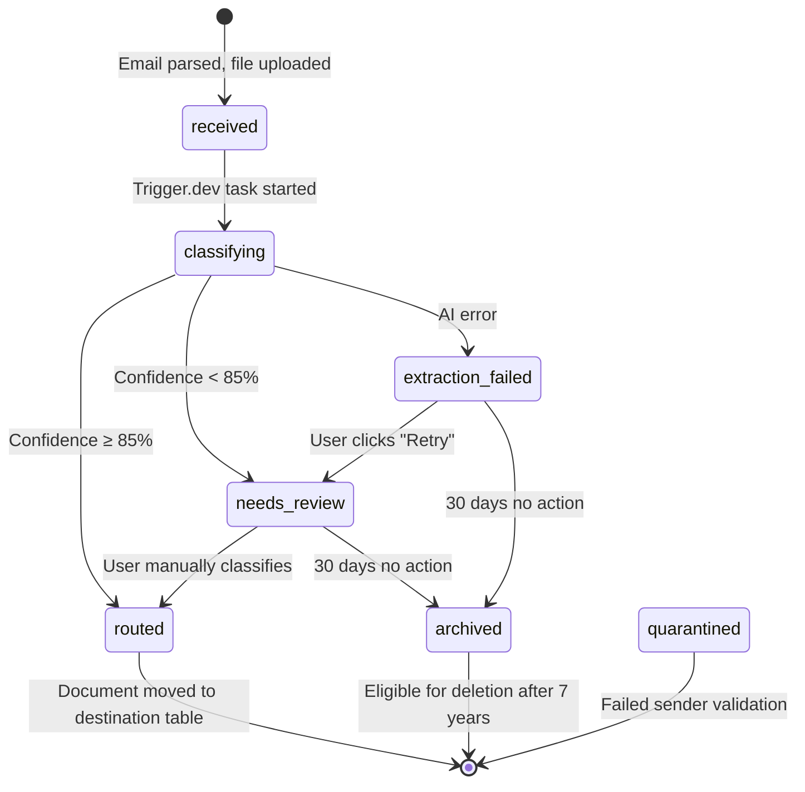

# Data Model: Email Forwarding for Documents

**Date**: 2026-03-16
**Phase**: 1 (Design & Contracts)
**Status**: Complete

## Overview

This document defines the Convex database schema and state transitions for email forwarding document ingestion. The design extends existing tables (`businesses`) and introduces a new table (`document_inbox_entries`) for the "Needs Review" workflow.

---

## Convex Schema Extensions

### 1. New Table: `document_inbox_entries`

**Purpose**: Temporary holding table for documents requiring manual classification (confidence <85% or extraction failures). Documents are routed here when AI cannot confidently determine type or destination.

**Lifecycle**: Documents remain in this table until:
- User manually classifies → Routed to destination (expense_claims or invoices) → Record deleted
- 30 days of inactivity → Auto-archived → `status: 'archived'`
- User deletes → Record hard-deleted

```typescript
// convex/schema.ts
import { defineSchema, defineTable } from 'convex/server';
import { v } from 'convex/values';

export default defineSchema({
  // ... existing tables ...

  document_inbox_entries: defineTable({
    // Identity
    businessId: v.id('businesses'),
    userId: v.id('users'), // User who forwarded the email
    fileStorageId: v.id('_storage'), // Convex file storage reference

    // Source metadata
    sourceType: v.union(v.literal('email_forward'), v.literal('manual_upload')),
    emailMetadata: v.optional(v.object({
      from: v.string(),         // sender@domain.com
      subject: v.string(),       // Email subject line
      body: v.string(),          // Email body text (first 1000 chars)
      receivedAt: v.number(),    // Timestamp when SES received email
      messageId: v.string(),     // SES message ID for tracking
    })),

    // Document metadata
    originalFilename: v.string(),
    fileHash: v.string(),        // MD5 hash for duplicate detection
    fileSizeBytes: v.number(),
    mimeType: v.string(),        // application/pdf, image/jpeg, image/png

    // Classification results
    aiDetectedType: v.optional(v.union(
      v.literal('receipt'),
      v.literal('invoice'),
      v.literal('e_invoice'),
      v.literal('unknown')
    )),
    aiConfidence: v.optional(v.number()), // 0.0-1.0
    aiReasoning: v.optional(v.string()),  // Why AI classified this way

    // Processing status
    status: v.union(
      v.literal('received'),        // Email parsed, file uploaded to storage
      v.literal('classifying'),     // Trigger.dev classification task running
      v.literal('needs_review'),    // Low confidence, awaiting manual classification
      v.literal('extraction_failed'), // Classification or extraction error
      v.literal('routed'),          // Successfully routed to destination
      v.literal('archived'),        // Auto-archived after 30 days
      v.literal('quarantined')      // Failed sender validation
    ),

    // Manual classification (when user overrides AI)
    manuallyClassifiedType: v.optional(v.union(
      v.literal('receipt'),
      v.literal('invoice'),
      v.literal('e_invoice')
    )),
    classifiedBy: v.optional(v.id('users')), // User who manually classified
    classifiedAt: v.optional(v.number()),

    // Routing destination (after classification)
    destinationDomain: v.optional(v.union(
      v.literal('expense_claims'),
      v.literal('invoices'),
      v.literal('einvoice')
    )),
    destinationRecordId: v.optional(v.union(
      v.id('expense_claims'),
      v.id('invoices'),
      v.id('einvoice_received_documents')
    )),

    // Error tracking
    errorMessage: v.optional(v.string()),
    errorDetails: v.optional(v.any()),  // JSONB for structured error data
    retryCount: v.number(),             // Number of classification retries

    // Duplicate detection
    isDuplicate: v.boolean(),
    duplicateOriginalId: v.optional(v.union(
      v.id('expense_claims'),
      v.id('invoices'),
      v.id('document_inbox_entries')
    )),

    // Retention metadata
    archiveEligibleAt: v.number(),   // createdAt + 30 days
    deleteEligibleAt: v.number(),    // createdAt + 7 years (PDPA compliance)

    // Timestamps
    createdAt: v.number(),
    updatedAt: v.number(),
  })
    .index('by_business_status', ['businessId', 'status'])      // Find needs_review docs for business
    .index('by_user_status', ['userId', 'status'])              // User's pending classifications
    .index('by_file_hash', ['businessId', 'fileHash', 'createdAt']) // Duplicate detection
    .index('by_archive_eligible', ['archiveEligibleAt'])        // Cron: Auto-archive old docs
    .index('by_created_at', ['businessId', 'createdAt'])        // Recent documents view
    .searchIndex('search_filename', {
      searchField: 'originalFilename',
      filterFields: ['businessId', 'status']
    }),

  // ... rest of schema ...
});
```

**Index Justifications**:
- `by_business_status`: Primary query for "Needs Review" inbox UI (get all `needs_review` docs for business)
- `by_user_status`: Filter inbox by current user (employees see only their forwarded docs)
- `by_file_hash`: Duplicate detection query (find existing docs with same hash in 90-day window)
- `by_archive_eligible`: Cron job to auto-archive docs after 30 days of inactivity
- `by_created_at`: Sort inbox by recency (newest first)
- `search_filename`: Allow users to search inbox by filename

---

### 2. Extended Table: `businesses`

**Purpose**: Store email forwarding configuration per business.

**New Fields**:

```typescript
// convex/schema.ts
businesses: defineTable({
  // ... existing fields (name, slug, ownerId, settings, etc.) ...

  // Email forwarding configuration
  docInboxEmail: v.optional(v.string()),  // docs@{slug}.hellogroot.com
  authorizedEmailDomains: v.array(v.string()), // ['@mycompany.com', '@contractors.com']
  emailForwardingEnabled: v.boolean(),    // Feature flag per business
  emailNotificationPreferences: v.optional(v.object({
    notifyOnNeedsReview: v.boolean(),     // Email user when doc requires manual classification
    notifyOnExtractionFailure: v.boolean(), // Email user when extraction fails
    notifyOnQuarantine: v.boolean(),      // Email admin when unauthorized submission detected
    digestFrequency: v.union(            // Daily digest of inbox activity
      v.literal('none'),
      v.literal('daily'),
      v.literal('weekly')
    ),
  })),

  // ... rest of existing fields ...
})
  .index('by_slug', ['slug'])  // Existing index (lookup business by inbox email subdomain)
  .index('by_owner', ['ownerId'])
  // ... other existing indexes ...
```

**Default Values** (set at business creation):
```typescript
{
  docInboxEmail: `docs@${business.slug}.hellogroot.com`,
  authorizedEmailDomains: [extractDomain(owner.email)], // Auto-add owner's company domain
  emailForwardingEnabled: true,
  emailNotificationPreferences: {
    notifyOnNeedsReview: true,
    notifyOnExtractionFailure: true,
    notifyOnQuarantine: true,
    digestFrequency: 'daily'
  }
}
```

---

### 3. Extended Table: `expense_claims`

**Purpose**: Track documents created via email forwarding (vs manual upload).

**New Fields**:

```typescript
// convex/schema.ts
expense_claims: defineTable({
  // ... existing fields ...

  // Source tracking
  sourceType: v.union(
    v.literal('manual_upload'),
    v.literal('email_forward'),
    v.literal('mobile_camera')
  ),
  sourceInboxEntryId: v.optional(v.id('document_inbox_entries')), // Link back to inbox if routed from there

  // ... rest of existing fields ...
})
  .index('by_source_type', ['businessId', 'sourceType']) // Analytics: track adoption of email forwarding
  // ... other existing indexes ...
```

**Backward Compatibility**: Existing `expense_claims` records have `sourceType: undefined` (treated as `'manual_upload'` in queries).

---

### 4. Extended Table: `invoices` (AP Invoices)

**Purpose**: Track invoices created via email forwarding.

**New Fields** (same as `expense_claims`):

```typescript
// convex/schema.ts
invoices: defineTable({
  // ... existing fields ...

  // Source tracking
  sourceType: v.union(
    v.literal('manual_upload'),
    v.literal('email_forward'),
    v.literal('api_integration')
  ),
  sourceInboxEntryId: v.optional(v.id('document_inbox_entries')),

  // ... rest of existing fields ...
})
  .index('by_source_type', ['businessId', 'sourceType'])
  // ... other existing indexes ...
```

---

## State Transitions

### Document Inbox Entry Lifecycle



**State Definitions**:

| State | Description | Next States | Trigger |
|-------|-------------|-------------|---------|
| `received` | Email parsed, file uploaded to Convex storage, awaiting classification | `classifying` | Immediate (Lambda completes) |
| `classifying` | Trigger.dev classification task running (Gemini Vision API call) | `needs_review`, `routed`, `extraction_failed` | Classification result |
| `needs_review` | Low confidence (<85%) or unknown type, awaiting manual user classification | `routed`, `archived` | User action or 30-day timeout |
| `extraction_failed` | Classification or extraction API error (timeout, rate limit, invalid file) | `needs_review`, `archived` | User retry or 30-day timeout |
| `routed` | Document successfully moved to destination table (expense_claims or invoices) | Terminal (record deleted) | Immediate after routing |
| `archived` | No user action for 30 days, moved to long-term storage (S3 Glacier) | Terminal (eligible for deletion after 7 years) | Cron job |
| `quarantined` | Failed sender domain validation (unauthorized email domain) | Terminal (admin review required) | Immediate (Lambda) |

**Terminal States**:
- `routed`: Document record deleted from inbox (data moved to destination table)
- `archived`: Record marked as archived, file moved to S3 Glacier, eligible for hard delete after 7 years
- `quarantined`: Record retained indefinitely for security audit trail (admin can manually release or delete)

---

## Data Flow Examples

### Example 1: High-Confidence Receipt (Happy Path)

**Scenario**: User forwards clear receipt image with good lighting, no blurriness.

```
1. User forwards email with receipt.jpg to docs@mycompany.hellogroot.com
2. SES receives email → Stores in S3 → Triggers Lambda
3. Lambda:
   - Parses email with mailparser
   - Validates sender domain (user@mycompany.com) ✅
   - Checks file hash for duplicates ✅ No match
   - Creates document_inbox_entries record:
     {
       status: 'received',
       sourceType: 'email_forward',
       emailMetadata: { from: 'user@mycompany.com', ... },
       fileHash: 'abc123...',
       ...
     }
   - Uploads file to Convex storage
   - Triggers Trigger.dev classification task
4. Trigger.dev (classify-document task):
   - Calls Gemini Vision API
   - Result: { type: 'receipt', confidence: 0.92, reasoning: '...' }
   - Confidence ≥ 85% → Route directly to expense_claims
5. Convex mutation (createExpenseClaim):
   - Creates expense_claims record with extracted data
   - Sets sourceType: 'email_forward'
   - Sets sourceInboxEntryId: <inbox record ID>
6. Convex mutation (routeDocument):
   - Updates inbox record: status = 'routed', destinationRecordId = <expense_claim_id>
   - Deletes inbox record (moved to destination)
7. User opens Groot → Sees new draft expense claim in their submission batch
```

**Result**: Receipt appears in expense claims within 10-15 seconds, zero user interaction.

---

### Example 2: Low-Confidence Invoice (Needs Review Path)

**Scenario**: User forwards blurry invoice PDF, AI confidence is 72%.

```
1-3. Same as Example 1 (email received, parsed, inbox record created)
4. Trigger.dev (classify-document task):
   - Calls Gemini Vision API
   - Result: { type: 'invoice', confidence: 0.72, reasoning: 'Blurry text, partial OCR' }
   - Confidence < 85% → Route to "Needs Review" inbox
5. Convex mutation (updateInboxStatus):
   - Updates inbox record:
     {
       status: 'needs_review',
       aiDetectedType: 'invoice',
       aiConfidence: 0.72,
       aiReasoning: 'Blurry text, partial OCR',
       archiveEligibleAt: Date.now() + (30 * 24 * 60 * 60 * 1000)
     }
6. Convex cron (sendExceptionNotifications):
   - Sends email to user:
     Subject: "Document needs your review"
     Body: "The document 'invoice.pdf' requires manual classification. View in inbox."
     Link: https://finance.hellogroot.com/documents-inbox
7. User clicks link → Opens "Needs Review" inbox → Sees invoice with 72% confidence badge
8. User clicks "Classify" button → Modal opens with dropdown
9. User selects "AP Invoice" → Confirms
10. Convex mutation (manuallyClassifyDocument):
    - Creates invoices record with extracted data (best-effort)
    - Updates inbox record: status = 'routed', manuallyClassifiedType = 'invoice'
    - Deletes inbox record
11. User navigates to AP Invoices page → Sees new invoice entry
```

**Result**: User manually classified document in <30 seconds, document successfully routed.

---

### Example 3: Duplicate Detection (File Hash Match)

**Scenario**: User accidentally forwards same receipt twice within 90 days.

```
1. User forwards email with receipt.jpg (first time) → Processed normally (Example 1)
2. User forwards same email again (duplicate) → SES receives → Lambda
3. Lambda:
   - Parses email with mailparser
   - Validates sender domain ✅
   - Computes file hash: 'abc123...' (same as first receipt)
   - Queries Convex: findByHash(businessId, 'abc123', since: 90 days ago)
   - Match found: expense_claims record from 2 weeks ago
4. Lambda:
   - Sends auto-reply email to user:
     Subject: "Duplicate Document Detected"
     Body: "The document 'receipt.jpg' was already submitted on 2026-03-02.
            View original: https://finance.hellogroot.com/expense-claims/123"
   - Creates inbox record with:
     {
       status: 'quarantined',  // Or 'routed' with isDuplicate=true
       isDuplicate: true,
       duplicateOriginalId: <expense_claim_id>,
       errorMessage: 'Duplicate file hash detected'
     }
   - Does NOT trigger classification (save API costs)
5. User receives email → Clicks link → Sees original expense claim
```

**Result**: Duplicate rejected in <5 seconds, user notified, no wasted API calls.

---

## Data Retention & Cleanup

### Auto-Archive Cron (runs daily at 2 AM)

**Purpose**: Archive documents in `needs_review` or `extraction_failed` status with no user action for 30 days.

```typescript
// convex/crons.ts
export default crons.interval(
  'auto-archive-inbox-documents',
  { hours: 24 },
  internal.crons.autoArchiveInboxDocuments
);

// convex/functions/crons.ts
export const autoArchiveInboxDocuments = internalMutation({
  handler: async (ctx) => {
    const now = Date.now();
    const eligibleDocs = await ctx.db
      .query('document_inbox_entries')
      .withIndex('by_archive_eligible', (q) => q.lte('archiveEligibleAt', now))
      .filter((q) =>
        q.or(
          q.eq(q.field('status'), 'needs_review'),
          q.eq(q.field('status'), 'extraction_failed')
        )
      )
      .collect();

    for (const doc of eligibleDocs) {
      // Move file to S3 Glacier (long-term storage)
      await archiveFileToGlacier(doc.fileStorageId);
      // Update status
      await ctx.db.patch(doc._id, { status: 'archived', updatedAt: now });
    }

    return { archived: eligibleDocs.length };
  }
});
```

### Hard Delete After 7 Years (PDPA compliance)

**Purpose**: Permanently delete archived documents after 7-year retention period.

```typescript
export const deleteExpiredDocuments = internalMutation({
  handler: async (ctx) => {
    const now = Date.now();
    const expiredDocs = await ctx.db
      .query('document_inbox_entries')
      .filter((q) =>
        q.and(
          q.eq(q.field('status'), 'archived'),
          q.lte(q.field('deleteEligibleAt'), now)
        )
      )
      .collect();

    for (const doc of expiredDocs) {
      // Delete file from S3 Glacier
      await deleteFileFromStorage(doc.fileStorageId);
      // Hard delete record
      await ctx.db.delete(doc._id);
    }

    return { deleted: expiredDocs.length };
  }
});
```

---

## Migration Plan

### Schema Deployment (Convex)

**Step 1**: Add new fields to existing tables (non-breaking)

```bash
# Convex schema changes are backward-compatible
npx convex deploy --yes
```

**Step 2**: Backfill existing records with default values

```typescript
// Migration script (run once)
export const backfillSourceType = internalMutation({
  handler: async (ctx) => {
    const claims = await ctx.db.query('expense_claims').collect();
    for (const claim of claims) {
      if (!claim.sourceType) {
        await ctx.db.patch(claim._id, { sourceType: 'manual_upload' });
      }
    }
  }
});
```

**Step 3**: Verify migrations

```bash
# Check all expense_claims have sourceType
npx convex run migrations:verifySourceTypeBackfill
```

### Rollback Plan

**If email forwarding needs to be disabled**:

1. **Feature flag**: Set `emailForwardingEnabled: false` in `businesses` table
2. **SES**: Disable receipt rule (keep configuration for re-enable)
3. **Frontend**: Hide "Needs Review" inbox nav item via feature flag check
4. **Data**: `document_inbox_entries` table can remain (empty, no cost)
5. **No schema rollback needed**: New fields are optional, existing code unaffected

---

**Data Model Complete**: 2026-03-16
**Next**: Generate API contracts in `contracts/` directory
