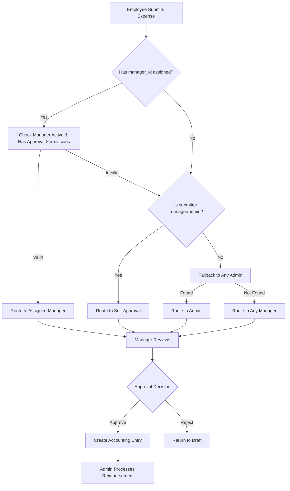

# Expense Claims Approval Workflow Documentation

## Overview

The expense claims module implements a unified approval workflow that integrates with organizational hierarchy through the business_memberships table. The system supports intelligent routing based on manager assignments with robust fallback mechanisms.

## Workflow States

```
draft → submitted → approved → reimbursed
               ↓
          rejected
```

### Status Definitions

- **draft**: Editable state after OCR completion or manual entry
- **submitted**: Submitted for approval, routed to appropriate approver
- **approved**: Manager/Admin approved, creates accounting entry
- **rejected**: Manager/Admin rejected with reason
- **reimbursed**: Payment processed by admin

## Approval Routing Logic

### Manager Hierarchy Routing

Uses `business_memberships.manager_id` with intelligent fallback logic:



### Routing Implementation

Located in `src/domains/expense-claims/lib/data-access.ts`:

```typescript
async function findNextApprover(submittingUserId, businessId, supabase) {
  // Step 1: Check assigned manager_id
  if (submitterMembership?.manager_id) {
    // Route to assigned manager if active with approval permissions
    return managerUserId
  }

  // Step 2: Self-approval for managers/admins without assignment
  if (['manager', 'admin'].includes(submitterMembership.role)) {
    return submittingUserId // Route to self
  }

  // Step 3: Fallback to any admin
  // Step 4: Fallback to any manager
}
```

## Team Management Integration

### Manager Assignment UI

Location: `src/domains/users/components/teams-management-client.tsx`

**Features:**
- **Employees**: Required manager assignment
- **Managers/Admins**: Optional manager assignment
- **Self-Assignment Prevention**: Managers/Admins cannot assign themselves
- **Role-Based Filtering**: Smart filtering based on user roles

**UI Behavior:**
```typescript
// Dynamic labeling
currentRole === 'employee' ? 'Manager' : 'Manager (Optional)'

// Dynamic placeholders
currentRole === 'employee' ? 'Assign manager' : 'Optional manager'

// Dropdown options
currentRole === 'employee' ? 'No Manager' : 'No Assignment'
```

## Database Schema

### Key Tables

**business_memberships:**
```sql
- user_id (FK to users.id)
- business_id (FK to businesses.id)
- role ('employee' | 'manager' | 'admin')
- manager_id (FK to users.id) -- Manager assignment
- status ('active' | 'inactive')
```

**expense_claims:**
```sql
- user_id (submitter)
- reviewed_by (current approver assignment)
- status (workflow state)
- accounting_entry_id (NULL until approved)
```

## Accounting Integration

### IFRS Compliance

**Principle**: Only approved expense claims create accounting entries.

```
expense_claims table = "Pending Requests" (workflow system)
accounting_entries table = "Posted Transactions" (general ledger)
```

**Approval Flow:**
1. **Submission**: `expense_claims` record created, `accounting_entry_id = NULL`
2. **Approval**: Creates `accounting_entries` record, links via `accounting_entry_id`
3. **Reimbursement**: Updates `accounting_entries.status = 'paid'`

### Implementation Details

**Status Change Handler** (`updateExpenseClaim`):
```typescript
case 'approved':
  // Create accounting entry from processing_metadata
  const accountingEntryData = {
    // Extract from processing_metadata.financial_data
    transaction_type: 'Expense',
    category: processingMetadata.category_mapping?.accounting_category,
    // ... other fields
  }

  // Link to expense claim
  statusUpdateData.accounting_entry_id = accountingEntry.id
```

## Workflow Engine

Location: `src/domains/expense-claims/lib/enhanced-workflow-engine.ts`

**Capabilities:**
- **Compliance Checks**: Otto's policy validation
- **Risk Assessment**: Automated scoring based on amount, vendor, patterns
- **Audit Trail**: Comprehensive logging for all state changes
- **Policy Overrides**: Admin override capabilities with justification

**Example Compliance Rules:**
```typescript
// High-value expenses require project code
if (amount > 10000 && !claim.business_purpose_details?.project_code) {
  violations.push('HIGH_VALUE_NO_PROJECT')
}

// Receipt requirements for amounts > 300
if (amount > 300 && !claim.transaction?.document_id) {
  violations.push('MISSING_RECEIPT')
}
```

## API Endpoints

### Core Operations

**Create Expense Claim:**
```
POST /api/v1/expense-claims
- Supports file upload with AI processing
- Automatic currency conversion
- Duplicate detection
```

**Update Status:**
```
PUT /api/v1/expense-claims/{id}
- Status transitions with RBAC validation
- Automatic routing assignment
- Accounting entry creation on approval
```

**Manager Assignment:**
```
POST /api/v1/users/{userId}/roles
- Updates business_memberships.manager_id
- Used by team management interface
```

## Security & Permissions

### Role-Based Access Control (RBAC)

**Permission Checks:**
- `canSubmitOwnClaim()` - Employee submissions
- `canApproveExpenseClaims()` - Manager/Admin approvals
- `canProcessReimbursements()` - Admin reimbursements
- `canRecallOwnClaim()` - Employee recall submitted claims

**Implementation:**
```typescript
// Status-specific permission validation
switch (request.status) {
  case 'submitted':
    hasPermission = await canSubmitOwnClaim()
    break
  case 'approved':
    hasPermission = await canApproveExpenseClaims()
    break
  case 'reimbursed':
    hasPermission = await canProcessReimbursements()
    break
}
```

## Key Features

### Manager Hierarchy Support
✅ Flexible manager assignment for all roles
✅ Optional assignment for managers/admins
✅ Intelligent routing with fallback mechanisms
✅ Self-approval capability for managers/admins

### Compliance & Audit
✅ IFRS-compliant accounting integration
✅ Comprehensive audit trail
✅ Policy violation detection
✅ Risk scoring and monitoring

### User Experience
✅ Real-time status updates
✅ Clear approval routing visibility
✅ Duplicate detection and prevention
✅ Multi-currency support with conversion

## Configuration

### Workflow Transitions

Defined in `src/domains/expense-claims/types/index.ts`:

```typescript
export const EXPENSE_WORKFLOW_TRANSITIONS: WorkflowTransition[] = [
  // Basic workflow
  { from: 'draft', to: 'submitted', action: 'submit', requiredRole: 'employee' },
  { from: 'submitted', to: 'approved', action: 'approve', requiredRole: 'manager' },
  { from: 'approved', to: 'reimbursed', action: 'approve', requiredRole: 'admin' },

  // Override workflows
  { from: ['submitted'], to: 'approved', action: 'override_approve', requiredRole: 'admin' }
]
```

## Troubleshooting

### Common Issues

1. **No Approver Found**: Ensure business has active managers/admins
2. **Routing Loops**: Verify manager_id assignments don't create circular references
3. **Permission Errors**: Check user roles in business_memberships table
4. **Accounting Entry Errors**: Verify processing_metadata contains required financial_data

### Debugging

**Logging Locations:**
- `[Approver Routing]` - Manager hierarchy routing decisions
- `[Enhanced Workflow]` - Workflow engine operations
- `[Expense Submission]` - Status transitions and assignments

**Key Debug Points:**
- Manager assignment in team management interface
- Routing decisions during submission
- Status transition validation
- Accounting entry creation