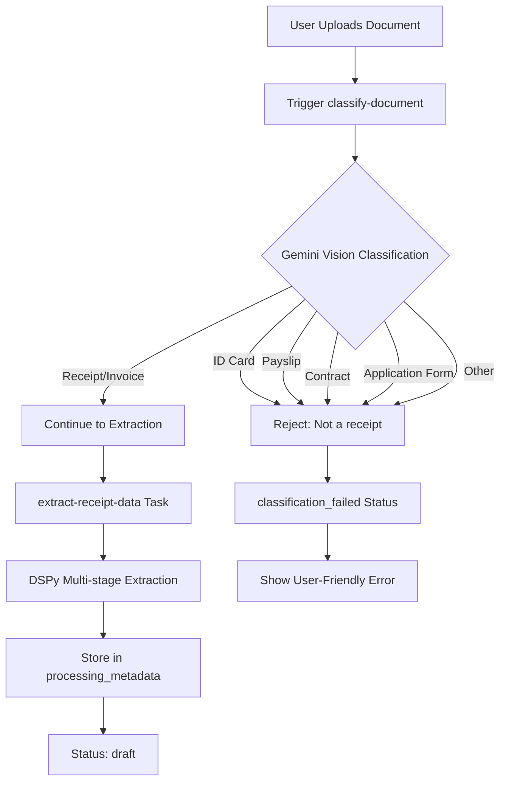
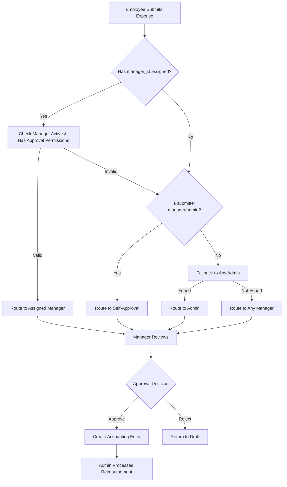

# Expense Claims Module Documentation

## Overview

The expense claims module implements a complete receipt processing and approval workflow system. It features AI-powered document classification and extraction, automatic validation, and intelligent approval routing through organizational hierarchy.

### Key Capabilities
- **Document Classification**: AI validates receipts vs non-receipt documents
- **Data Extraction**: Automated receipt data extraction using DSPy/Gemini
- **Approval Workflow**: Manager hierarchy-based routing with fallbacks
- **IFRS Compliance**: Accounting entries only created after approval
- **Performance Optimized**: Parallel data fetching, intelligent caching

## Document Processing Pipeline

### Receipt Upload → Classification → Extraction Flow



### Document Classification Details

**Location**: `src/trigger/classify-document.ts`

**Supported Document Types**:
- ✅ **Receipt**: Purchase receipts, restaurant bills, taxi receipts, retail transactions
- ✅ **Invoice**: Treated as receipt for expense claims
- ❌ **ID Card**: Rejected with message
- ❌ **Payslip**: Rejected with message
- ❌ **Application Form**: Rejected with message
- ❌ **Contract/Other**: Rejected with message

**Classification Implementation**:
```typescript
// src/trigger/classify-document.ts (lines 223-343)
case 'receipt':
  // Route to extract-receipt-data task
  const receiptRun = await tasks.trigger<typeof extractReceiptData>("extract-receipt-data", {
    expenseClaimId: documentId,
    documentDomain: 'expense_claims'
  });
  break;

case 'ic':
  if (documentDomain === 'expense_claims') {
    const errorMsg = 'This appears to be an identity card. Please upload a receipt or invoice.';
    await updateDocumentStatus(documentId, 'classification_failed', errorMsg);
    throw new Error(errorMsg);
  }
  break;
```

### Processing Status Flow

```
Status Progression:
1. uploading       → File being uploaded to storage
2. classifying     → AI analyzing document type
3. processing      → Extracting receipt data
4. analyzing       → DSPy processing
5. draft           → Extraction complete, ready for review
6. submitted       → Sent for approval
7. approved        → Manager approved
8. reimbursed      → Payment processed

Error States:
- classification_failed → Wrong document type
- failed           → Processing error
```

### API Endpoints for Document Processing

**Create Expense Claim with File:**
```
POST /api/v1/expense-claims
Content-Type: multipart/form-data
- file: Receipt image/PDF
- processing_mode: 'ai' | 'manual'
- description: Business purpose
- business_purpose: Required text
- transaction_date: Date
- vendor_name: String
- total_amount: Number
- original_currency: Currency code

Response:
{
  success: true,
  data: {
    expense_claim_id: uuid,
    task_id: string,
    processing_complete: boolean
  }
}
```

**Check Processing Status:**
```
GET /api/v1/expense-claims/{id}
- Returns current processing_status
- Includes extraction results when complete
```

### Frontend Components

**Processing Flow Components**:
- `ExpenseSubmissionFlow` - Main orchestrator
- `ReceiptUploadStep` - File selection/capture
- `ProcessingStep` - Shows chain-of-thought extraction
- `CreateExpensePageNew` - Pre-filled form with extracted data

**Hook for Processing Status**:
```typescript
// src/domains/expense-claims/hooks/use-expense-claim-processing.tsx
const { processingClaims, addProcessingClaim } = useExpenseClaimProcessing()

// Tracks status: uploading → classifying → processing → completed
```

## Performance Optimizations

### Database Indexes (Applied 2025-01-24)
```sql
-- Key indexes for expense_claims table
idx_expense_claims_status_deleted      -- Status filtering
idx_expense_claims_user_status         -- User dashboard
idx_expense_claims_business_status     -- Team views
idx_expense_claims_metadata_gin        -- JSONB search
idx_expense_claims_processing          -- Background jobs
idx_expense_claims_approver_status     -- Approval routing
```

### Caching Strategy
```typescript
// src/domains/expense-claims/hooks/use-expense-claims.tsx
- Dashboard data: 1 minute cache (frequent changes)
- Categories: 30 minutes cache (rarely changes)
- Processing claims: No cache (real-time updates)
- Parallel fetching with useQueries for better performance
```

## Workflow States

```
draft → submitted → approved → reimbursed
               ↓
          rejected
```

### Status Definitions

- **draft**: Editable state after OCR completion or manual entry
- **submitted**: Submitted for approval, routed to appropriate approver
- **approved**: Manager/Admin approved, creates accounting entry
- **rejected**: Manager/Admin rejected with reason
- **reimbursed**: Payment processed by admin

## Approval Routing Logic

### Manager Hierarchy Routing

Uses `business_memberships.manager_id` with intelligent fallback logic:



### Routing Implementation

Located in `src/domains/expense-claims/lib/data-access.ts`:

```typescript
async function findNextApprover(submittingUserId, businessId, supabase) {
  // Step 1: Check assigned manager_id
  if (submitterMembership?.manager_id) {
    // Route to assigned manager if active with approval permissions
    return managerUserId
  }

  // Step 2: Self-approval for managers/admins without assignment
  if (['manager', 'admin'].includes(submitterMembership.role)) {
    return submittingUserId // Route to self
  }

  // Step 3: Fallback to any admin
  // Step 4: Fallback to any manager
}
```

## Team Management Integration

### Manager Assignment UI

Location: `src/domains/users/components/teams-management-client.tsx`

**Features:**
- **Employees**: Required manager assignment
- **Managers/Admins**: Optional manager assignment
- **Self-Assignment Prevention**: Managers/Admins cannot assign themselves
- **Role-Based Filtering**: Smart filtering based on user roles

**UI Behavior:**
```typescript
// Dynamic labeling
currentRole === 'employee' ? 'Manager' : 'Manager (Optional)'

// Dynamic placeholders
currentRole === 'employee' ? 'Assign manager' : 'Optional manager'

// Dropdown options
currentRole === 'employee' ? 'No Manager' : 'No Assignment'
```

## Database Schema

### Key Tables

**business_memberships:**
```sql
- user_id (FK to users.id)
- business_id (FK to businesses.id)
- role ('employee' | 'manager' | 'admin')
- manager_id (FK to users.id) -- Manager assignment
- status ('active' | 'inactive')
```

**expense_claims:**
```sql
- user_id (submitter)
- reviewed_by (current approver assignment)
- status (workflow state)
- accounting_entry_id (NULL until approved)
```

## Receipt Data Extraction

### DSPy Multi-Stage Extraction Pipeline

**Location**: `src/trigger/extract-receipt-data.ts`

**Extraction Process**:
1. **Stage 1**: Gemini 2.5 Flash (primary extraction)
2. **Stage 2**: vLLM Skywork (fallback if needed)
3. **Adaptive Complexity**: Simple/Medium/Complex routing
4. **Category Mapping**: Business-specific expense categories

**Extracted Data Structure**:
```typescript
processing_metadata: {
  extraction_method: 'dspy',
  confidence_score: 0.0-1.0,

  financial_data: {
    vendor_name: string,
    total_amount: number,
    original_currency: string,
    transaction_date: date,
    description: string,
    reference_number: string | null,
    subtotal_amount: number | null,
    tax_amount: number | null
  },

  line_items: [{
    item_description: string,
    quantity: number,
    unit_price: number,
    total_amount: number,
    tax_amount: number,
    tax_rate: number
  }],

  category_mapping: {
    accounting_category: string,
    confidence: number
  }
}
```

## Accounting Integration

### IFRS Compliance

**Principle**: Only approved expense claims create accounting entries.

```
expense_claims table = "Pending Requests" (workflow system)
accounting_entries table = "Posted Transactions" (general ledger)
```

**Approval Flow:**
1. **Submission**: `expense_claims` record created, `accounting_entry_id = NULL`
2. **Approval**: Creates `accounting_entries` record, links via `accounting_entry_id`
3. **Reimbursement**: Updates `accounting_entries.status = 'paid'`

### Implementation Details

**Status Change Handler** (`updateExpenseClaim`):
```typescript
case 'approved':
  // Create accounting entry from processing_metadata
  const accountingEntryData = {
    // Extract from processing_metadata.financial_data
    transaction_type: 'Expense',
    category: processingMetadata.category_mapping?.accounting_category,
    // ... other fields
  }

  // Link to expense claim
  statusUpdateData.accounting_entry_id = accountingEntry.id
```

## Workflow Engine

Location: `src/domains/expense-claims/lib/enhanced-workflow-engine.ts`

**Capabilities:**
- **Compliance Checks**: Otto's policy validation
- **Risk Assessment**: Automated scoring based on amount, vendor, patterns
- **Audit Trail**: Comprehensive logging for all state changes
- **Policy Overrides**: Admin override capabilities with justification

**Example Compliance Rules:**
```typescript
// High-value expenses require project code
if (amount > 10000 && !claim.business_purpose_details?.project_code) {
  violations.push('HIGH_VALUE_NO_PROJECT')
}

// Receipt requirements for amounts > 300
if (amount > 300 && !claim.transaction?.document_id) {
  violations.push('MISSING_RECEIPT')
}
```

## API Endpoints

### Core Operations

**Create Expense Claim with AI Processing:**
```
POST /api/v1/expense-claims
Content-Type: multipart/form-data

Request:
- file: Receipt file (image/PDF)
- processing_mode: 'ai' | 'manual'
- description: Business purpose
- business_purpose: Required text
- expense_category: Optional category
- transaction_date: ISO date
- vendor_name: String
- total_amount: Number
- original_currency: Currency code

Response:
{
  success: true,
  data: {
    expense_claim_id: "uuid",
    task_id: "trigger-job-id",
    processing_complete: false,
    status: "classifying"
  }
}

Processing Flow:
1. Creates expense_claims record
2. Uploads file to Supabase storage
3. Triggers classify-document task
4. Returns immediately (non-blocking)
```

**Get Expense Claim Details:**
```
GET /api/v1/expense-claims/{id}

Response:
{
  success: true,
  data: {
    id: "uuid",
    status: "draft",
    processing_metadata: { /* extracted data */ },
    vendor_name: "Starbucks",
    total_amount: 25.50,
    currency: "SGD",
    transaction_date: "2025-01-24",
    storage_path: "expense_claims/user_id/file.jpg",
    classification_result: {
      document_type: "receipt",
      confidence: 0.95
    }
  }
}
```

**List Expense Claims (with caching):**
```
GET /api/v1/expense-claims?limit=10&status=draft

Cache: 1 minute staleTime
Response includes:
- claims: Array of expense claims
- pagination: { total, page, limit }
- summary: { total_claims, pending_approval, approved_amount }
```

**Update Expense Claim:**
```
PUT /api/v1/expense-claims/{id}

Request:
{
  status: "submitted", // Status transitions
  vendor_name: "Updated Vendor",
  total_amount: 30.00,
  // Other fields...
}

Status Transitions:
- draft → submitted (employee)
- submitted → approved (manager/admin)
- submitted → rejected (manager/admin)
- approved → reimbursed (admin)
```

**Delete Expense Claim:**
```
DELETE /api/v1/expense-claims/{id}
- Soft delete (sets deleted_at)
- Only allowed in draft status
- Returns success/error
```

**Get Categories (with caching):**
```
GET /api/v1/expense-claims/categories

Cache: 30 minutes staleTime (rarely changes)
Response:
{
  success: true,
  data: [
    { id: "uuid", name: "Travel", is_active: true },
    { id: "uuid", name: "Meals", is_active: true }
  ]
}
```

**Manager Assignment:**
```
POST /api/v1/users/{userId}/roles
- Updates business_memberships.manager_id
- Used by team management interface
```

## Security & Permissions

### Role-Based Access Control (RBAC)

**Permission Checks:**
- `canSubmitOwnClaim()` - Employee submissions
- `canApproveExpenseClaims()` - Manager/Admin approvals
- `canProcessReimbursements()` - Admin reimbursements
- `canRecallOwnClaim()` - Employee recall submitted claims

**Implementation:**
```typescript
// Status-specific permission validation
switch (request.status) {
  case 'submitted':
    hasPermission = await canSubmitOwnClaim()
    break
  case 'approved':
    hasPermission = await canApproveExpenseClaims()
    break
  case 'reimbursed':
    hasPermission = await canProcessReimbursements()
    break
}
```

## Key Features

### Manager Hierarchy Support
✅ Flexible manager assignment for all roles
✅ Optional assignment for managers/admins
✅ Intelligent routing with fallback mechanisms
✅ Self-approval capability for managers/admins

### Compliance & Audit
✅ IFRS-compliant accounting integration
✅ Comprehensive audit trail
✅ Policy violation detection
✅ Risk scoring and monitoring

### User Experience
✅ Real-time status updates
✅ Clear approval routing visibility
✅ Duplicate detection and prevention
✅ Multi-currency support with conversion

## Configuration

### Workflow Transitions

Defined in `src/domains/expense-claims/types/index.ts`:

```typescript
export const EXPENSE_WORKFLOW_TRANSITIONS: WorkflowTransition[] = [
  // Basic workflow
  { from: 'draft', to: 'submitted', action: 'submit', requiredRole: 'employee' },
  { from: 'submitted', to: 'approved', action: 'approve', requiredRole: 'manager' },
  { from: 'approved', to: 'reimbursed', action: 'approve', requiredRole: 'admin' },

  // Override workflows
  { from: ['submitted'], to: 'approved', action: 'override_approve', requiredRole: 'admin' }
]
```

## Troubleshooting

### Common Issues

#### Document Processing Issues

1. **Classification Failed - Wrong Document Type**
   - **Error**: "This appears to be an identity card. Please upload a receipt or invoice."
   - **Cause**: User uploaded non-receipt document (ID, payslip, contract)
   - **Solution**: Upload a valid receipt or invoice

2. **Processing Stuck in "classifying"**
   - **Check**: Trigger.dev job status
   - **Solution**: Check `extraction_task_id` in database, verify Trigger.dev is running

3. **Extraction Quality Low**
   - **Cause**: Poor image quality, blurry photo
   - **Solution**: Re-upload clearer image or enter data manually

#### Workflow Issues

1. **No Approver Found**:
   - Ensure business has active managers/admins
   - Check `business_memberships.status = 'active'`

2. **Routing Loops**:
   - Verify manager_id assignments don't create circular references
   - Check for self-assignments

3. **Permission Errors**:
   - Check user roles in business_memberships table
   - Verify RBAC permissions match role

4. **Accounting Entry Errors**:
   - Verify processing_metadata contains required financial_data
   - Check RPC function `create_accounting_entry_from_approved_claim`

### Debugging

**Logging Locations:**
- `[Classify]` - Document classification decisions
- `[Receipt Extraction]` - DSPy extraction process
- `[Approver Routing]` - Manager hierarchy routing
- `[Enhanced Workflow]` - Workflow engine operations
- `[Expense Submission]` - Status transitions
- `[AI Processing]` - Background job status

**Key Debug Points:**
- Classification results in `processing_metadata.classification_result`
- Extraction confidence in `processing_metadata.confidence_score`
- Task IDs in `extraction_task_id` field
- Manager assignments in team management interface
- Status transitions in audit logs

### Performance Monitoring

**Database Query Performance:**
```sql
-- Check slow queries
SELECT * FROM v_expense_claims_performance;

-- Verify indexes are being used
EXPLAIN ANALYZE
SELECT * FROM expense_claims
WHERE status = 'submitted'
  AND deleted_at IS NULL;
```

**Cache Hit Rates:**
- Monitor React Query DevTools in development
- Check Network tab for redundant API calls
- Categories should cache for 30 minutes
- Dashboard data refreshes every 1 minute