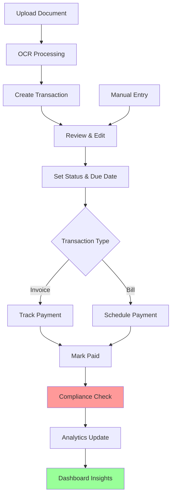

# 🏆 FinanSEAL MVP: SEA Developer Challenge Winning Strategy

## Executive Summary

**Strategic Positioning:** Transform FinanSEAL from a document processing tool into a **Cross-Border Financial Intelligence Platform** for Southeast Asian SMEs.

**Refined Two-Phase Approach:**
- **Phase 1:** Complete Financial Workflow + Analytics Dashboard
- **Phase 2:** AI-Powered Cross-Border Tax Compliance Analyzer

**Key Competitive Advantages:**
1. **Complete Business Loop:** Document → Transaction → Status → Compliance → Insights
2. **SEA-Focused:** Built specifically for Singapore-Malaysia cross-border business
3. **Transaction-Aware Intelligence:** AI that analyzes user's actual business data, not generic advice
4. **Regulatory Accuracy:** Curated knowledge base from IRAS, LHDN, and authoritative sources

---

## Phase 1: Enhanced Minimal Viable Bookkeeping Loop

### Database Schema Changes

```sql
-- Add transaction status and enhanced metadata
ALTER TABLE transactions 
ADD COLUMN status VARCHAR(50) DEFAULT 'pending' CHECK (status IN ('pending', 'awaiting_payment', 'paid', 'overdue', 'cancelled', 'disputed')),
ADD COLUMN due_date DATE,
ADD COLUMN payment_date DATE,
ADD COLUMN payment_method VARCHAR(100),
ADD COLUMN notes TEXT,
ADD COLUMN created_by_method VARCHAR(50) DEFAULT 'manual' CHECK (created_by_method IN ('manual', 'ocr', 'api')),
ADD COLUMN compliance_status VARCHAR(50) DEFAULT 'unchecked' CHECK (compliance_status IN ('unchecked', 'compliant', 'requires_attention', 'non_compliant'));

-- Create invoice/bill numbers table for proper sequencing
CREATE TABLE transaction_sequences (
  id UUID PRIMARY KEY DEFAULT gen_random_uuid(),
  user_id UUID NOT NULL REFERENCES users(id) ON DELETE CASCADE,
  sequence_type VARCHAR(20) NOT NULL CHECK (sequence_type IN ('invoice', 'bill', 'receipt')),
  current_number INTEGER DEFAULT 0,
  prefix VARCHAR(10) DEFAULT '',
  created_at TIMESTAMP WITH TIME ZONE DEFAULT NOW(),
  UNIQUE(user_id, sequence_type)
);

-- Real-time analytics via optimized RPC function (replaces caching table)
-- Uses get_dashboard_analytics_realtime() for sub-10ms performance
```

### API Endpoint Requirements

```typescript
// New endpoints to implement
POST /api/transactions                    // Manual transaction creation
PATCH /api/transactions/{id}/status       // Update transaction status
GET /api/transactions/analytics          // Financial analytics dashboard
POST /api/transactions/{id}/duplicate    // Duplicate transaction
GET /api/transactions/sequences          // Get next invoice/bill numbers
POST /api/transactions/bulk-status       // Bulk status updates

// Enhanced existing endpoints
GET /api/transactions                    // Add status, due_date filters
PUT /api/transactions/{id}              // Include new fields
```

### Core UI Components to Build

1. **`<TransactionStatusBadge />`** - Color-coded status indicators
2. **`<StatusUpdateButton />`** - Quick status change dropdown
3. **`<ManualTransactionForm />`** - Complete invoice/bill creation form
4. **`<FinancialDashboard />`** - Analytics overview with charts
5. **`<PaymentTracker />`** - Due dates and overdue alerts
6. **`<BulkStatusEditor />`** - Multi-select status updates
7. **`<CurrencyBreakdownChart />`** - Multi-currency analytics
8. **`<ComplianceStatusIndicator />`** - Regulatory compliance alerts
9. **`<DashboardActionCenter />`** - High-priority widget that tells users exactly what they need to do next (e.g., "You have 2 overdue bills," "3 transactions require compliance review"). Transforms the dashboard from passive to active by surfacing actionable items and priority tasks.

### User Flow Diagram



### Phase 1 Success Metrics
- Complete transaction lifecycle management
- Real-time financial analytics
- Multi-currency cash flow tracking
- Overdue payment alerts
- Professional invoice generation

---

## Phase 2: Cross-Border Tax Compliance Analyzer

### Strategic Focus Refinement

**Instead of:** Generic regulatory guidance chatbot
**Build:** Transaction-aware cross-border tax compliance analyzer

**Core Value Proposition:**
"Automatically analyze your Singapore-Malaysia transactions for tax compliance requirements, reporting obligations, and optimization opportunities."

### Proactive Compliance Monitoring

**System Architecture:** A backend trigger (serverless function) automatically runs compliance checks when cross-border transactions are created or updated. This system pre-populates the `compliance_status` field on transactions, creating an "Aha!" moment for users before they even ask.

**Implementation Flow:**
1. Transaction created/updated → Webhook trigger
2. Automated compliance analysis using `CrossBorderTaxComplianceTool`
3. Pre-populate `compliance_status` field with initial assessment
4. Generate compliance alerts for dashboard action center
5. Queue detailed analysis for user review when accessed

**Key Benefits:**
- Zero-friction compliance awareness
- Proactive risk identification
- Seamless integration into existing workflow
- Reduces cognitive load on business owners

### Data Ingestion Workflow

#### 1. Curated Knowledge Base Sources
```yaml
Singapore_Sources:
  - IRAS_GST_Guide_2024.pdf
  - IRAS_International_Tax_2024.pdf
  - Singapore_Malaysia_DTA.pdf
  - ACRA_Reporting_Requirements.pdf

Malaysia_Sources:
  - LHDN_GST_Manual_2024.pdf
  - Malaysia_Singapore_Tax_Treaty.pdf
  - SSM_Compliance_Guide.pdf
  - Malaysia_Transfer_Pricing_Guidelines.pdf

Cross_Border_Sources:
  - ASEAN_Tax_Harmonization_2024.pdf
  - PWC_SEA_Tax_Guide_2024.pdf
  - Deloitte_Transfer_Pricing_SEA.pdf
```

#### 2. Document Processing Pipeline
```bash
# Step 1: Document Download & Validation
./scripts/download_regulatory_docs.sh

# Step 2: PDF Processing & Chunking
python scripts/process_regulatory_docs.py \
  --input_dir ./regulatory_docs \
  --output_dir ./processed_chunks \
  --chunk_size 1000 \
  --overlap 200

# Step 3: Embedding & Qdrant Ingestion
python scripts/ingest_to_qdrant.py \
  --collection regulatory_kb \
  --processed_dir ./processed_chunks
```

### Qdrant Collection Schema

```python
# regulatory_kb collection structure
{
  "vectors": {
    "size": 1024,  # ColNomic Embed Multimodal 3B dimensions
    "distance": "Cosine"
  },
  "payload_schema": {
    "content": "text",           # Document chunk content
    "country": "keyword",       # ["singapore", "malaysia", "both"]
    "tax_type": "keyword",      # ["gst", "income_tax", "withholding", "transfer_pricing"]
    "document_source": "text",  # Official document name
    "section": "text",          # Document section/chapter
    "effective_date": "datetime",
    "currency_relevant": ["SGD", "MYR", "USD"],
    "business_type": "keyword", # ["all", "sme", "multinational"]
    "confidence_score": "float"
  }
}
```

### LangGraph Tool Definition

**Architectural Decision:** We will implement a **Single, Powerful Agent with Specialized Tools**. The primary agent will act as an orchestrator. All complex, multi-step logic (fetching data, querying the vector store, calling the LLM for synthesis) will be encapsulated within the `CrossBorderTaxComplianceTool`. This approach avoids the latency and complexity of a multi-agent system while maintaining a clean, powerful, and maintainable architecture.

```python
class CrossBorderTaxComplianceTool(BaseTool):
    """
    Analyzes specific transactions for cross-border tax compliance requirements.
    """
    
    def get_tool_schema(self) -> Dict[str, Any]:
        return {
            "type": "function",
            "function": {
                "name": "analyze_transaction_compliance",
                "description": "Analyze specific transactions for Singapore-Malaysia cross-border tax compliance requirements and reporting obligations",
                "parameters": {
                    "type": "object",
                    "properties": {
                        "transaction_ids": {
                            "type": "array",
                            "items": {"type": "string"},
                            "description": "Transaction IDs to analyze"
                        },
                        "analysis_type": {
                            "type": "string",
                            "enum": ["gst_compliance", "withholding_tax", "transfer_pricing", "reporting_requirements", "all"],
                            "description": "Type of compliance analysis to perform"
                        },
                        "target_countries": {
                            "type": "array",
                            "items": {"type": "string", "enum": ["singapore", "malaysia"]},
                            "description": "Countries for compliance analysis"
                        }
                    },
                    "required": ["transaction_ids", "analysis_type", "target_countries"]
                }
            }
        }
    
    async def execute(self, parameters: Dict[str, Any], user_context: Dict[str, Any]) -> Dict[str, Any]:
        """
        Execute transaction-specific compliance analysis
        """
        transaction_ids = parameters.get("transaction_ids", [])
        analysis_type = parameters.get("analysis_type", "all")
        target_countries = parameters.get("target_countries", ["singapore", "malaysia"])
        
        # 1. Fetch transaction details
        transactions = await self._fetch_transactions(transaction_ids, user_context["user_id"])
        
        # 2. Build context-aware query
        query_context = self._build_compliance_query(transactions, analysis_type, target_countries)
        
        # 3. Search regulatory knowledge base
        regulatory_context = await self._search_qdrant_kb(query_context, target_countries)
        
        # 4. Generate compliance analysis
        analysis_result = await self._generate_compliance_analysis(
            transactions, regulatory_context, analysis_type
        )
        
        return {
            "success": True,
            "analysis": analysis_result,
            "transactions_analyzed": len(transactions),
            "recommendations": analysis_result.get("recommendations", []),
            "compliance_status": analysis_result.get("status", "requires_review"),
            "source_documents": [doc["source"] for doc in regulatory_context]
        }
    
    def _build_compliance_query(self, transactions, analysis_type, countries):
        """Build contextual query based on actual transaction data"""
        amounts = [t["original_amount"] for t in transactions]
        currencies = list(set([t["original_currency"] for t in transactions]))
        vendors = list(set([t["vendor_name"] for t in transactions if t["vendor_name"]]))
        
        return f"""
        Cross-border tax compliance for {analysis_type}:
        - Transaction amounts: {amounts}
        - Currencies: {currencies}  
        - Vendors: {vendors}
        - Countries: {countries}
        - Transaction types: {[t["transaction_type"] for t in transactions]}
        """

    async def _search_qdrant_kb(self, query: str, countries: List[str]):
        """Search curated regulatory knowledge base"""
        # Implementation details for Qdrant search with country filtering
        pass

    async def _generate_compliance_analysis(self, transactions, regulatory_context, analysis_type):
        """Generate specific compliance analysis with recommendations"""
        # Implementation details for AI analysis
        pass
```

### Prompt Engineering Example

```python
COMPLIANCE_ANALYSIS_PROMPT = """
You are a specialized cross-border tax compliance analyzer for Southeast Asian businesses.

CONTEXT:
User's Business: {business_context}
Transactions to Analyze: {transaction_details}
Regulatory Knowledge: {regulatory_context}

TASK:
Analyze the specific transactions for tax compliance requirements between Singapore and Malaysia.

ANALYSIS FRAMEWORK:
1. **GST/VAT Obligations**
   - Registration thresholds
   - Rate applicability  
   - Input tax claims
   
2. **Withholding Tax Requirements**
   - Applicable rates
   - Payment deadlines
   - Exemption criteria
   
3. **Transfer Pricing Considerations**
   - Arm's length principle
   - Documentation requirements
   - Safe harbor provisions
   
4. **Reporting Obligations**
   - Form requirements
   - Filing deadlines
   - Supporting documentation

OUTPUT FORMAT:
{{
  "compliance_status": "compliant|requires_attention|non_compliant",
  "issues_identified": [
    {{
      "category": "gst|withholding|transfer_pricing|reporting",
      "severity": "low|medium|high|critical",
      "description": "Specific issue description",
      "regulation_reference": "Official regulation citation",
      "recommended_action": "Specific action to take",
      "deadline": "If applicable"
    }}
  ],
  "recommendations": [
    {{
      "priority": "high|medium|low",
      "action": "Specific recommendation",
      "rationale": "Why this is important",
      "estimated_impact": "Cost/benefit estimate"
    }}
  ],
  "summary": "Executive summary of compliance status"
}}

IMPORTANT GUIDELINES:
- Only reference information from the provided regulatory knowledge
- Include specific regulation citations
- Provide actionable recommendations
- Indicate confidence level in analysis
- Always include disclaimer about seeking professional advice
"""
```

### Core UI Components for Phase 2

1. **`<ComplianceScorecard />`** - Primary user interface for displaying compliance analysis results. Translates complex JSON output into a simple, actionable view with four key sections:
   - **Overall Status:** Visual indicator (✅ Compliant, ⚠️ Requires Attention, ❌ Non-Compliant)
   - **Issue Summary:** High-level overview of identified compliance gaps
   - **Recommended Actions:** Clear, prioritized steps the user should take
   - **Source of Truth:** Citations from regulatory documents that support the analysis

### Integration Strategy

```typescript
// Transaction Detail Component Integration
const TransactionDetailModal = () => {
  const [complianceAnalysis, setComplianceAnalysis] = useState(null);
  
  const analyzeCompliance = async () => {
    const result = await fetch('/api/chat', {
      method: 'POST',
      headers: { 'Content-Type': 'application/json' },
      body: JSON.stringify({
        message: `Analyze compliance for transaction ${transaction.id}`,
        conversationId: complianceConversationId,
        toolName: 'analyze_transaction_compliance'
      })
    });
    
    setComplianceAnalysis(result.analysis);
  };
  
  return (
    <div className="transaction-detail">
      {/* Existing transaction details */}
      
      <div className="compliance-section">
        <h3>Cross-Border Compliance Analysis</h3>
        <button onClick={analyzeCompliance}>
          Analyze Tax Compliance
        </button>
        
        {complianceAnalysis && (
          <ComplianceScorecard analysis={complianceAnalysis} />
        )}
      </div>
    </div>
  );
};
```

---

## Timeline & Priorities

### Sprint 1 (Week 1-2): Phase 1 Core
- [ ] Database schema migration
- [ ] Transaction status management
- [ ] Manual transaction creation form
- [ ] Basic status update UI

### Sprint 2 (Week 3-4): Phase 1 Analytics  
- [ ] Financial analytics calculation
- [ ] Dashboard components
- [ ] Multi-currency summaries
- [ ] Payment tracking features

### Sprint 3 (Week 5-6): Phase 2 Foundation
- [ ] Download and process regulatory documents
- [ ] Set up Qdrant regulatory_kb collection
- [ ] Implement document chunking and embedding
- [ ] Basic compliance tool skeleton

### Sprint 4 (Week 7-8): Phase 2 Intelligence
- [ ] Complete compliance analysis tool
- [ ] Integration with transaction workflow
- [ ] Prompt engineering and testing
- [ ] UI integration for compliance reports

### Sprint 5 (Week 9-10): Competition Preparation
- [ ] Demo scenario preparation
- [ ] Performance optimization
- [ ] Error handling and edge cases
- [ ] Competition submission materials

### Demo Story Arc
1. **"Meet Sarah, Singapore SME Owner"** - Upload Malaysian supplier invoice
2. **"Instant Intelligence"** - OCR creates transaction with line items
3. **"Complete Workflow"** - Track payment status, set due dates
4. **"Smart Compliance"** - AI analyzes GST implications for cross-border purchase
5. **"Business Insights"** - Dashboard shows monthly P&L, currency exposure, compliance status

---

## Competitive Differentiators

### Technical Excellence
- **Multimodal AI Pipeline:** Document → Transaction → Compliance → Insights
- **Southeast Asia Focus:** Built specifically for Singapore-Malaysia business
- **Production Ready:** Complete financial workflow, not just a prototype

### Business Impact  
- **Complete Solution:** From document upload to compliance reporting
- **Risk Mitigation:** Proactive identification of tax compliance issues
- **Cost Savings:** Automated compliance checking reduces accounting fees

### Market Fit
- **SME Focused:** Designed for businesses without full-time tax expertise
- **Cross-Border Specialist:** Addresses specific SEA regulatory complexity
- **AI-Powered:** But grounded in authoritative, curated knowledge

---

## Success Metrics for Competition

### Technical Metrics
- Transaction processing accuracy: >95%
- OCR field extraction precision: >90%  
- Compliance analysis response time: <5 seconds
- System uptime during demo: 100%

### Business Metrics
- Complete workflow demonstration: Document → Transaction → Compliance → Insights
- Cross-border compliance scenarios: 5+ different tax situations covered
- Multi-currency handling: SGD, MYR, USD transactions
- Real-time analytics: P&L, cash flow, compliance status

### Judge Appeal Factors
- **Practical Value:** Solves real SME pain points
- **Technical Sophistication:** Advanced AI with curated knowledge base  
- **Market Opportunity:** Clear path to monetization and scaling
- **Demo Impact:** Compelling narrative with measurable business outcomes

---

## Scalability & Future Roadmap

### Automated Knowledge Base Update Pipeline

To maintain the regulatory knowledge base's accuracy and completeness, we implement a best-practice architecture for continuous document monitoring and automated ingestion:

#### 1. Human Curator Role
- **Designated Knowledge Steward**: Assign a compliance expert to maintain the `sources.yaml` configuration
- **Quarterly Review Cycle**: Scheduled assessment of regulatory document sources for additions/removals
- **Change Management**: Version-controlled updates to source configurations with approval workflows
- **Quality Assurance**: Manual validation of new regulatory sources before automation integration

#### 2. Automated Cron Job Execution
- **Scheduled Processing**: Daily/weekly cron jobs execute the RAG pipeline automatically
  ```bash
  # Example crontab configuration
  0 2 * * 1 cd /app && python scripts/knowledge_base/process.py # Weekly on Monday 2 AM
  30 2 * * 1 cd /app && python scripts/knowledge_base/ingest.py # 30 minutes later
  ```
- **Resource Management**: Execute during low-traffic periods to minimize system impact
- **Error Handling**: Comprehensive logging and alerting for failed automation runs
- **Rollback Strategy**: Maintain previous knowledge base snapshots for quick recovery

#### 3. Checksum Validation for Efficiency
- **Document Fingerprinting**: Calculate SHA-256 checksums for all source documents
- **Change Detection**: Compare current checksums against stored values to identify updates
- **Incremental Processing**: Process only new or modified documents to optimize pipeline performance
- **Storage Optimization**: Avoid redundant embedding generation and vector storage operations

#### 4. Versioning Metadata in Qdrant
- **Document Versioning**: Include version timestamps and checksums in vector payload metadata
- **Audit Trail**: Maintain complete history of regulatory document changes and ingestion events
- **Compliance Tracking**: Enable legal teams to trace analysis results back to specific document versions
- **Rollback Capability**: Support rollback to previous knowledge base versions if needed

### Implementation Architecture
```python
# Enhanced metadata structure for production knowledge base
{
  "document_checksum": "sha256_hash",
  "ingestion_timestamp": "2024-01-31T10:00:00Z",
  "document_version": "v2.1",
  "source_last_modified": "2024-01-30T14:30:00Z",
  "curator_approved": true,
  "regulatory_effective_date": "2024-02-01",
  "pipeline_version": "1.2.0"
}
```

This scalable architecture ensures the RAG system remains current with evolving Southeast Asian regulatory landscapes while maintaining operational efficiency and audit compliance.

---

*This winning plan transforms FinanSEAL from a document processing tool into a comprehensive Cross-Border Financial Intelligence Platform that judges will recognize as both technically impressive and commercially viable.*